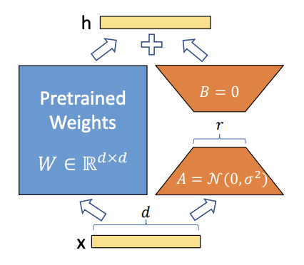

# LoRA: Low-Rank Adaptation of Large Language Models

Link to original paper: [https://arxiv.org/abs/2106.09685](https://arxiv.org/abs/2106.09685)

## What is LoRA

<ins>The Problem</ins>

In Natural Language Processing, we often have to **fine-tune** pre-trained language models to perform better at specific tasks (e.g. train a GPT-3 model to be better at solving math problems). 

During fine-tuning, all the parameters of the pre-trained model is updated to produce the new model; the new model has as many parameters as the original. This makes fine-tuning challenging in terms of computational costs and deployment, especially for large pre-trained models (e.g. GPT-3 has 175 billion trainable parameters)

Prior to LoRA, the existing techniques to mitigate the problem include

1. Limiting the number of parameters that can be updated
2. Incorporating external modules tailored to new tasks

However, these solutions often introduce **inference latency** (time taken for model to generate output once it is fed its input) because they

1. extend the depth of the model (more layers = more operations)
2. reduce the model’s usable sequence (need to process input in smaller segments)

Moreover, these methods often compromise the model quality.

<ins>Hypothesis of LoRA</ins>

The authors hypothesise that the change in weights during fine-tuning has a **low “intrinsic rank”**, i.e. the weights changes during adaptation might reside in a lower-dimensional subspace compared to the full parameter space, allowing for efficient low-rank approximations.

The rank of a matrix refers to the number of linearly independent rows/columns in that matrix. Let’s use an example, pretend you have a 4x5 matrix $\Delta W$ which represents the weight updates during a single instance of backpropagation

$$
\Delta W =
\begin{bmatrix}
1 & 2 & 3 & 4 & 5 \\
2 & 4 & 6 & 8 & 10 \\
2 & 5 & 7 & 4 & 8 \\
4 & 10 & 14 & 8 & 16 \\
\end{bmatrix}
$$

We can reduce $\Delta W$ to its **reduced row echelon form** $B$

$$
\Delta W =
\begin{bmatrix}
1 & 2 & 3 & 4 & 5 \\
2 & 4 & 6 & 8 & 10 \\
2 & 5 & 7 & 4 & 8 \\
4 & 10 & 14 & 8 & 16 \\
\end{bmatrix} \sim
\begin{bmatrix}
1 & 0 & 1 & 12 & 9 \\
0 & 1 & 1 & -4 & -2 \\
0 & 0 & 0 & 0 & 0 \\
0 & 0 & 0 & 0 & 0 \\
\end{bmatrix} =
B
$$

We can deduce that the weight updates has a **rank** of 2. That means there exists a 4x2 matrix $F$ and a 2x4 matrix $C$ such that

$$
\Delta W = CF
$$

We can remove the non-pivot columns 3, 4 and 5 from $\Delta W$ to get $C$ and get $F$ by removing the rows of zeroes from $B$

$$
C = 
\begin{bmatrix}
1 & 2  \\
2 & 4  \\
2 & 5  \\
4 & 10  \\
\end{bmatrix}, \space
F =
\begin{bmatrix}
1 & 0 & 1 & 12 & 9 \\
0 & 1 & 1 & -4 & -2 \\
\end{bmatrix}
$$

It is straightforward to check that

$$
\Delta W = 
\begin{bmatrix}
1 & 2 & 3 & 4 & 5 \\
2 & 4 & 6 & 8 & 10 \\
2 & 5 & 7 & 4 & 8 \\
4 & 10 & 14 & 8 & 16 \\
\end{bmatrix} = 
\begin{bmatrix}
1 & 2  \\
2 & 4  \\
2 & 5  \\
4 & 10  \\
\end{bmatrix}
\begin{bmatrix}
1 & 0 & 1 & 12 & 9 \\
0 & 1 & 1 & -4 & -2 \\
\end{bmatrix} =
CF
$$

As you can see, $\Delta W$ has $4 \times 5 = 20$ elements but $C$ and $F$ has $4 \times 2 \space + 2 \times 4 = 16$ elements. We managed to factorise $\Delta W$ into smaller matrices $C$ and $F$ because it is a low-rank matrix.

- **Note**: If you are unfamiliar with linear algebra and rank of matrices, you can check out some of the notes I have [here](https://www.notion.so/Linear-Algebra-78eeeef8cf3e4c2d8eee0796b4c6d786?pvs=21).

That is essentially the idea behind LoRA. The authors believe that the weight changes during fine-tuning has an intrinsically low rank, which means it can be decomposed into much smaller matrices. Moreover, rather than updating the pre-trained weights directly, LoRA keeps them frozen and optimise the rank decomposition matrices separately instead (I will mention more about this in the methodology below).

In principle, we can apply LoRA to any trainable weight matrices in a neural network. For e.g., the authors applied LoRA to transformers such as GPT-2, GPT-3 and RoBERTa, and was in fact able to outperform several baselines including full fine-tuning.

## LoRA’s Methodology

<ins>Key Difference between Full Fine-tuning and LoRA</ins>

The formula for updating the weights in a single backpropagation is

$$
W'= W \space + \Delta W
$$

where $W$ is the old weight matrix, $\Delta W$ is the weight updates, and $W'$ is the new weights. All the matrices have the same dimensions $d \times k$

- Note that $\Delta W$ is derived from the gradient of the loss function w.r.t. to the weights and the learning rate

In full fine-tuning, we will directly update the weights of all the nodes. As such, the forward pass yields

$$
h = W'x
$$

where $x$ is the input and $W'$ is the updated weight matrix.

](images/Untitled%201.png)

Image from [Umar Jamil](https://www.youtube.com/watch?v=PXWYUTMt-AU)

In LoRA, we keep the original weight matrix $W$ **frozen** (we do not update it) and only train a separate weight updates matrix (green arrow). The input is then multiplied with both the frozen weights and the weight updates matrices separately before summing them coordinate-wise to produce the output vectors. Therefore, the modified forward pass yields

$$
h = Wx + \Delta Wx
$$

Moreover, LoRA approximates that $\Delta W$ can be represented by a low-rank decomposition such that

$$
\Delta W =  BA
$$

where $B$ is a $d \times r$ matrix, $A$ is a $r \times k$ matrix and $r$ is the approximate rank.

- Note: we choose $r \ll \min(d, k)$ because we hypothesise a low intrinsic rank

LoRA initialises $A$ and $B$ using random Gaussian initialisation so $\Delta W = BA = 0$ at the start. They then scale $\Delta Wx$ by $\frac{\alpha}{r}$ where $\alpha$ is a constant.

## Advantages of LoRA

**1) The weight updates are separated from the original pre-trained weights**

This means that we can easily build many small LoRA modules for different specialised tasks. This is because each LoRA module is represented by the set of weight updates matrices $A$ and $B$ which can easily be unplugged and plugged in with a different set. 

This reduces the storage requirement because you only need one big pre-trained model and many small LoRA modules instead of multiple big pre-trained models for each specialised tasks.

**2) Faster computation during fine-tuning**

LoRA makes training more efficient because there is no need to calculate the gradients for all the parameters in the original pre-trained model (they are frozen). Rather, they only need to optimise the smaller low-rank matrices $A$ and $B$

**3) No inference latency**

LoRA modules do not add extra depth or reduction of the model’s usable sequences when performing specialised tasks. Rather, you can just perform a coordinate-wise sum of the pre-trained weights and the trainable matrices to get the tuned weights. I.e.

$$
W' = W + BA
$$

When unplugging a LoRA module, you can recover the original weights $W$ by simply subtracting $BA$

## Conclusion

LoRA represents a transformative breakthrough in addressing the computational hurdles associated with fine-tuning large pre-trained language models. By positing the hypothesis that weight updates during adaptation reside within a lower-dimensional subspace, LoRA offers an innovative method that preserves model expressiveness while significantly reducing computational complexity and deployment constraints.

They empirically validate their hypothesis by showing that the LoRA atop of transformer models can perform competitively with a very small $r$. They also show that increasing $r$ seem to produce relatively minor changes in subspace coverage → further substantiates the hypothesis that crucial updates during adaptations can be confined to a lower-dimensional subspace.

## References

- [https://www.youtube.com/watch?v=PXWYUTMt-AU](https://www.youtube.com/watch?v=PXWYUTMt-AU)
- [https://medium.com/@alexmriggio/lora-low-rank-adaptation-from-scratch-code-and-theory-f31509106650](https://medium.com/@alexmriggio/lora-low-rank-adaptation-from-scratch-code-and-theory-f31509106650)
