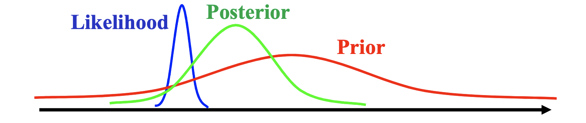

# Bayesian Learning

## Recap

Before we dive into Bayesian learning, it would probably be good to recap on Bayes Theorem and the Frequentist view of linear regression

### Bayes’ Theorem

<ins>Events</ins>

Suppose events $B_1, B_2, \dots, B_m$ partition the sample space (that is, they are mutually exclusive and collectively exhaustive), then using the law of total probability, for each $B_k$ and any event $A$ with $P(A) > 0$

$$
P(B_k|A) = \frac{P(A|B_K)P(B_K)}{P(A)}= \frac{P(A|B_k) P(B_k)}{\sum_{i=1}^m P(A| B_i)  P(B_i)}
$$

<ins>Random Variables</ins>

Using the same assumption as in the law of total probability, given continuous random variables $X$ and $Y$, Bayes’ Theorem is given by

$$
p_{X|Y}(x|y) = \frac{p_{Y|X}(y|x)p_X(x)}{p_Y(y)} = \frac{p_{Y|X}(y|x)p_X(x)}{\int p_{Y|X}(y|x)p_X(x)dx}
$$

where each $p$ is a density function and $p_Y(y) > 0$.

### Linear Regression

The linear regression model assumes that the relationship between the dependent variable $y$ and the regressors $x$ is linear. Given a sample of $n$ paired observations, i.e. $(x_1, y_1), (x_2, y_2),\dots , (x_n, y_n)$ and each input $x_i \in \mathbb{R}^{1\times d}$ is a vector with $d$ features, the relationship between $y$ and $x$ is expressed as such:

$$
y_i  = \beta_0 + \beta_1 x_{i1} + \beta_2x_{i2} +\dots +\beta_dx_{id} + \epsilon_i, \qquad i = 1, \dots, n
$$

where $\beta_0$ is the intercept term, $\beta_1, \beta_2, \dots, \beta_d$  are the coefficients and $\epsilon_i$ is the residual (or error) term. 

For convenience, we express the formula using matrix notation, that is

$$
Y = X\beta+\epsilon
$$

where $\beta$ is a $(d + 1)$-dimensional vector which includes the intercept term and the coefficients for each feature.

### Frequentist View of Linear Regression

The frequentist approach assumes that the regression coefficients and variance are fixed but unknown quantities and we can say something meaningful about $\beta$ with enough data measurements. Using the Ordinary Least Squares method and matrix calculus, we derive that the “best” possible estimate for $\beta$ is

$$
\hat\beta = (X^TX)^{-1}X^TY
$$

## Bayesian Linear Regression

In the Bayesian approach, we treat regression coefficients and variance as random variables and therefore formulate linear regression using probability distributions. We start off with a prior belief about the parameters and we combine them with the data’s likelihood function to yield posterior belief about $\beta$ and $\sigma^2$. In other words, *Bayesian linear regression* does not attempt to compute a point estimate of the parameters, but instead the full posterior distribution over the parameters is taken into account when making predictions.

### Formulation

We want to calculate the probability of our model’s parameter $\theta$ given the input $X$ and response $Y$. We formulate our Bayes’ theorem formula as:

$$
\underbrace{p(\theta|X,Y)}_{\text{posterior}} = \frac{{\overbrace{p(Y|X,\theta)}^{\text{likelihood}}}{\overbrace{p(\theta)}^{\text{prior}}}}{{\underbrace{p(Y|X)}_{\text{marginal likelihood}}}}
$$

Due to the integration over the parameter space, the marginal likelihood does not depend upon the parameters, which means we can treat it as simply the normalizing constant that ensures the posterior is well-defined. Therefore,

$$
\underbrace{p(\theta|X,Y)}_{\text{posterior}} \propto {\overbrace{p(Y|X, \theta)}^{\text{likelihood}}\overbrace{p(\theta)}^{\text{prior}}}
$$

The likelihood function is Gaussian, $\mathcal{N}(y|X\theta, \sigma^2I)$.

We will also assume a Gaussian prior over the parameters with mean $m_0$ and covariance $S_0$ → $p(\theta) = \mathcal{N}(\theta | m_0, S_0)$

This means that the posterior is proportional to the product of two normal PDFs, that is

$$
\begin{align} \notag
p(\theta|X,Y) &\propto p(Y|X, \theta)p(\theta)\\\ \notag
&= \mathcal{N}(y|X\theta, \sigma^2I)\mathcal{N}(\theta | m_0, S_0)
\end{align}
$$

### Deriving the Posterior

Great, now that we have set up our probabilistic model, it is time to determine the posterior.

$$
\begin{align} \notag
p(\theta|X,Y) &\propto p(Y|X, \theta)p(\theta)\\\ \notag
&=\mathcal{N}(y|X\theta, \sigma^2I)\mathcal{N}(\theta | m_0, S_0)\\\ \notag
&\propto e^{-\frac{1}{2\sigma^2}(y - X\theta)^T(y-X\theta)} e^{-\frac{1}{2S_0}(\theta - m_0)^T(\theta-m_0)}\\\ \notag
&= e^{-\frac{1}{2}[\frac{1}{\sigma^2}(y - X\theta)^T(y-X\theta) + \frac{1}{S_0} (\theta - m_0)^T(\theta-m_0)]}\\\ \notag
&= e^{-\frac{1}{2}[\frac{1}{\sigma^2}(y^Ty - 2y^TX\theta + \theta^TX^TX\theta) + \frac{1}{S_0}(\theta^T\theta - 2m_0^T\theta + m_0^Tm_0)]}\\\ \notag
&= e^{-\frac{1}{2}[{\color{skyblue}y^T\sigma^{-2}y} + \theta^T(X^T(\sigma^{2}I)^{-1}X + S_0^{-1})\theta - 2(y^T(\sigma^{2}I)^{-1}X + m_0^TS_0^{-1})\theta + {\color{skyblue}m_0^TS_0^{-1}m_0}]}
\end{align}
$$

The terms highlighted in blue are constants independent of $\theta$ which means

$$
p(\theta|X,Y) \propto e^{-\frac{1}{2}[{\color{limegreen}{\theta^T(X^T(\sigma^{2}I)^{-1}X + S_0^{-1})\theta}} - {\color{orange} 2(y^T(\sigma^{2}I)^{-1}X + m_0^TS_0^{-1})\theta} + \text{\color{skyblue}const}]} \tag{1}
$$

The fact that the exponent is in quadratic form (green term is quadratic in $\theta$ and the orange term is linear in $\theta$) implies that the unnormalized posterior is Gaussian. 

Our goal now is to bring this Gaussian into the form that is proportional to $\mathcal{N}(\theta | m_N, S_N)$, i.e. we need to identify the mean $m_N$ and the covariance matrix $S_N$ where the subscript $N$ refers to the size of the observed data.

We can do so by *completing the squares*. The desired (unnormalized) posterior is

$$
\begin{align} \notag
\mathcal{N}(\theta | m_N, S_N) &= \frac{1}{\sqrt{S_N2\pi}}e^{-\frac{1}{2}(\theta - m_N)^TS_N^{-1}(\theta - m_N)}\\\
&\propto e^{-\frac{1}{2}[{\color{limegreen}\theta^TS_N^{-1}\theta} - {\color{orange}2m_N^TS_N^{-1}\theta} + {\color{skyblue}m_N^TS_N^{-1}m_N}]} \tag{2}
\end{align}
$$

What we did was expand the quadratic form into a term that is quadratic in $\theta$ (green), a term that is linear in $\theta$ (orange), and a constant term (blue). Now we just have to match the colored terms in (1) and (2), which yields

$$
\begin{align} \notag
S_N^{-1} &= X^T(\sigma^2I)^{-1}X + S_0^{-1}\\\ \notag
\implies S_N &= \sigma^2(X^TX + S_0^{-1})^{-1}
\end{align}
$$

and

$$
\begin{align} \notag
m_N^TS_N^{-1} &= (y^T(\sigma^2I)^{-1}X + m_0^TS_0^{-1})\\\ \notag
\implies m_N &= S_N(\sigma^{-2}X^Ty + S_0^{-1}m_0)
\end{align}
$$

### Conjugate Analysis

I would just like to spend a little time explaining why we assumed a Gaussian prior and what we have just implicitly proved. 

In Bayesian framework, it is often not possible to compute the posterior distribution analytically. That is why the choice of priors is very important. Given a likelihood function, if we choose a family of prior distributions such that the prior-to-posterior updating yields a posterior that is also in the same family, then the prior is known as a *conjugate prior*.

What we have done earlier was we implicitly proved that for a normal likelihood function with unknown mean, using a prior that is Gaussian will yield a posterior that is also Gaussian, i.e. we chose a conjugate prior. 

It is good to know that when given a likelihood that belongs to the exponential family, there exists a lists of conjugate distributions to help us make sure that our derived posterior has a closed-form expression. This is especially important when we want to integrate over the posterior to make predictions.

Here are some of the conjugate distributions

| Likelihood | Prior | Posterior |
| --- | --- | --- |
| Binomial | Beta | Beta |
| Poisson | Gamma | Gamma |
| Normal (mean unknown) | Normal | Normal |
| Normal (variance unknown) | Inverse Gamma | Inverse Gamma |
| Multinomial | Dirichlet | Dirichlet |

## Bayesian vs Frequentist Regression

### Posterior Predictions

In practice, we are usually not so much interested in $\theta$ themselves. Rather, our focus is on the predictions we make with those parameter values. Now that we have derived the posterior, which represents our updated beliefs about the model, we can use it to compute the predictive distribution of $y'$, at a test input $x'$.

In a Bayesian setting, we take the parameter distribution and average over all plausible parameter settings when we make predictions. More specifically, to make predictions at $x'$, we integrate out $\theta$ and obtain

$$
\begin{align} \notag
p(y'| X, Y, x') &= \int p(y'|x', \theta)p(\theta|X,Y)d\theta\\\ \notag
&= \int \mathcal{N}(y'|x'^T\theta, \sigma^2) \mathcal{N}(\theta|m_N, S_N)d\theta\\\
&= \mathcal{N}(y'|x'^Tm_N, \sigma^2 + x'^TS_Nx') \tag{3}
\end{align}
$$

which we can interpret as the average prediction of $y'|x', \theta$ for all plausible parameters $\theta$ according to the posterior distribution $p(\theta |X, Y)$

Note that the expression in (3) is a normal PDF as a result of the convolution of two Gaussians. I did not show the proof for it as that is not the focus of today. However, I’ll definitely talk more about it in future content. 

The predictive mean $x'^Tm_N$ is the point on the linear regression hyperplane. The term $x'^TS_Nx'$ reflects the posterior uncertainty associated with the parameters $\theta$. This is a crucial point because the Bayesian framework is able to incorporate our uncertainty about $\theta$ upon observing the training data $X, Y$. 

### Frequentist vs Bayesian

Let’s take a look at how the Bayesian prediction differs from the Frequentist MLE predictor:

$$
p(y'| X, Y, x') = \mathcal{N}(y'|x'^T\theta_{MLE}, \sigma^2)
$$

Notice the difference? Unlike (3), the likelihood function in MLE has fixed variance $\sigma^2$ regardless of the new input $x'$. If we were to plot the graph of prediction $y'$ against input $x'$ for MLE and Bayesian linear regression side by side, the difference becomes clearer.

The blue bars represents the distribution of $y'$ at each $x'$. The red circles represent the training data $X,Y$ we have observed. Note that we have yet to observe any data towards the extremes of the graphs.

In MLE, the variance of $y'$ is constant throughout. That means that even though we have yet to observe any training data at the extremes of the graph, we are equally confident in our prediction about those points. 

However, for the Bayesian linear regression model, the predictive uncertainty takes into account the location of $x'$ and the uncertainty of $\theta$ at different points. As such, at points where not much data is observed, the Bayesian framework displays high predictive variance. 

This is the key advantage of the Bayesian framework over the Frequentist MLE. It makes sense that we should be not confident about inputs we have lack information about, and it is even more important to incorporate this uncertainty in decision-making systems where bad decisions can have significant consequences (e.g., in reinforcement learning or robotics).

### Recovering MLE from Bayesian

Even though the Bayesian framework formulates linear regression differently from MLE, I would like to show that it is flexible enough to recover it.

<ins>Ridge Regression</ins>

Consider the special case where we have a spherical Gaussian prior with mean $m_0 = 0$ and covariance $S_0 = \tau_0^2I$ , i.e. $p(\theta) \sim \mathcal{N}(0, \tau_0^2I)$, where $\tau_0$ is some constant. Then the posterior mean reduces to

$$
\begin{align} \notag
m_N &= S_N(\sigma^{-2}X^Ty) = \sigma^{-2}\sigma^2(X^TX + \tau_0^{-2} I)^{-1} X^Ty\\\ \notag
&= (X^TX + \frac{\sigma^2}{\tau_0^2}I)^{-1}X^TY\\\ \notag
&= (X^TX + \lambda I)^{-1}X^TY
\end{align}
$$

Observe that the expression is identical to the MLE loss function with ridge regression when we let $\lambda = \frac{\sigma^2}{\tau_0^2}$!

But what does this mean intuitively? The prior represents our initial belief about the parameters of the model. As $\tau_0$ increases, the variance of the prior distribution also increase, which indicates higher uncertainty in our beliefs about $\theta$. As $\tau_0$ approaches infinity, then it means that we are assigning equal weight to every possible value of the parameter, i.e. we have an uninformative (flat) prior. The prior becomes a constant and our posterior is proportional to the likelihood function.

$$
\underbrace{p(\theta|x,y)}_{\text{posterior}} \propto {\overbrace{p(y|x, \theta)}^{\text{likelihood}}\overbrace{const}^{\text{prior}}}
$$

Since the posterior is proportional to the likelihood, the value $\theta$ that maximizes the posterior has to be the $\theta$ that maximizes the likelihood. This means that we would yield the same result as the maximum likelihood estimate! 

We can confirm this formula-wise. As $\tau_0$ approaches infinity, $\lambda = \frac{\sigma^2}{\tau_0^2}$ approaches zero. Then, 

$$
m_N = (X^TX)^{-1}X^TY
$$

which is exactly the same as the loss function for Ordinary Least Squares (OLS). If we were to take the MAP (Maximum A Posteriori) estimator of the posterior (using argmin because we want to minimise negative log-posterior), we get the same estimate as MLE.

<ins>Lasso Regression</ins>

Let’s consider a different distribution for the prior, like a Laplace distribution, $Laplace(0,\tau)$, instead

$$
P(\theta) = (\frac{1}{2\tau})e^{-\frac{|\theta |}{\tau}}
$$

The Laplace distribution is symmetric around zero, and more strongly peaked as $\lambda$ increases.

We will have to derive the posterior from scratch since we are no longer using a Gaussian prior.

$$
\begin{align} \notag
p(\theta|X,Y) &= \frac{p(Y|X, \theta)p(\theta)}{p(Y|X)}\\\ \notag
\log p(\theta|X,Y) &= \log p(Y|X, \theta) + \log p(\theta) + const\\\ \notag 
&= -\frac{1}{2}log(2\pi) - log(\sigma) - {\frac{(Y-X\theta)^2}{2\sigma^2}} - log(2\tau) -{\frac{|\theta|}{\tau}} + const
\end{align}
$$

Convert the above to negative log-likelihood and discard the terms independent of $\theta$  and we get

$$
\begin{align} \notag
\theta_{MAP} &= \underset{\theta}{argmin} \space (Y-X\theta)^2 + \frac{1}{\tau}|\theta|\\\ \notag
&= \underset{\theta}{argmin} \space (||Y-X\theta||_2^2 + \lambda||\theta||_1)
\end{align}
$$

Tf we let $\lambda = \frac{1}{\tau}$, we are able to recover the MAP estimate is exactly the same as the MLE estimate under Lasso regression.

## Conclusion

The really nice thing about the Bayesian framework is that it allows us to not only encode our uncertainty about the model’s parameters when making predictions but also flexible enough to recover frequentist estimates.