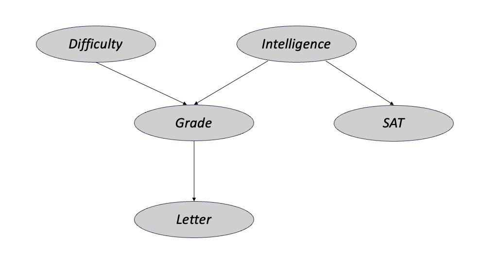
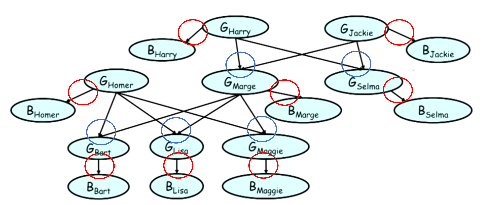
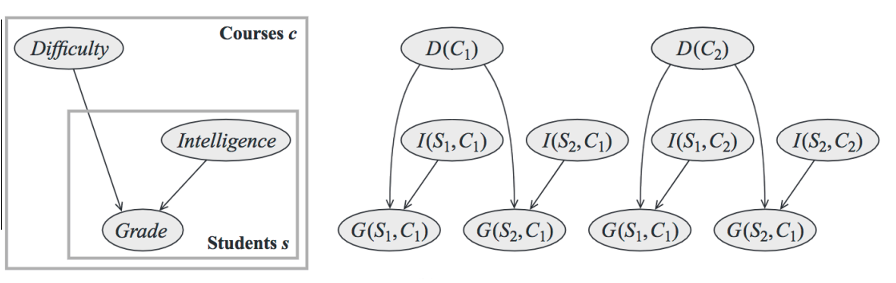

# Probabilistic Graphical Models: Bayesian Networks

Today we will be covering about the motivation behind Probabilistic Graphical Models (PGM) and then we will delve deep into one of the types of PGM known as Bayesian Networks.

# Fundamentals

Probabilistic models can be challenging to design and applied due to the lack of knowledge about the conditional dependence between random variables. 

A common approach to addressing this would be to assume that the random variables in the model are conditionally independent. The Naive Bayes classification model is one implementation of this assumption.

An alternative approach would be to come up with a probabilistic model with partial conditional independence assumptions, that is, we assume some variables are conditionally independent and some are not. The benefit of this approach is that it provides a middle ground that avoids the strict constraint of a global assumption of conditional independence while maintaining tractability by allowing us to avoid working with a fully conditionally dependent model.

But how do we illustrate these assumptions that we have? One way we can do this is via Probabilistic Graphical Models, which is a representation of a probabilistic model with a graph structure. 

## Describing Probabilities with Graphs

In a PGM, the nodes in the graph represent the random variables and the edges that connect the nodes represent the relationships between the random variables. It can be difficult to visualize this at this point of time but fret not, we will be diving extensively into one type of PGM, the Bayesian Network. 

# Bayesian Networks

Bayesian Networks is a probabilistic graphical model where the edges of the graph are directed, meaning they can be navigated in one direction. This is often referred to as a directed acyclic graph (DAG), where cycles are not allowed.

A running example that we will be using throughout is the student model. The model is represented by 5 random variables,

- $G$: grade on an exam
- $D$: difficulty of the course
- $I$: intelligence
- $S$: SAT score
- $L$: quality of reference letter given to the student by the professor who taught the course

To make things convenient, we will simplify this model by assuming every variable is binary, except $G$ which takes 3 possible values. 

The joint probability distribution over the 5 variables is given by $P(G,D,I,S,L)$. Now, let’s think about how we can construct the dependencies within this joint probability distribution. We need to come up with some assumptions. First, by intuition, the grade of the student, $G$, is conditionally dependent on the difficulty of the course, $D$, and the student’s intelligence, $I$. The SAT score of the student, $S$, is most likely to only depend on the intelligence of the student. Finally, we assume that the letter of recommendation $L$ is only dependent on the grade of the student, $G$. This is how the model looks like if it was represented using a Bayesian network.

Note how the edges are directed and there are no cycles in the graph. The graphical representation of this distribution is a DAG that visually specifies how random variables depend on each other.

Now, let’s identify the distributions involved. We have the marginal probability distributions, which are $P(D)$ and $P(I)$, and the conditional probability distributions, which are $P(G|I,D)$, $P(S|I)$ and $P(L|G)$. These discrete probability distributions are specified by the tables below.

By applying chain rule, the joint probability distribution factorizes as follows:

$$
P(D,I,G,S,L) = P(D)P(I)P(G|I,D)P(S|I)P(L|G)
$$

Let’s try an example by computing the joint distribution of this particular assignment of the random variables $\set{d^0, i^1, g^3, s^1, l^1}$. Using the probability distribution tables in the image and the formula above, we have

$$
\begin{align} \notag
P(d^0, i^1, g^3, s^1, l^1) &= P(d^0)P(i^1)P(g^3|i^1, d^0)P(s^1|i^1)P(l^1|g^3) \\\ \notag
&= 0.6 \times 0.3 \times 0.02 \times0.8 \times 0.01 \\\ \notag
&= 0.0000288
\end{align}
$$

## Formal Definition

The example we have just seen provides an idea of what Bayesian networks are, but let’s give it a formal definition.

Formally, a Bayesian network is a directed acyclic graph $G = (V, E)$ together with

- A random variable $X_i$ for each node $i \in V$
- A conditional probability distribution (CPD) $P(X_i|Par_G(X_i))$ per node, where $Par_G(X_i)$ are the parents of the node $X_i$. In other words, the probability of each node is conditioned on its parents’ values. The only exceptions are the nodes which are the ancestors, $X_A$, which we use the marginal probability distributions, i.e. $P(X_A)$.

The Bayesian network also represents a joint distribution over all the random variables given by

$$
P(X_i, \dots, X_n) = \prod_iP(X_i|Par_G(X_i))
$$

But how do we guarantee that this joint probability distribution is valid?

First, we have to show that $P(X_i, \dots, X_n)$ is non-negative. That is pretty straightforward since it is just a product of all the CPDs, which are all non-negative.

Second, we have to show that $\sum_{X_i, \dots, X_n} P(X_i, \dots, X_n)$, the sum of all the probabilities of all assignments of $\set{X_i, \dots, X_n}$ adds up to equal 1. Let’s try to prove that using the student model example we had above. Using the factorization of joint distribution we had earlier, the sum over the joint probability distribution of the student model is given by

$$
\sum_{D, I, G, S, L} P(D, I, G, S, L) = \sum_{D, I, G, S, L}P(D)P(I)P(G|I,D)P(S|I)P(L|G)
$$

Note that each factor, e.g. $P(S|I)$, only involves a small subset of all variables. When we have a situation like so, we can distribute the summation to each factor as such

$$
\sum_{D, I, G, S, L} P(D, I, G, S, L) = \sum_{D} P(D)\sum_{I}P(I)\sum_{G}P(G|I,D)\sum_{S}P(S|I)\sum_{L}P(L|G)
$$

Using the definition of CPDs, the summation over the conditional variable of each CPD is essentially summing up all mutually exclusive and exhaustive values of the conditional variable, which should sum to one, i.e. $\sum_X(X|Y) = 1$. Therefore, 

$$
\sum_{D, I, G, S, L} P(D, I, G, S, L) = 1
$$

## Reasoning Patterns

Having defined the Bayesian network, let’s look at some of the reasoning patterns it allows us to perform. Let’s go back to the Bayesian network we set up for the student model earlier

### Causal Reasoning

Let’s say it is given that the marginal probability of a student getting a good recommendation letter $P(l^1) = 0.5$. Now, let’s say we are going to condition the probability distribution on low intelligence, $i^0$. We observe that $P(l^1|i^0) = 0.39$, which means that a lower intelligence results in lower probability of getting a good recommendation letter. This is not surprising because intuitively the lower the intelligence, the probability of the grade of the student being good decreases and consequently the probability of a good recommendation letter also decreases. This is an example of *causal reasoning*. This is only possible because we are using directed graphs, in which the dependence is only unidirectional and allows us to infer causality between random variables.

### Evidential Reasoning

Evidential reasoning occurs in the opposite direction of causal reasoning, i.e. bottom-up. For example, we are given that the probability of the student being highly intelligent is $P(i^1) = 0.3$. Now, assuming we condition it on the course a poor student grade and we observe $P(i^1|g^3) = 0.08$. Again, this makes sense intuitively because if we are presented the evidence that the student’s grade is poor, the probability of the student being highly intelligent should be lower. This is an example of *evidential reasoning*.

### Intercausal Reasoning

Earlier, we observed $P(i^1) = 0,3$ and $P(i^3|g^3) = 0.08$. What if in addition to observing a poor student grade, we observe that the class is difficult? The posterior probability of high intelligence is now $P(i^1|g^3, d^1) = 0.28$. Note that $P(i^1|g^3) < P(i^1|g^3, d^1)$. This is an example of intercausal reasoning, because it is the flow of information between two causes ($D, I$) of a single effect ($G$). The effect we observed, where conditioning on one cause affects the posterior probability of another independent cause is a pattern often termed as “explaining away”.  When we are trying to reason about the probability of several causes ($D, I$) leading to an effect ($G$), the confirmation of one cause reduces the need to invoke alternative causes. In our model, we know two causes can result in poor grade $g^3$, that is 1) the course is difficult, and 2) the student has low intelligence. If we already confirmed that the course is difficult $d^1$, we need less reason to believe that the student has low intelligence, which means the posterior probability that the student has high intelligence $P(i^1|g^3, d^1)$ should increase.

## Flow of Probabilistic Influence

So we’ve seen a few reasoning patterns and we derived the intuition that probabilistic influence can kind of start in one nodes and flow through the graph to another node. What we’re going to do now is to make this intuition more rigorous by trying to understand exactly when one variable can influence another variable and when it can’t.

There are three possible structures in a Bayesian network. Let’s observe in which of these three structures can $X$ influence $Y$ ($\color{green}{\textbf{green}}$ represents valid probabilistic influence and $\color{red}{\textbf{red}}$ represents invalid).

1. $\color{green}{\textbf{Cascade (e.g. a and b)}}$: From causal reasoning, we know that a parent can directly influence its child node, which means influence can propagate down to any descendant node, which means $X$ can influence $Y$ in (a). Similarly, from the evidential standpoint, probabilistic influence can occur in the reverse direction, which means $X$ can influence $Y$ in (b). We’ll see that probabilistic influence is symmetry in general.
2. $\color{green}{\textbf{Common parent (e.g. c)}}$:  If we observe the value of $X$, it would influence the parent, $Z$, by evidential reasoning which would in turn influence $Y$. This means that $X$ can influence $Y$ when they are connected by a common parent
3. $\color{red}{\textbf{V-structure (e.g. d)}}$: In the case where $X$ and $Y$ are causes with a joint effect, we call it a v-structure. In this structure, $X$ cannot influence $Y$.

But can $X$ influence $Y$ if we were given evidence about $Z$? Let’s take a look at the three structures again. ($\color{green}{\textbf{green}}$ represents valid probabilistic influence and $\color{red}{\textbf{red}}$ represents invalid).

1. $\color{red}{\textbf{Cascade (e.g. a and b)}}$: Since $X \rightarrow Z \rightarrow Y$ in (a), if $Z$ is already observed, then it does not matter what $X$ is, it can’t change the probability of $Y$. This means $X$ can no longer influence $Y$. Symmetrically, for $X \leftarrow Z \leftarrow Y$ in (b), if $Z$ is observed, then $X$ cannot influence $Y$.
2. $\color{red}{\textbf{Common parent (e.g. c)}}$:  Similarly, if we already observed the parent $Z$, then it really does not matter what any of the child values are; child nodes cannot influence one another. Therefore,  $X$ cannot influence $Y$.
3. $\color{green}{\textbf{V-structure (e.g. d)}}$: In the case where $X$ and $Y$ are causes with a joint effect $Z$ in a v-structure, if $Z$ is observed, then $X$ can influence $Y$ via intercausal reasoning. In fact, we don’t even need to observe $Z$. Just by observing any descendant of $Z$, it would result in evidential reasoning about $Z$, which in turn permits influence between $X$ and $Y$.

### Active Trails

Firstly, a trail $X_1 - \dots -X_n$ is active if it has no v-structures.

However, given $Z$ , a trail with v-structures is active if:

- for any v-structure $X_{i-1} \rightarrow X_i \leftarrow X_{i+1}$, we have that $X_i$ or one of its descendants $\in Z$
- no other $X_i \in Z$ (prevent blockage in influence for cascade and common parent structures).

## Independence (Preliminaries)

So far, we’ve defined graphical models primarily as a data structure for encoding probability distribution. It turns out that one can view the graph structure using a completely complementary viewpoint, which is a representation of the set of independences that the probability distribution must satisfy.

Let’s start by recalling the basic notion of independence within a probability distribution. 

For events $a, \beta$, $p \models a \perp \beta$ if:

- $P(a, \beta) = P(a)P(\beta)$; their joint probability is the product of their individual probabilities
- $P(a | \beta) = P(a)$
- $P(\beta | a) = P(\beta)$

For random variables $X, Y$, $P \models X \perp Y$ if:

- $P(X, Y) = P(X)P(Y)$
- $P(X | Y) = P(X)$
- $P(Y| X) = P(Y)$

### Conditional Independence

For sets of random variables $X, Y, Z$, $P \models (X \perp Y|Z)$ if:

- $P(X, Y|Z) = P(X|Z)P(Y|Z)$
- $P(X | Y, Z) = P(X|Z)$
- $P(Y| X,Z) = P(Y|Z)$
- $P(X, Y, Z) \propto \phi_1(X,Z) \phi_2(Y,Z)$ which is similar to the first line. It basically says that the joint probability is proportional to the product of two factors, one factor over $X$ and $Z$, and one factor over $Y$ and $Z$.

## Independencies in Bayesian Networks

One of the most elegant properties of probabilistic graphical models is the intricate connection between the factorization of the probabilities distribution as a product of factors and the independence properties that it needs to satisfy. Now, we are going to explore how these two properties are connected in Bayesian networks.

Let’s first remind ourselves why independence and factorization are related to one another. As explored earlier, given random variables $X$, $Y$, $Z$ where $X \perp Y$,  independence is not only defined by $P(X,Y) = P(X)P(Y)$ but also represents the factorization of the joint distribution over $X, Y$ and $Z$ as the product of two factors, i.e. $P(X, Y, Z) \propto \phi_1(X,Z) \phi_2(Y,Z)$.

So, we see that factorization of the distribution corresponds to the independencies that hold in that distribution, and the question is: “If $P$ factorizes over $G$, can we read these independencies from the structure of $G$?”

### Flow of influence and d-separation

First, let me provide the formal definition of d-separation. Two nodes $X$ and $Y$ are d-separated in a graph $G$ given a set of observation $Z$ if there is no active trail (no flow of probabilistic influence) in $G$ between $X$ and $Y$ given $Z$. We denote this d-separation as $\text{d-sep}_G(X,Y|Z)$. The intuition I would like to demonstrate is the notion that influence cannot flow between two nodes, $X$ and $Y$, corresponds to the rigorous notion of conditional independence between those two nodes in the graph. 

Theorem: If $P$ factorizes over $G$ and $\text{d-sep}_G(X,Y|Z)$, then $P \models (X \perp Y|Z)$

Rather than providing a general proof for this formula, let’s just try to demonstrate it via example, using the student model again.

Note that $D$ and $S$ are d-separated in this graph because of the v-structure of $D \rightarrow G \leftarrow I$ and $G$ is not observed. We want to prove that this d-separation between $D$ and $S$ implies $D \perp S$.

Recall the factorization of the joint probability

$$
P(D, I, G, S, L) = P(D)P(I)P(G|I,D)P(S|I)P(L|G)
$$

To prove independence between $D$ and $S$, we need to show that $P(D,S) = P(D)P(S)$

Therefore, we marginalize out the variables that are not $D$ and $S$ from the joint distribution

$$
\begin{align} \notag
P(D, S) &= \sum_{G, L, I}P(D)P(I)P(G|I,D)P(S|I)P(L|G) \\\ \notag
&= \sum_IP(D)P(S|I)P(I)\sum_GP(G|I,D)\sum_LP(L|G) \\\ \notag
&= \sum_IP(D)P(S|I)P(I) \\\ \notag
&= \sum_IP(D)P(S,I) \\\ \notag
&= P(D)P(S) \implies D \perp S
\end{align}
$$

and we have demonstrated the independence of $D$ and $S$.

Let us denotes the set of all independencies that hold for a graph $G$ as $I(G)$. For e.g., if $P(X,Y) = P(X)P(Y)$, then we say that $X \perp Y \in I(G)$. Since d-separation in between two variables in $P$ implies independence between these two variables, then the $I(G)$ should be a set of all d-separated variables, i.e.

$$
I(G) = \{(X \perp Y | Z): \text{d-sep}_g(X,Y|Z)\}
$$

If $P$ factorizes over $G$, then $I(G) \subseteq I(P)$. In this case, we say that $G$ is an $I$-map (independence map) for $P$, that means we can read from $G$ about independencies in $P$.  The converse also holds, that is if $G$ is a $I$-map for $P$, then $P$ factorizes over $G$.

Note that a distribution that factorizes over $G$ can have independencies that are not captured in $G$, which means even though $G$ is an $I$-map for $P$, $P$ may not be an $I$-map for $G$.

To summarize, we have provided two equivalent views of the graph structure. The first is the graph as a factorization, as a data structure that tells us how the distribution $P$ can be broken up into pieces by allowing $P$ to be represented as a set of factors or CPD's over the network. The second is the $I$-map view, the fact that the independencies encoded within the structure of G must necessarily hold in P. Now what we've shown is that each of these actually implies the other. Understanding the independencies within a distribution is really valuable because it tells us about how a change in one variable can influence another, i.e. the consequences of different types of observations.

# Template Models for Bayesian Networks

In many cases, we need to model distributions that have a recurring structure. 

The above is a Bayesian network that allows us to reason about genetic inheritance within a particular family tree. If we have a somewhat different family tree: another 3 cousins and a great grandfather join the family tree (a different family altogether), we would still want to use the same sort of ideas. We want to use the same pieces of in the original network to construct the network for the other family tree because there’s clearly a lot of commonalities between them. We have what you might call **sharing between models**.

In addition to sharing between models, we also often have **sharing within models**. 

For example, the process in which Selma’s genotype affects Selma’s blood type is presumably the same process by which Marge’s genotype affects Marge’s blood type and the same for Maggie, Lisa, Bart, Homer and everyone else (circled in $\color{red}{\textbf{red}}$).  We might also realise that the genetic inheritance relationship by which Bart’s genotype is determined by the genotype of his two parents can be applied to everyone else (circled in $\color{blue}{\textbf{blue}}$). So, we have a lot of parameters that are shared within the model. What we would like to have is some way of constructing models that have this large amounts of shared structure, that allows us to both, construct very large models from a sparse parameterization (sharing within models) and also construct entire families of models from a single concise representation (sharing between models). This necessitates the creation of a general purpose graphical model that is not limited for a single application, i.e. a template model.

Template models are a convenient way of representing Bayesian networks that have a high amount of parameter sharing and structure. This gives rise to template variables $X(U_1, \dots, U_k)$ which are are instantiated (duplicated) multiple times throughout a unrolled network, for e.g. $Genotype(person)$ and $Phenotype(person)$ variables are both indexed by a person.

## Temporal Models - Dynamic Bayesian Networks

There are many classes of template models that allow for a single concise representation of multiple models. However, one of the most commonly used among those is for reasoning about models where we have a system that evolves over time, i.e. temporal models.

Dealing with continuous quantities can become troublesome. Therefore, the first thing we want to do when representing a distribution over continuous time is to discretize time. More specifically, we’re going to do that by picking a particular time granularity $\Delta$, which is the granularity at which we’re going to measure time. As usual, we will include the random variables of interest and $X^{(t)}$ denotes the instantiation of a particular random variable $X$ at time point $t\Delta$. Furthermore, we introduce the notation

$$
X^{(t:t')} = {X^{(t)}, \dots , X^{(t')}}, t \leq t'
$$

which denotes the set of random variable $X$ between $t$ and $t'$.

Our goal is to be able to come up with a concise representation of the probability distribution over the trajectory of any system between any duration, i.e. we are interested in $P(X^{(t:t'})$.

$$
P(X^{(0:T)}) = P(X^{(0)})\prod_{t=0}^{T-1}P(X^{(t+1)}|X^{(0:t)})
$$

The above equation is an expression of a probability distribution in a temporal manner using chain rule. The chain rule for probabilities in this context basically says that the probability distribution of $X$ from time step $0$ to $T$ is equal to the probability of $X$ at time step 0 times the product of the sequence of probabilities of $X$ at every subsequent time step conditioned on every $X$ from previous time steps. Given that the trajectories can be of any arbitrary duration, this means that we can have an infinite family of distributions. This makes our life very complicated.

### Markov Assumption

Therefore, we introduce an assumption known as the Markov assumption. The Markov assumption is a type of conditional independence assumption given by:

$$
(X^{(t+1)} \perp X^{(0:t-1)} | X^{(t)})
$$

It is essentially a forgetting assumption, that is once you know the current state, you don’t care about your past. More formally, the probability distribution $P(X^{(t+1)})$ is conditionally independent to every $X^{(0:t-1)}$ given the current state $X^{(t)}$. We can then go back to simplify our  earlier expression as:

$$
P(X^{(0:T)}) = P(X^{(0)})\prod_{t=0}^{T-1}P(X^{(t+1)}|X^{(t)})
$$

However, to what extent is the Markov assumption warranted? Let’s take for example that $L$ denotes the location of a robot. Is it reasonable to assume $L^{(t+1)} \perp L^{(t-1)} | L^{(T)}$? In most cases, it is probably too strong of an assumption as it completely ignores the issue of velocity. One way we can fix this issue is to enrich our state description at every time step (e.g. include velocity and other variables as parameters) such that the assumption becomes more warranted. Another solution would be to use a semi-Markov model which includes dependencies that go further back in time. 

### Time Invariance

The second assumption that we are going to have to make in order to simplify the model is to assume time invariance of the model.  We are going to stipulate that there is a template probability model $P(X'|X)$ where $X$ denotes a random variable at an arbitrary time point $t$, $X'$ denotes the random variable at $t+1$ and that this model is consistent and applicable to every time step. 

$$
P(X^{(t+1)} | X^{(t)}) = P(X'|X)
$$

In other words, we assume that the dynamics of the system does not depend on the time $t$. Similarly, this assumption can be too strong for certain situations (e.g. traffic depends heavily of time of day). Again, we can robustify this assumption by enriching our state description.

### Dynamic Bayesian Network

Given our above assumptions, let’s introduce a representation of temporal probabilistic graphical models called Dynamic Bayesian Networks (DBN). 

A DBN is defined to be a pair of BNs $(BN_0, BN_{\rightarrow})$. $BN_0$ defines the initial BN at time step 0 over the collection of template variables $X_1^{(0)}, \dots, X_n^{(0)}$. $BN_{\rightarrow}$ is a two-time-slice Bayesian Network (2TBN) which defines the defines the transition from nodes at a time step, $X_1, \dots, X_n$ to the next, $X_1',\dots,X_n'$ by means of a DAG. The nodes in the first slice of a 2TBN do not have any parameters associated with them,
but each node in the second slice of the 2TBN has an associated conditional probability distribution (CPD)

$$
P(X'|X) = \prod_{i=1}^nP(X'_i|Par(X_i'))
$$

where $Par(X_i')$ denotes the set of parents of $X_i'$. This CPD is conditioned only on the direct parent nodes because of our first-order Markov assumption (each state only depends on the previous).

Given these pair of BNs, a DBN can be unrolled (duplicated over multiple time steps) to form a ground network

- The dependency model for $X_1^{(0)}, \dots, X_n^{(0)}$ is copied from $BN_0$
- The dependency model for $X_1^{(t)}, \dots, X_n^{(t)}$ for all $t>0$ is copied from $BN_{\rightarrow}$

The ground network allows us to define probability distributions over arbitrarily long trajectories $0, \dots, T$.

The above shows a DBN that is unrolled over 3 time steps. 

In this case, $BN_0$ defines the prior distribution $P(W^{0}, V^0, L^0, F^0, O^0)$, and the 2TBN, i.e. $BN_{\rightarrow}$, defines $P(W', V', L', F', O'|W, V, L, F)$. Note how the 2TBN’s distribution is not conditioned on $O$ from the previous time-step because there are no inter-time-slice edges for $O$. Using chain rule, we can expand this CPD as:

$$
P(W', V', L', F', O'|W, V, L, F) = {\color{green}P(W'|W)P(V'|W, V)P(L'|V,L)P(F'|W,F)}{\color{orange}P(O'|L',F')}
$$

These CPDs represent the transition dynamics. Observe that we have dependencies that are across (in $\color{green}{\textbf{green}}$) and within (in $\color{orange}{\textbf{orange}}$) time. These dependencies that are across time slices are represented by “inter-time-slice edges” and the dependencies that are within time slices are represented by “intra-time-slice edges” in the graph.

A particular kind of inter-time-slice edges that’s worth highlighting are the edges that go from a variable to the same variable at the next time-step. These are called persistence edges (circled in $\color{blue}{\textbf{blue}}$) and they indicate the tendency of a variable to persist in state from one time point to another.

## Temporal Models - Hidden Markov Models

Another simple yet extraordinary class of probabilistic temporal model is the class of Hidden Markov Models (HMM). Although these models can be viewed as a subclass of DBNs, we’ll see that they have their own type of structure that makes them particularly useful for a broad range of applications.

An HMM is a Markov model in which each state generates an observation. We use $X_t$ to denote the hidden state at time-step $t$ and $Y_t$ to denote the observation at time-step $t$. If there are $K$ possible states, then $X_t \in \set{1, \dots, K}$. $Y_t$ might be a discrete symbol, $Y_t \in {1,\dots , L}$, or a feature-vector $Y_t \in \mathcal{R}^L$. 

The HMM really only has 2 probabilistic components, the transition model and the observation model. The transition model is characterized by a conditional multinomial distribution which tells us the probability of transitioning from state $i$ to state $j$ at any time $t$: $A(i, j) = P(X_t = j| X_{t-1} = i)$ where $A$ is a transition matrix (each row sums to one). $A$ is also often sparse; you can only transition from a state to a limited number of other states, there are many zero probability entries in the matrix.

The observation model tells us in a given state, how likely we are to see different observations: $P(Y_t |X_t)$. A HMM that is unrolled over 4 time steps is shown below:

Essentially, HMMs are a special case of DBNs in which the each time slice contains one hidden state variable, dependent on the previous one to give a Markov chain, and each state emits an observation variable. The structure of a HMM typically manifests in sparsity of the transition matrix and also in terms of repeated elements (states can make transitions to themselves).

## Plate Models

Plate notation becomes very relevant for constructing template models because it allows us to model repetition of variables in a graphical model. Instead of drawing each repeated variable individually, a plate (indicated using a rectangle) is used to group variables into a subgraph that repeat together.

### Single Plates

Here, we have a two variable model which includes  intelligence ($I$) and grade ($G$) indexed by different students ($S$). We make two copies of the model, one for student 1, $S_1$, and one for student 2, $S_2$. 

We can parameterize the CPD for $I$ and $G$ as $\theta_I$ and $\theta_G$ and include those parameters explicitly within the model. As you can see on the right, every student’s grade and intelligence rely on the same set of CPD.

### Nested Plates

Now, just repeating the same model multiple times is not particularly interesting. We can nest different plates within one another. The above example shows the student plate ($S$) being nested within the course plate ($C$). In this case, $I$ and $G$ are indexed by both $S$ and $C$. Again, we replicate the variables twice on the right. It shows that the intelligence of the student is conditioned on the course. This means that we can have an physics course intelligence and a math course intelligence which are independent. This complicates the model and it is perhaps ideal to not include the intelligence variable within the course plate. This leads us to our alternative representation using overlapping plates.

### Overlapping Plates

In overlapping plates, we can have plates overlap but not necessarily full nested in one another. In the example above, only $G$ is a property of both $S$ and $C$. When we unravel the model, we can see that there is indeed only one $I$ per student.

### Plate Model Notation

A plate model defines for each template attribute $A(U_1, \dots, U_k)$

- A set of template parents
    
    $Par(A) = \set{B_1(U_1), \dots, B_\ell(U_\ell)}$
    
    - Such that for each $B_i(U_i)$, we have that  $U_i \subseteq \set{U_1, \dots, U_k}$
        - No indices in parent that are not in child
- A template CPD $P(A|Par(A))$