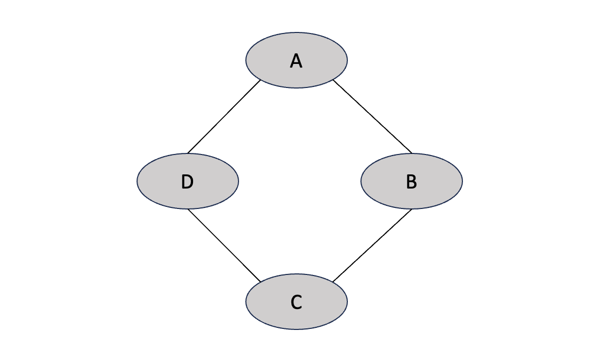

# Markov Networks

Earlier, we explored Bayesian Networks, which belongs to a family of graphical models that uses directed graphs. We also see that some distributions may have independence assumptions that cannot be perfectly represented by the structure of a Bayesian network.  

There exists another technique for compactly representing and visualizing a probability distribution that is based on the language of undirected graphs. This class of models can compactly represent independence assumptions that directed models cannot represent. Undirected graphical models are typically called Markov networks, or also Markov random field. 

We are going to start by talking about the simplest subclass of those which is pairwise Markov networks and we’re going to generalize it.

# Pairwise Markov Networks

Pairwise Markov networks are a subclass of Markov networks that represent distributions where all of the factors are over single variables or pairs of variables.

The above diagram is a model for four students, **A**lice, **B**ob, **C**harles and **D**ebbie, who get together in pairs to work on their homework for a class. The random variables indicate whether these students have a misconception about the homework or not (binary assignment). The pairs that meet are shown via the edges in the undirected graph. Note that the edges connecting the nodes are bidirectional. 

We are interested in building a model for all four individuals and that amounts to specifying $P(A,B,C,D)$. However, the key issue with parameterizing a Markov network is that the edges are undirected, i.e. we no longer have the notion of a conditional probability distribution. We’re therefore going to use the general notion of a factor.

Notice that these factors are not in the range of 0-1. Now, what do these factors mean? These factors are compatibility factors which capture the affinities between adjacent variables.

- $\phi_1(A,B)$ asserts that is more likely that Alice and Bob agree. It also adds more weight for the cases where they are both right then both wrong.
- $\phi_2(B,C)$ describes that it is more likely for Bob and Charles to agree and assigns weights to the joint assignments where they are both right and both wrong equally
- $\phi_4(D,A)$ has the same assertion as $\phi_2(B,C)$, except for Debbie and Alice
- $\phi_3(C,D)$ indicates that Charles and Debbie tend to argue, so the most likely joint assignments are those where they end up disagreeing.

To define a global model that specifies $P(A,B, C,D)$, we can multiply these factors together:

$$
\tilde{p}(A, B, C, D) = \phi_1(A,B) \phi_2(B, C) \phi_3(C, D) \phi_4(D, A)
$$

Note that $\tilde{p}$ denotes an unnormalized joint distribution. Thus, we need to normalize it to define a legal distribution. Specifically, we define

$$
P(A, B, C, D) = \frac{1}{Z}\phi_1(A,B) \phi_2(B, C) \phi_3(C, D) \phi_4(D, A)
$$

where

$$
Z = \sum_{A, B, C, D}\phi_1(A,B) \phi_2(B, C) \phi_3(C, D) \phi_4(D, A)
$$

is a normalizing constant known as the partition function. 

Let’s try to better understand what factors actually mean in the context of undirected graphs. To elaborate on this, let me show you the marginal probability of $A$ and $B$, i.e. $P(A,B)$, derived from our joint distribution.

Observe that this marginal probability distribution does not respect $\phi_1(A,B)$ which asserts that Alice and Bob prefer to agree with each other. Let’s take a moment to think about why that is. The joint probability distribution is derived from the product of all the four factors.

We can see that $\phi_1(B, C)$ indicate that the affinity for Bob and Charles to agree with each other is really strong (circled in blue). We observe the same for Debbie and Alice via $\phi_4(D,A)$. $\phi_3(C,D)$ asserts that Charles and Debbie strongly prefer to disagree (circled in orange). Note that the weights in these three factors are much stronger than that in $\phi_1(B,C)$. So the marginal probability of $A$ and $B$, i.e. $P(A,B)$, is some kind of complicated aggregate of these different factors that compose the Markov network. There isn’t a natural mapping to infer the joint distribution from the factors. This is in direct contrast to Bayesian networks where we can look at the individual CPDs to tell what the joint distribution between adjacent variables will look like.

## Formal Definition

With that intuition, we can go ahead and provide a formal definition for pairwise Markov networks. A pairwise Markov network is an undirected graph whose nodes are $X_1, \dots, X_n$ and each edge $X_i - X_j$ is associated with a factor $\phi_{ij}(X_i - X_j)$, i.e. the scope of each factor has two or less variables.

The Pairwise Markov property states that any two non-adjacent variables are conditionally independent given all other variables. We can decompose our earlier joint distribution of the student model as such:

$$
P(A, B, C, D) = \left[\frac{1}{Z}\phi_1(A,B) \phi_2(B, C)\right] \phi_3(C, D) \phi_4(D, A)
$$

From this decomposition, we can infer the pairwise Markov property from our student model, that is

$$
P \models (A {\perp\kern-5pt\perp} C | B,D), \quad P \models (B {\perp\kern-5pt\perp} D | A, C)
$$

# Gibbs Distribution

Earlier, we explored the notion of pairwise Markov networks. Unlike the pairwise case which is restricted to factors with scope of two variables, we’re going to define a much more general notion that is considerably more expressive. That is, the Gibbs distribution, or also called Boltzmann distribution. 

A distribution $P_\Phi$ is a Gibbs distribution parameterized by a set of factors $\Phi = \set{\phi_1(D_1), \dots, \phi_k(D_k)}$, where each $\phi_i$ has a particular scope $D_i$, and its distribution is defined as follows:

$$
P_\Phi(X_1, \dots, X_n) = \frac{1}{Z}\prod_{i=1}^k\phi_i(D_i)
$$

where $Z$ is the partition function that normalizes the distribution.

## Induced Markov Network

Let’s think about how we would construct a Markov network if given a particular set of factors. Let’s say we have 4 random variables, $A, B, C, D$ and we are given this set of factors:

$$
{\color{royalblue}\phi_1(A, B, C)}, \quad {\color{red}\phi_2(B, C, D)}
$$

What edges should we draw in the Markov random field if $A, B, C$ get to influence one another and $B, C, D$ get to influence on another? Intuitively, we will draw edges connecting the corresponding random variables in a factor to one another.

And the above shows the Markov network induced by these factors. 

More generally, given a set of factors, $\Phi = \set{\phi_1(D_1), \dots, \phi_K(D_k)}$, the induced Markov network $H_\Phi$ should have an edge $X_i - X_j$ whenever there exists a factor $\phi_m$ such that $X_i$ and $X_j$ are both within its scope. Or more formally, whenever

$$
\exists \phi_m \in \Phi, X_i, X_j \in D_m
$$

## Factorization

Now let’s define when a distribution $P$ factorizes over a Markov network $H$. We say that $P$ factorizes over $H$ if there exists $\Phi = \set{\phi_1(D_1), \dots, \phi_K(D_k)}$ s.t. $P= P_\Phi$ and $H$ is the induced graph for $\Phi$.

Observe the following Markov network:

Would you be able to tell the set of factors that parameterize this network? The answer is no. For example,

1. $\Phi_i = \set{\phi_1(A,B,D), \phi_2(B,C,D)}$
2. $\Phi_j = \set{\phi_1(A,B), \phi_2(B,C), \phi_3(C,D), \phi_4(A,D), \phi_5(B,D)}$
3. $\Phi_k = \set{\phi_1(A,B,D), \phi_2(B,C), \phi_3(C,D)}$

all three sets of factors $\Phi_i, \Phi_j, \Phi_k$ would have induced the Markov network above. What that tells us is that we can have different factorizations, each with their own expressive power, that induce the exact same graph, making it impossible to read factorization from a network.

## Active Trails

Even though we cannot read factorization from a graph, the graph tells us about the flow of influence in between the nodes, which is consistent regardless of the combination of factors that induced it. In other words, the trails in the graphs through which influence can flow is the same regardless of the finer grain structure of the factorization, which is why the induced graph is the same.

So let’s formalise this intuition by defining the notation of an active trail in a Markov network. A trail $X_1 - \ldots - X_n$ is active given a set of observation $Z$ if no $X_i$ is in $Z$.

For example, given that $A$ is observed, then $D \rightarrow A \rightarrow B$ is no longer an active trail, i.e. $D$ can no longer influence $B$ through $A$.

# Conditional Random Fields

Now, let’s introduced an important case of Markov networks called a Conditional Random Field (CRF) that are important when we need to deal with task-specific prediction. So far, we have described the Markov network representation as encoding a joint distribution over $X = \set{X_1, \dots, X_n}$. In some settings such as supervised learning, we are given an observation $X$ and we want to predict an output $Y$. In these case, the joint distribution between $X$ and $Y$, i.e. $P(X, Y)$, is not important to us. Rather, we want to model the conditional distribution of $Y$ given $X$, i.e. $P(Y|X)$. 

](images/Untitled%207.png)

Image from [Stefano Ermon](https://ermongroup.github.io/cs228-notes/representation/undirected/)

In order to motivate a CRF, let’s consider the example of trying to predict a word given a sequence of $N$ grayscale drawings in the form of pixel matrices. The output of our predictor is a sequence of alphabet letters, $y_i \in \set{a, b,\dots, z}, \quad i \in N$. So our goal is to solve this kind of text prediction problem, you may ask why don’t we just use a build a neural network classifier to do so? Well, the issue with these types of model is that each output node is typically considered independently of others, assuming conditional independence given the input. This is because neural networks typically don't inherently capture dependencies between the output nodes unless explicitly designed to do so (e.g., through a sequence model like an LSTM or GRU). 

In the above example, the true label of the second letter is hard to tell; it can be either a ‘U’ or a ‘V’. However, when we put the entire input into consideration and see that its neighbours are ‘Q’ and ‘E’, we will infer that ‘U’ is the more likely label. One way to correct these assumptions would be to add edges in between input variables to capture dependencies in between each input letter. But finding out how these letters are correlated is difficult and furthermore trying to put in these correlations can give rise to densely connected models that can make computation of the joint distribution intractable. 

That is the reason why CRFs are useful because it focuses solely on the conditional distribution of $Y$ given $X$. The role of $X$ is that of a condition; we need to be overly concerned about the distribution over $X$. CRFs capture the dependencies in $X$ indirectly by considering the influence of $X$ when predicting each $Y_i$ individually. This allows us to have models with highly expressive features, while at the same time abstracting away the burden of encoding the dependencies in $X$, particularly when there is concern about making incorrect assumptions regarding the dependencies between variables.

> The fact that we avoid encoding the distribution over the variables in X is one of the main strengths of the CRF representation. This flexibility allows us to incorporate into the model a rich set of observed variables whose dependencies may be quite complex or even poorly understood. It also allows us to include continuous variables whose distribution may not have a simple parametric form. This flexibility allows us to use domain knowledge in order to define a rich set of features characterizing our domain, without worrying about modeling their joint distribution. —  *Koller and Friedman, 2009*
> 

## Formal Definition

A CRF is parameterized by a set of factors $\Phi = \set{\phi_1(D_1), \dots, \phi_k(D_k)}$ and its unnormalized joint distribution of $X$ and $Y$ is given by

$$
\tilde P_\Phi(X,Y) = \prod_{i=1}^k\phi_i(D_i)
$$

So far, our definition is not different from that of the Gibbs distribution, other than the trivial use of $X, Y$ as arguments rather than an arbitrary set of random variables. This is where the distinction comes in. If we want to model the conditional distribution of $Y$ given $X$, then we would need a partition function over $X$ only 

$$
Z_\Phi(X) = \sum_Y\tilde P_\Phi(X,Y)
$$

This means that for an given $x \in X$, we sum over all corresponding assignments to $Y$. As such, divide the joint distribution over this partition function to construct the conditional distribution:

$$
P_\Phi(Y|X) = \frac{\tilde P_\Phi(X,Y)}{Z_\Phi(X)}
$$

# Independencies in Markov Networks

So, we’ve previously shown the connection between independencies and the factorization of the distribution in the context of Bayesian networks. Now, we’re going to demonstrate that the same kind of connection holds in the case of Markov networks.

Definition: $X$ and $Y$ are separated in Markov network $H$ given an observation $Z$ if there is no active trail in $H$ between $X$ and $Y$

This means that as long as there are any path of unobserved variables between $X$ and $Y$, then $X$ and $Y$ can influence each other. Conversely, if every trail between $X$ and $Y$ has a variable within $Z$, then they are separated.

For example, in the above Markov network, the orange nodes are observed and the gray nodes are not. We can see the following independence assertions:

1. $E \perp D | B, C$
2. $E \perp A | B, C$
3. $F \perp D | B, C$
4. $F \perp A | B, C$

Now, we can proceed to use almost identical theorems we proved previously for Bayesian networks in the context of Markov networks, with some minor modifications.

**Theorem 1 (Factorization ⇒ Independence)**: If $P$ factorizes over $H$, and $\text{sep}_H(X,Y|Z)$, then $P \models (X\perp Y|Z)$

We can also use similar notion as before and let $I(H)$ be the set of all separated variables in Markov network $H$, i.e.

$$
I(H) = \{(X \perp Y | Z): \text{sep}_H(X,Y|Z)\}
$$

**Theorem 2 (Factorization ⇒ Independence)**: If $P$ factorizes over $H$, then $H$ is an $I$-map (independence map) of $P$.

In other words, if $P$ factorizes over $H$, we can read from $H$ about independencies in $P$, i.e. $I(H) \subseteq I(P)$. 

However, unlike in the Bayesian networks, the converse only holds for the context of Markov networks for a positive distribution $P$ due to the Hammersley-Clifford Theorem. Which means we have,

**Theorem 3 (Independence ⇒ Factorization): G**iven a positive distribution $P$, if $H$ is a $I$-map for $P$, then $P$ factorizes over $H$.

# Factor Graphs

It is often useful to view MRFs where factors and variables are explicit and separate in the representation. A factor graph is one such way to do so. A factor graph is a graph containing two types of nodes: one type corresponds, as usual, to random variables; the other corresponds to factors over the variables.

Factor graphs make explicit the structure of the factors in the network. For example, in a fully connected pairwise Markov network, the factor graph would contain a factor node for each $n \choose 2$ pairs of nodes. For better visualization, take a look at the factor graph for the pairwise Markov network shown below:

This view allows us to easily visualize the factor dependencies between variables because edges go between factors and variables that those factors depend upon. In the future, we will explore how factor graphs also aid us in computing probability distributions.

# Local Structure in Markov Networks

Although factor graphs makes the factor dependencies more explicit, they still encode factors as complete tables over the scope of the factor. 

Local structure that doesn’t involve full table representations is important for both directed and undirected models. But how do we incorporate these type of local structure into undirected models? The framework for that is called log-linear models.

## Log-Linear Models

Our goal is to convert our factors into a representation that does not involve full tables. In the original representation of the unnormalized distribution, we define

$$
\tilde P = \prod_i\phi_i(D_i)
$$

as a product of factors $\phi_i(D_i)$, which is potentially a full table. To shift the table representation to a linear representation, we represent it in the form of a function whose logarithm equals a linear combination of the parameters of the model. Specifically, the $\tilde P$ for the Markov network can be converted to the following representation

$$
\tilde P = \exp(-\sum_jw_jf_j(D_j))
$$

where $f_j$  is an arbitrary feature that describes the compatibility between the variables in $D_j$ and $w_j$ are weights. This is a little abstract so let’s try to understand it by taking a look at how we can represent table factors using a log-linear model.

Given a factor $\phi$ over two binary random variables $X_1, X_2$, the full table factor is parameterized by 4 possible joint assignments of random variables, i.e.

$$
\phi(X_1, X_2) = 
\begin{pmatrix}
a_{00} & a_{01} \\
a_{10} & a_{11} \\
\end{pmatrix}
$$

We can represent this model in a log-linear representation using a set of indicator features of the form

$$
f_{kl}(X_1, X_2) = \mathbf{1}\set{X_1 = k, X_2 = l} 
$$

where $\mathbf{1}\set{X_1 = a, X_2 = b}$ is an indicator function that takes the value 1 when $X_1 =a, X_2=b$ and 0 otherwise, i.e.

$$
\mathbf{1}\set{X_1 = k, X_2 = l} = 
\begin{cases}
1 \quad X_1 = k, X_2 = l\\
0 \quad \text{otherwise}
\end{cases}
$$

As such, we introduce one feature for each possible joint assignment of $X_1$ and $X_2$, which comprises of

$$
\begin{align} \notag
f_{00}(X_1, X_2) = \mathbf{1}\set{X_1 = 0, X_2 = 0}\\ \notag
f_{01}(X_1, X_2) = \mathbf{1}\set{X_1 = 0, X_2 = 1}\\ \notag
f_{10}(X_1, X_2) = \mathbf{1}\set{X_1 = 1, X_2 = 0}\\ \notag
f_{11}(X_1, X_2) = \mathbf{1}\set{X_1 = 1, X_2 = 1}
\end{align}
$$

And so if we want to represent $\phi(X_1, X_2)$ using a log-linear model, we can sum up all weighted features and take the exponent of the negative value.

$$
\phi(X_1, X_2) = \exp(-\sum_{kl}w_{kl}f_{kl}(X_1, X_2))
$$

When $X_1 = 0$ and $X_2 = 0$, we see that $\phi(X_1,X_2) = \exp(-w_{00})$. Similarly, when $X_1 = 0$ and $X_2 = 1$, $\phi(X_1,X_2) = \exp(-w_{01})$. You see the point here. If we let $w_{kl}$ be the negative log of the corresponding entry $a_{kl}$ in the factor table, i.e. $w_{kl} = -\ln a_{kl}$, then we recover the original factor

$$
\exp(-w_{kl}) = \exp(\ln a_{kl}) = a_{kl} = \phi(X_1 = k, X_2 =l)
$$

## Shared Features in Log-Linear Models

When covering Bayesian networks, we explored how we often share structures and parameters via template models. Eliciting parameters in an undirected model is difficult because they don’t directly represent conditional probabilities or probabilities. This makes it easier to represent them as sort of templates that are comprised of smaller building blocks, making the sharing of features ubiquitous among undirected models as well. Now, we will be exploring how we can share parameters in log-linear models.

Same feature and weight can be shared and applied over many scopes in log-linear models. Generally, for a feature $f_k$ that we plan to repeatedly use across the model, we define a set of scopes $\text{Scopes}[f_k]$ for which we like it to be applied. And so, for each scope $D_k \in \text{Scopes}[f_k]$ we have a term $w_kf_k(D_k)$ in the energy function
