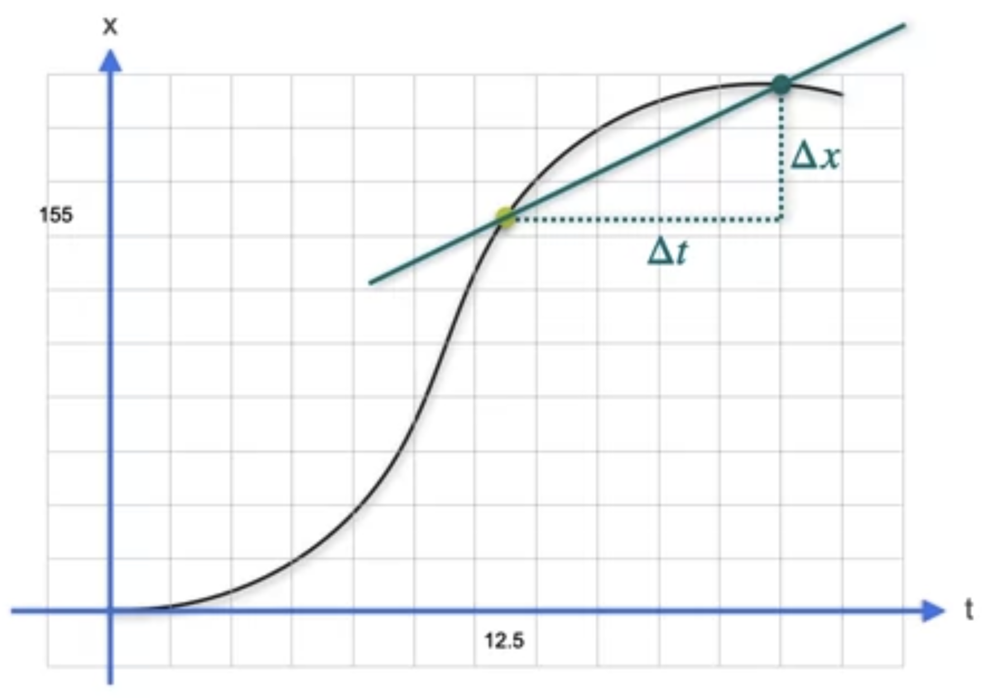

# Derivatives

In mathematics, the derivative shows the sensitivity of change of a function’s output with respect to the input. But what exactly does that mean?

From Physics class in high school, we all learnt to calculate the average velocity over an interval, which is the change of distance (or displacement) over change in time, i.e.

$$
v = \frac{\Delta x}{\Delta t} = \frac{s(t_2) - s(t_1)}{t_2 - t_1}
$$

where $s$ is a function that returns the distance $x$ at a certain time $t$.

. Please check out his series!](images/derivatives_(3).gif)

Clip taken from [3Blue1Brown’s Youtube](https://www.youtube.com/watch?v=9vKqVkMQHKk&list=PL0-GT3co4r2wlh6UHTUeQsrf3mlS2lk6x&index=2). Please check out his series!

This allows us to find the slope (rate of change) between two points, but what if I want to find the slope at a single point? To do so, you will have to make the difference in the time $t$ so small and measure the corresponding change in distance $x$. This gives us the derivative, or often described as the **“instantaneous rate of change”** 

$$
s'(t) = \frac{dx}{dt} = \lim_{\Delta t\to 0}\frac{s(t + \Delta t) - s(t)}{\Delta t}
$$

In other words, the derivative of $s$ equals to the limit of the average rate of change in distance over time $\frac{s(t + \Delta t) - s(t)}{\Delta t}$ as the difference in time $\Delta t$ approaches zero.

Geometrically, the derivative at a point represents the **slope of the tangent line to the curve** representing the function at that specific point.

Note that it is kinda paradoxical to call it the instantaneous rate of change because how can change be instantaneous if it is something measured over an interval? Perhaps a better way to understand it would that it is the **best possible linear approximation of the change at a certain point**.

## Derivatives and their notation

Given a function $f$ where

$$
y = f(x)
$$

how do we denote its derivative? Both the notations below are accepted and used depending on the given context

<ins>Leibniz’s Notation</ins>

$$
\frac{df}{dx}(x) = \frac{d}{dx}f(x) = \frac{dy}{dx}
$$

- **Note**: $\frac{dy}{dx}$ is a noun, it is the thing you get after taking the derivative of $y$ over $x$. $\frac{d}{dx}$ is a verb, it says “take the derivative of the subsequent term with respect to $x$”

Higher derivatives are written as

$$
\frac{d^2y}{dx^2}, \frac{d^3y}{dx^3}, \frac{d^4y}{dx^4},\dots, \frac{d^ny}{dx^n}
$$

<ins>Lagrange’s Notation</ins>

$$
f'(x)
$$

Higher derivatives are written as

$$
f''(x), f'''(x), f^{(4)}x,\dots , f^{(n)}x
$$

## Power Rule

The power rule is used to differentiate functions of the form $f(x) = x^r$, where $r$ is a real number, such that

$$
f'(x) = rx^{r-1}
$$

Let’s try to visualise and understand this formula using several powers of $x$

<ins>Derivative of a Constant, $x^0$</ins>

Given the function,

$$
y = f(x) = c
$$

The slope of the function is always flat, i.e.

$$
\frac{dy}{dx} = \frac{c - c}{x_1 - x_0} = 0
$$

<ins>Derivative of a Line</ins>

Given the function,

$$
y = ax +b
$$

We can see that the slope of the function is constant, i.e.

$$
\frac{dy}{dx} = \frac{(ax_2 + b) - (ax_1+b)}{ax_2 - ax_1} = a
$$

<ins>Derivative of Quadratic functions</ins>

Given the function,

$$
y = f(x) = x^2
$$

The slope of the function between two points is given by

$$
\begin{align}
\notag
\frac{\Delta y}{\Delta x} &= \frac{f(x + \Delta x) - f(x)}{\Delta x} \\ \notag
&= \frac{(x + \Delta x)^2 - x^2}{\Delta x} \\ \notag
&= \frac{x^2 + 2x\Delta x + \Delta x^2 - x^2}{\Delta x} \\ \notag
&= \frac{2x\Delta x + \Delta x^2}{\Delta x} \\ \notag
&= 2x + \Delta x
\end{align}
$$

As $\Delta x$ approaches zero,

$$
\frac{dx}{dy} = 2x
$$

<ins>Derivative of Cubic Functions</ins>

Given the function,

$$
y = f(x) = x^3
$$

The slope of the function between two points is given by

$$
\begin{align}
\notag
\frac{\Delta y}{\Delta x} &= \frac{f(x + \Delta x) - f(x)}{\Delta x} \\ \notag
&= \frac{(x + \Delta x)^3 - x^3}{\Delta x} \\ \notag
&= \frac{x^3 + 3x^2\Delta x + 3x\Delta x^2 + \Delta x^3 - x^3}{\Delta x} \\ \notag
&= \frac{3x^2\Delta x + 3x\Delta x^2 + \Delta x^3}{\Delta x} \\ \notag
&= 2x^2 + 3x\Delta x + \Delta x^2
\end{align}
$$

As $\Delta x$ approaches zero,

$$
\frac{dx}{dy} = 2x^2
$$

<ins>Derivative of $x^{-1}$</ins>

Given the function,

$$
y = f(x) = x^{-1} = \frac{1}{x}
$$

The slope of the function between two points is given by

$$
\begin{align}
\notag
\frac{\Delta y}{\Delta x} &= \frac{f(x + \Delta x) - f(x)}{\Delta x} \\ \notag
&= \frac{(x + \Delta x)^{-1} - x^{-1}}{\Delta x} \\ \notag
&= \frac{\frac{1}{x + \Delta x} - \frac{1}{x}}{\Delta x} \\ \notag
&= \frac{\frac{x -x -\Delta x}{x(x + \Delta x)}}{\Delta x} \\ \notag
&= -\frac{1}{x^2 +x\Delta x}
\end{align}
$$

As $\Delta x$ approaches zero,

$$
\frac{dx}{dy} = -\frac{1}{x^2} = -x^{-2}
$$

## Derivative of Inverse Functions

In mathematics, the inverse function of a function $f$ is a function that undoes the operation of $f$. The inverse of $f$ exists if and only if $f$ is bijective, i.e. every unique input $x$ has a unique output $y$ and vice versa.

For example, if $f: \R \rightarrow \R$ is defined by

$$
f(x) = x^2
$$

The inverse function $g: \R \rightarrow \R$ must fulfil

$$
g(f(x)) = x
$$

As such,

$$
g(y) = \sqrt{y}
$$

From the graph, we see that for the corresponding points $x$ and $y$ where $f(x) = y$ and $g(y) = x$, there’s an inverse relationship between their derivatives. This means that

$$
f'(x) = \frac{dy}{dx}
$$

and

$$
g'(y) = \frac{dx}{dy}
$$

Therefore

$$
g'(y) = \frac{1}{f'(x)}
$$

and it follows that

$$
g'(y) = \frac{1}{f'[(g(y)]}
$$

## Derivative of Trigonometric Functions

When plotting the graph of $f(\theta) = sin(\theta)$ and $g(\theta) = cos(\theta)$, we notice that

$$
f'(\theta) = \frac{d\sin\theta}{d\theta} = \cos{\theta}
$$

and that

$$
g'(\theta) = \frac{d\cos\theta}{d\theta} = -\sin\theta
$$

But is there a more intuitive way to understand this? Let’s first try to understand what these trigonometric functions even mean

](images/Untitled%209.png)

Image from [Lumen Learning](https://courses.lumenlearning.com/ccbcmd-math-1/chapter/unit-circle/)

The sine of the angle allows us to know the $y$-coordinate of the point along a circle and the cosine of the angle allows us to know the $x$-coordinate of the point along the circle. As we learnt in high school,

$$
\begin{align}
sin\theta = \frac{Opp.}{Hyp.} \\\
cos\theta = \frac{Adj.}{Hyp.}
\end{align}
$$

Given a unit circle (radius equals 1), the sine and cosine values are directly equal to the height and width of the triangle as the hypotenuse is always equal to 1.

Now, let’s try to understand what $f'(\theta) = \frac{d\sin\theta}{d\theta}$ means. It basically says for a infinitesimal nudge $d\theta$, what is the $dsin\theta,$ at a particular point

](images/Untitled%2010.png)

Image from [robjohn on Mathematics Stack Exchange](https://math.stackexchange.com/questions/281893/how-to-find-the-derivative-of-the-sine-from-the-definition-of-derivative/282041#282041)

And we can see on the image above, the change in height $dsin(\theta)$ is the adjacent of a tiny triangle formed by the straight-line approximation of the nudge $d\theta$ along the circumference and the angle of this triangle is also the original $\theta$. Therefore, we can see that

$$
f'(\theta) = \frac{d\sin \theta}{d\theta} = \frac{Adj.}{Hyp.} = cos\theta
$$

What about $g'(\theta)$? Using the same logic, $dcos\theta$ will be the opposite of the tiny triangle but in the **negative** direction, which means

$$
g'(\theta) = \frac{d\cos \theta}{d\theta} = \frac{-Opp.}{Hyp.} = -sin\theta
$$

This logic holds regardless of whichever quadrant of the circle you are visualising from!

## Derivative of Exponents

Given

$$
f(x) = a^x
$$

We want to differentiate this

$$
\begin{align} \notag
f'(x) &= \lim_{h \to 0} \frac{f(x+h) - f(x)}{h} \\ \notag
&= \lim_{h \to 0} \frac{a^{x+h} - a^x}{h} \\ \notag
&= \lim_{h \to 0} \frac{a^{x}a^h - a^x}{h} \\ \notag
&= \lim_{h \to 0} \frac{a^{x}(a^h - 1)}{h} \\ \notag
&= a^{x}\lim_{h \to 0} \frac{a^h - 1}{h}
\end{align}
$$

But what is 

$$
\lim_{h \to 0} \frac{a^h - 1}{h}
$$

Turns out it there is a magic number called the Euler’s number, denoted as $e$, such that 

$$
\lim_{h \to 0} \frac{a^h - 1}{h} = ln(a)
$$

As such

$$
\frac{d}{dx}2^x = 2^xln(x)
$$

## Euler’s number $e$

The number $e$, also known as **Euler’s number**, is a mathematical irrational constant equal to $2.71828\dots$

Let’s take the look at the function

$$
f(n) = (1 + \frac{1}{n})^n
$$

As the value of $n$ approaches infinity, we see that $f$ approaches $e$

| n | 1 | 10 | 100 | 100 | ∞ |
| --- | --- | --- | --- | --- | --- |
| f(n) | 2 | 2.594 | 2.705 | 2.717 | 2.718 |

Therefore,

$$
e = \lim_{h \to 0}(1 + \frac{1}{n})^n
$$

$e$ has a very unique property where

$$
f(x) =e^x = f'(x)
$$

<ins>Natural Logarithm</ins>

The **natural logarithm** of a number is its logarithm to the base of the mathematical constant $e$. The natural logarithm of $x$ is generally written as $\ln{x}$, $\log_e{x}$, or simply $\log{x}$ when the base $e$ is implicit. Since the logarithm is the inverse function to exponentiation, if

$$
f(x) = e^x
$$

then there exists the inverse function

$$
g(x) = \log_ex
$$

such that

$$
g(f(x)) = e^{\log_e{x}} = x
$$

Given our knowledge of the derivatives of inverse functions, since

$$
f'(x) = e^x
$$

then the derivative of $g$ must be

$$
g'(x) = \frac{1}{f'[g(x)]} = \frac{1}{e^{\log_e{x}}} = \frac{1}{x}
$$

## Existence of the derivative

A **differentiable function** is a function such that its derivative exists at each point in its entire domain. A differentiable function is **smooth** (the function is locally **well approximated as a linear function** at each point) and does not contain any 

1. cusp or angles
2. jump discontinuities
3. vertical tangents

$$
f(x) = |x|
$$

For example, the above function is not differentiable at $x = 0$ because there is a cusp.

$$
f(x) = 
\begin{cases}
2, \space \text{if x }\lt -1 \\\
x + 1, \space \text{if x }\ge -1 \\
\end{cases}
$$

The above function is a **piecewise function** which has a jump discontinuity, making it non-differentiable as well.

Lastly, the above function has a **vertical tangent** at $x = 0$, which means the function cannot be approximated as a linear function at that point → derivative is not well defined

## Properties of the derivative

<ins>Multiplication by Scalars</ins>

If there exist functions

$$
g(x) = kf(x)
$$

where $k$ is a scalar, then

$$
g'(x) = kf'(x)
$$

This is pretty intuitive because the slope of $g$ (rate of change) should $k$ times that of $f$ at every point $x$

<ins>The Sum Rule</ins>

If there exist functions

$$
f(x) = g(x) + h(x)
$$

then

$$
f'(x) = g'(x) + h'(x)
$$

This is also pretty intuitive. Since, $f(x) = g(x) + h(x)$, the rate of change of $f$ should be the sum of the rate of change of $g$ and $h$ at any point $x$ 

<ins>The Product Rule</ins>

Given the functions

$$
f(x) = g(x) \cdot h(x)
$$

then

$$
f'(x) = g'(x)\cdot h(x) + h'(x) \cdot g(x)
$$

For example,

$$
\frac{d}{dx}sin(x)x^2 = cos(x)x^2 + 2xsin(x)
$$

For the intuition behind product rule, please watch [3Blue1Brown’s explanation](https://www.youtube.com/watch?v=YG15m2VwSjA&list=PL0-GT3co4r2wlh6UHTUeQsrf3mlS2lk6x&index=4)

<ins>The Chain Rule</ins>

Given the function composition

$$
f(t) = g(h(t))
$$

then

$$
\begin{align} \notag
f'(t) &= \frac{dg}{dh} \cdot \frac{dh}{dt} \\ \notag 
&= g'(h(t)) \cdot h'(t)
\end{align}
$$

Why is that so? Here’s an intuitive explanation. 

Let’s pretend $h(t) = 2t$ represents

> The distance (km) travelled by a bicycle is twice the time $t$ (h)
> 

and $f = g(h) = 2h$ represents

> The distance (km) travelled by a car is twice the distance (km) travelled by the bicycle
> 

Therefore, $f'(t)$ represents

> The instantaneous rate of change of distance travelled by car relative to time → the speed of the car (km/h)
> 

Let’s say $t = 1$. To find out $f'(t)$, I have to first find out how much the bicycle has travelled which is

$$
\text{Distance by bicycle} = h(t) = 2km
$$

and how fast the bicycle is going which is

$$
\text{Speed of bicycle at time t} = h'(t) = 2km/h
$$

Then, I have to find out how the distance travelled by car 

$$
\text{Distance by car} = g(h(t)) = \text{Distance by bicycle} \times 2 = 4km
$$

Therefore, the speed of the car is

$$
\text{Speed of car at time t} = f'(t) = 4km/h
$$

We can see that

$$
\begin{align}
f'(t) &= \notag \text{Speed of car} \\\ \notag
&= \frac{d \space \text{Distance by car}}{d\space \text{Distance by bicycle}} \cdot \text{Speed of bicycle} \\\ \notag
&= \frac{dg}{dh} \cdot \frac{dh}{dt} \\\ \notag
&= g'(h(t)) \cdot h'(t) \\\ \notag
&= \frac{4km}{2km} \cdot 2km/h \\\ \notag
&= 4km/h
\end{align}
$$

Another explanation:

$\Delta t$: Nudge to the time →

$\Delta h = 2 \Delta t$: nudge to the distance travelled by bicycle by a multiple of 2 →

$\Delta g = 2 \Delta h = 4 \Delta t$: nudge to the distance travelled by car by a 4 →

$\frac{\Delta g}{\Delta t}$: change in distance of car with respect to time, i.e. the speed of the car, is 4

In extension,

$$
\frac{d}{dt}f(g(h(t))) = f'(g(h(t))) \cdot g'(h(t)) \cdot h'(t)
$$
