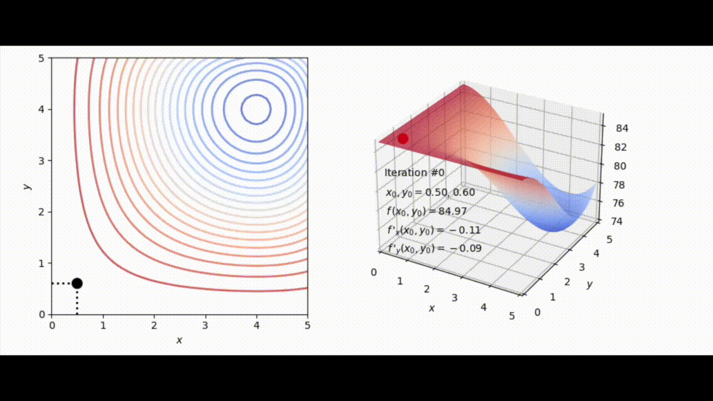

# Gradients

## Tangent Space

In two-dimensional spaces, the tangent is line and it represents a linear equation approximately describing the change of $y$ relative to change of $x$ at that point

/14%3A_Differentiation_of_Functions_of_Several_Variables/14.04%3A_Tangent_Planes_and_Linear_Approximations#:~:text=Definition%3A%20tangent%20planes,-Let%20S%20be&text=z%3Df(x0%2C,(y%E2%88%92y0).)](images/Untitled.png)

Image from [LibreTexts Mathematics](https://math.libretexts.org/Bookshelves/Calculus/Calculus_(OpenStax)/14%3A_Differentiation_of_Functions_of_Several_Variables/14.04%3A_Tangent_Planes_and_Linear_Approximations#:~:text=Definition%3A%20tangent%20planes,-Let%20S%20be&text=z%3Df(x0%2C,(y%E2%88%92y0).))

In three-dimensional spaces, the equation of the tangent involves three variables, making it a **tangent plane**.

## Partial Derivatives

In mathematics, a **partial derivative** of a function of several variables is its derivative with respect to **one** of those variables, with the others held **constant**. 

Given a function $f(x,y)$, the partial derivative of $f(x,y)$ with respect to $x$ is

$$
\frac{\partial f}{\partial x} = \lim_{h \to 0} \frac{f(x+h,y) - f(x,y)}{h}
$$

Notice how $y$ is a constant. Similarly

$$
\frac{\partial f}{\partial y} = \lim_{h \to 0} \frac{f(x,y+h) - f(x,y)}{h}
$$

Let’s try the calculating the partial derivatives for the function

$$
f(x,y) = x^2y + \sin y
$$

First, let’s keep calculate the partial derivative relative to $x$ by keeping $y$ as a constant

$$
\begin{align}
\frac{\partial f}{\partial x} &= \notag
\frac{\partial }{\partial x} (x^2y + \sin y) \\\ \notag
&= \frac{\partial }{\partial x} (x^2y) + \frac{\partial }{\partial x}(\sin y) \\\ \notag
&= 2xy +0 \\
\end{align}
$$

- **note**: $\frac{\partial }{\partial x}(\sin y) = 0$ because we fix $y$ as a constant

Similarly, we calculate partial derivative relative to $y$ by keeping $x$ as a constant

$$
\begin{align}
\frac{\partial f}{\partial y} &= \notag 
\frac{\partial }{\partial y} (x^2y + \sin y) \\\ \notag
&= \frac{\partial }{\partial y} (x^2y) + \frac{\partial }{\partial y}(\sin y) \\\ \notag
&= x^2 + \cos y \\
\end{align}
$$

## Gradient

Given the function $f$, its **gradient** is denoted by $\nabla f$ such that

$$
\frac{df}{d\theta} = \nabla f
$$

where $d\theta$ represents an infinitesimal displacement of the functions parameters $\theta$

When a coordinate system is used in which the basis vectors are not functions of positions (i.e. these vectors are fixed references regardless of the position in space), $\nabla$f is given by the vector whose components are the partial derivatives of $f$ at a point $p$. If $p = (x_1, x_2, \dots, x_n)$

$$
\nabla f(p)=
\begin{bmatrix}
\frac{\partial f}{\partial x_{1}}(p)\\\ 
\vdots \\\
\frac{\partial f}{\partial x_{n}}(p)
\end{bmatrix}
$$

Note that $\nabla f(p)$ only exists if it is differentiable at $p$

Let’s try to visualise it, given the function

$$
f(x,y) = x^2 +y ^2
$$

This is how the graph look like, it is a 3-dimensional plot as $x$ and $y$ are the input dimensions and $z$ is the output dimension.

By taking the partial derivatives of $f$ relative to $x$ and $y$, we get

$$
\nabla f = 
\begin{bmatrix}
\frac{\partial f}{\partial x} \\\
\\\
\frac{\partial f}{\partial y} \\
\end{bmatrix} =
\begin{bmatrix}
2x \\\
2y \\
\end{bmatrix}
$$

Now, let’s say we want to find out the tangent plane to the point $(2,1, f(2,1))$ represented by the purple circle

We know that the partial derivatives $\frac{\partial f}{\partial x} = 2x$ and $\frac{\partial f}{\partial y} = 2y$

$$
\frac{\partial f}{\partial x} = 2x \implies \frac{\partial f}{\partial x} = 4
$$

since $x = 2$

$$
\frac{\partial f}{\partial y} = 2y \implies \frac{\partial f}{\partial y} = 2
$$

since $y =1$

We know that the tangent plane represents a linear equation intersecting at a specific point $(x_0, y_0, z_0)$ of the curve, i.e.

$$
a(x - x_0) + b(y-y_0) + z_0 =z
$$

where $a$ and $b$ are scalars.

Let’s try to figure out what $a$ and $b$ are. Let $y = y_0$

$$
a(x-x_0) = z - z_0 \implies a = \frac{z-z_0}{x-x_0}
$$

We can see that $a$ is equal to the $\frac{\partial f}{\partial x}$. When we let $x = x_0$

$$
b(y-y_0) + z_0 =z \implies b = \frac{z-z_0}{y-y_0}
$$

we get $b$ is equal to the $\frac{\partial f}{\partial y}$

Therefore, this means that at the equation of the tangent plane is

$$
z - z_0 = 4(x - x_0) + 2(y-y_0)
$$

Substituting $x = 2$ and $y = 1$, we get

$$
z - z_0 = 4(x - 2) + 2(y-1)
$$

Solving $f(2,1)$ to get $z_0$, we have

$$
z - 5 = 4(x - 2) + 2(y-1)
$$

Let’s plot this function. We can see that it intersects $(2,1,5)$ and becomes the tangent plane!

Why the gradient is the direction of steepest ascent

The direction of the gradient vector $\nabla f(p)$ points in the direction of steepest ascent, i.e. the direction in which the function **increases most rapidly** at the given point.

But why is that so? Why does the combination of partial derivatives have anything to do with direction?

Let’s look at a function of three variables, $f(x,y,z)$

$$
\nabla f (x,y,z) = 
\begin{bmatrix}
\frac{\partial f}{\partial x} \\
\\
\frac{\partial f}{\partial y} \\ 
\\
\frac{\partial f}{\partial z} \\ 
\end{bmatrix}
$$

Let’s say we are at the point $p$. If we calculate the magnitude of the gradient vector at that point using the Euclidean norm,

$$
||\nabla f (p)|| = \sqrt{{\frac{\partial f}{\partial x}}^2 + {\frac{\partial f}{\partial y}}^2 + {\frac{\partial f}{\partial z}}^2}
$$

The norm measures the amount the function changes in its neighbourhood, it is only zero when gradient is the zero vector

The **directional derivative** measures the rate at which the function change in a particular direction at a given point

$$
\nabla_v f(p)=\lim_{h \to 0}{\frac {f(p +h \vec{v} )-f(p)}{h}}
$$

Basically it means the linear approximation of the change of $f$ if we move through $p$ at a velocity defined by a vector $\vec{v}$, i.e.

$$
\nabla_vf(p) = \nabla f (p) \cdot \vec{v}
$$

Since it is a dot product between two vectors, we know

$$
\nabla f(p) \cdot \vec{v} = ||\nabla f(p)||\space||\vec{v}||\cos\theta
$$

where $\theta$ is the angle between the velocity vector and gradient vector

If we want to travel from $p$ in the direction of greatest increase in $f$, we let $\theta = 0\implies \cos\theta = 1$ . Therefore $\vec{v}$ points in the same direction as the gradient vector

## Maxima, Minima and Saddle Points

Finding maxima and minima is the goal of mathematical **optimisation**. Given a function $f(x)$, 

- **Local Maximum**: We can say $f$ has a global maximum at $x'$ if $f(x') \geq f(x)$ for all $x$ in some **open interval** around $x^*$
- **Local Minimum**: We can say $f$ has a global maximum at $x'$ if $f(x') \leq f(x)$ for all $x$ in some **open interval** around $x^*$

The **derivative** of the function at local maxima and minima are **zero**. In mathematics, a **critical point** is the argument of a function where the function derivative is zero. Therefore, the local maxima and minima are critical points

What is a **saddle point** then? A saddle point is a critical point that is not a maxima or minima. 

Since all maximum, minimum and saddle points all have derivatives equal to zero, how do we tell them apart without look at the graph? We can distinguish them by using **second-derivative test** or **higher-order derivative test**, given sufficient differentiability.

Let’s take a look at the function $f(x,y) = x^2 + y^2$

The gradient of a **continuous** and **differentiable** multivariable function at a local maximum or minimum point will be the zero vector, which corresponds to the graph having a flat tangent plane. This means that the partial derivatives are zero at that point

$$
\nabla f(x,y) = 
\begin{bmatrix}
2x \\
2y 
\end{bmatrix} =
\begin{bmatrix}
0 \\
0 
\end{bmatrix}
$$

this means that $x = 0$ and $y = 0$ → the minimum point occurs at (0,0,0)

Global Minima/Maxima

What about global maxima and minima?

- **Global Maximum**: We can say $f$ has a global maximum at $x'$ if $f(x') \geq f(x)$ for all $x$ in $X$
- **Global Minimum**: We can say $f$ has a global minimum at $x'$ if $f(x') \leq f(x)$ for all $x$ in $X$

Note that global maxima and minima are **not necessarily** critical points. If the function is bounded (like the one above), global minimum and maximum can occur at the end of the intervals where the function derivative is not zero.

## Gradient Descent

In situations where our equations has hundred or million of variables, it becomes hard to solve for $\nabla f = 0$. That is where an approximate solution is valuable.

](images/Untitled%207.png)

Image from [poissonisfish](https://poissonisfish.com/2023/04/11/gradient-descent/)

Think of a **loss function** $f(\theta)$ that measures how inaccurate our machine learning model is at predicting the correct output and it defines some hilly terrain when graphed as a height map. We learnt that gradient evaluated at any point represents the direction of steepest ascent up this hilly terrain.

To minimise our losses, we can follow the negative of the gradient, i.e. adjust our parameters in the opposite direction of the gradient. This is known as **gradient descent**.

- **Note**: the important thing here is that we do not need to know where the local minima actually is, we just move small steps “downhill” iteratively until we find it.

In other words, gradient descent is an **iterative optimisation algorithm** for finding the local minimum of a function, It is an optimisation algorithm used to minimise some function by iteratively moving in the direction of the steepest descent (opposite of gradient). 

If we start at a point $\theta_0$ and calculate the gradient $\nabla f(\theta_0)$, we want to adjust our new point $\theta_1$ to be

$$
\theta_1 = \theta_0 - \nabla f(\theta_0)
$$

However, imagine if the slope at a point is very steep (gradient is large), then it is possible that we make such a big step downhill that we **overshoot** the minima

As such, we want to adjust the size of the steps we take such that we can be more secure in our path downhill (take more small steps). As such, we adjust the negative gradient using a scalar $\alpha$. In machine learning, this is known as the **learning rate**.

$$
\theta_1 = \theta_0 - \alpha\nabla f(\theta_0)
$$

But what makes a good learning rate?

For the gradient descent algorithm to reach the local minimum we must set the learning rate to an appropriate value, which is neither too low nor too high. This is important because if the steps it takes are too big, it may not reach the local minimum because it bounces back and forth between the convex function of gradient descent. If we set the learning rate to a very small value, gradient descent will eventually reach the local minimum but that may take a while

Let’s try an example. Given $f(x,y) = x^2 +y^2 - 6x$ and let the initial point be $x_0 = (0,1)$. Performing the gradient descent algorithm with learning rate = 0.1, which point will the first iteration lead us to?

- Step 1: Find the partial derivatives

$$
\begin{align}
\notag \nabla f = 
\begin{bmatrix}
\frac{\partial f}{\partial x} \\\
\\\
\frac{\partial f}{\partial y}
\end{bmatrix} =
\begin{bmatrix}
2x - 6 \\\
2y 
\end{bmatrix} \\ \notag
\implies \nabla f(0,1) = 
\begin{bmatrix}
-6 \\\
2
\end{bmatrix}
\end{align}
$$

- Step 2: Multiply the partial derivatives by the learning rate

$$
\alpha \nabla f(0,1) = 0.1
\begin{bmatrix}
-6 \\\
2
\end{bmatrix} =
\begin{bmatrix}
-0.6 \\\ 
0.2
\end{bmatrix}
$$

- Step 3: Find the next point

$$
x_1 = 
\begin{bmatrix}
0 \\\ 1
\end{bmatrix} -
\begin{bmatrix}
-0.6 \\\ 0.2
\end{bmatrix} =
\begin{bmatrix}
0.6 \\\ 0.8 
\end{bmatrix}
$$

Therefore, $x_1 = (0.6, 0.8)$