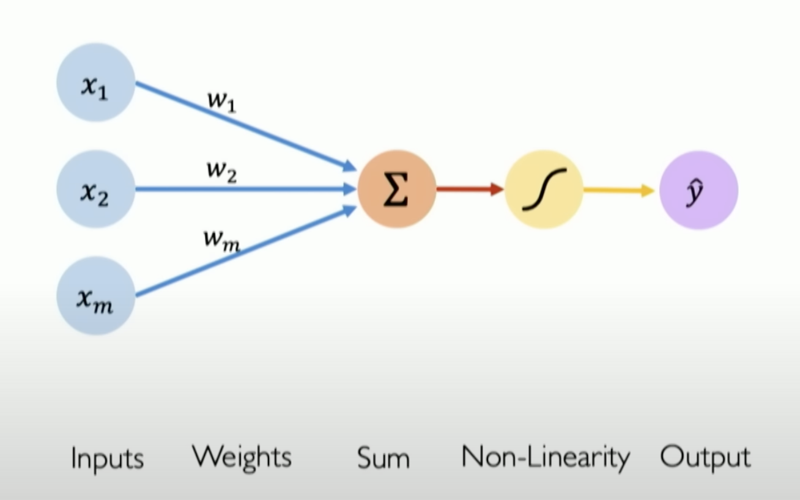

# Neural Networks

Perceptron is one of the simplest **a**rtificial neural network architectures. It is a simple feedforward (no recurrent connections) neural network consisting of connected nodes.

## Single-Layer Perceptron

A single layer perceptron takes several variables, $x_1,x_2,…,x_m$, and predicts a single output $\hat y$ based on a linear combination of these inputs followed by a non-linear function.

Weights, $w_1,w_2,…,w_m$, express the importance of the respective inputs to the output. The weighted sum of inputs $\sum_{j} w_jx_j$ added with a bias embodies a linear equation. The output of the linear equation is passed into a non-linear activation function to produce the final output $\hat y$. The equation of the output is as follow:

$$
\hat y = g(b+\sum_{i=1}^{m}x_iw_i)
$$

- $\hat y$: Output
- $g$: Non-linear activation function
- $b$: Bias
- $\sum_{i=1}^{m} x_iw_i$: Linear combination of inputs

### Activation Functions

Why do we need activation functions? Most relationships between input and output cannot be represented by a simple straight line. Therefore, by introducing non-linearity, the neural network is better able to understand complex patterns from data.

Moreover, non-linearity are useful when we want to constrain our data within a certain range (e.g. probability between 0 and 1)

A commonly used activation function is the **sigmoid function**.

$$
\sigma(z) = \frac{1}{1 + e^{-z}}
$$

It is useful because it transforms the input values to a range between 0 and 1. As such, this is useful for **binary classification** tasks such as predicting whether an image is more likely to be a dog (0) or a cat (1).

The derivative of the sigmoid function can be reduced to

$$
\frac{\partial d}{\partial z} \sigma (z) = \frac{1}{1+e^{-z}}\cdot (1 -\frac{1}{1+e^{-z}}) = \sigma(z)[1-\sigma(z)]
$$

which makes calculating the derivative or it really simple.

### Cost Functions

Now we have defined the components of a perceptron, how do we actually measure its performance? This is done by using **cost functions**, which measure how far the model’s predicted output is compared to the actual data. They are also called the **loss function**.

There are two types of cost functions, regression and classification. 

**Regression cost functions** are used when we are trying to predict a **continuous** value based on the input variables, for example salary of an employee, price of a car, loan prediction, etc. **Classification cost functions** are used when our output involves predicting a specific class (output is a probability).

Regression Cost Functions

1. **Mean Squared Error**

Mean Squared Error finds the average of the squared differences between the target and the predicted outputs

$$
MSE = \frac{1}{N}\sum_{i=1}^{N}(y-\hat y)^2
$$

where $N$ refers to the number of targets ($y$) and predictions ($\hat y$)

One disadvantage of this loss function is that it is very sensitive to outliers; if a predicted value is significantly greater than or less than its target value, this will significantly increase the loss.

1. **Mean Absolute Error**

Mean Absolute Error finds the average of the absolute differences between the target and the predicted outputs.

$$
MAE = \frac{1}{N}\sum_{i=1}^{N}|y-\hat y|
$$

Classification Cost Functions

1. **Binary Cross-Entropy Cost**

$$
\text{CE Cost} = -\frac{1}{N}\sum_{i=1}^{N}y_ilog(\hat {y_i}) + (1-y_i)log(1-\hat {y_i})
$$

where $N$ is the number of inputs and $y_i$ and $\hat {y_i}$ represents the ground truth and the predicted probability for the $i$-th input respectively

- When the ground truth $y_i$ is 1, the cross-entropy loss approaches 0 as the predicted probability p approaches 1.
- When the ground truth $y_i$ is 0, the the cross-entropy loss approaches 0 as the predicted probability p approaches 0.

While training a classification model, we would want the observation to be predicted with probability as close to the actual value (of 0 or 1) as possible. Hence, log-loss turns out to be a good choice for a loss function during training and optimising classification models, wherein farther away the prediction probability from its true value is, higher the prediction is penalised.

1. **Categorical Cross-Entropy Cost**

In cases where the number of classes is greater than two, we utilise categorical cross-entropy — this follows a very similar process to binary cross-entropy. If $M>2$ (i.e. multi-class classification), we calculate a separate loss for each class label per observation and sum the result. Then, we take an average of the sum of all the loss functions across the training set. This gives us the cost function:

$$
\text{CE Cost} = -\frac{1}{N}\sum_{i=1}^{N}\sum_{j=1}^{M}y_{ij}log(\hat {y_{ij}})
$$

- *N* is the number of inputs (samples or instances).
- *M* is the number of classes.
- $y_{ij}$ is the ground truth (actual) value, indicating whether the $i$-th input belongs to the $j$-th class. Typically, $y_{ij}$ is 1 if the $i$-th input belongs to class $j$ and 0 otherwise (one-hot encoded).
- $\hat{y_{ij}}$ represents the predicted probability that the $i$-th  input belongs to the $j$-th class as output by the model.

### Gradient Descent

Now we know the cost function that we want to **minimise**, ****let’s understand how we can minimise the loss by adjusting the weights and biases using gradient descent. To do so, we need to know the partial derivatives involved. Let’s take a look at the single-layer perceptron below.

The model has 2 input features $x_1,x_2$ with their corresponding weights $w_1, w_2$ and a bias. It is also a binary classification model with a sigmoid activation function. As such, we will use the binary cross-entropy cost function to optimise the model.

But how do we calculate these partial derivatives? The equation for the mode’s prediction $\hat y$ is given by

$$
\hat y = \sigma (b+x_1w_1 + x_2w_2)
$$

As we plan to minimise the function by updating the parameters which are the weights and bias, therefore the gradient constitutes of the following partial derivatives of the loss function relative to the weights and bias.

1. $\frac{\partial L}{\partial w_1}$: Derivative of loss relative to weight $w_1$
2. $\frac{\partial L}{\partial w_2}$: Derivative of loss relative to weight $w_2$
3. $\frac{\partial L}{\partial b}$: Derivative of loss relative to bias $b$

But how do we get these partial derivatives? From chain rule, we know that

$$
\begin{align} \notag
\frac{\partial L}{\partial w_1} = \frac{\partial L}{\partial \hat y}\cdot \frac{\partial \hat y}{\partial w_1} \\ \notag
\frac{\partial L}{\partial w_2} = \frac{\partial L}{\partial \hat y}\cdot \frac{\partial \hat y}{\partial w_2} \\ \notag
\frac{\partial L}{\partial b} = \frac{\partial L}{\partial \hat y}\cdot \frac{\partial \hat y}{\partial b}
\end{align}
$$

Therefore, we can derive the target partial derivatives by calculating the intermediaries $\frac{\partial L}{\partial \hat y}, \frac{\partial \hat y}{\partial x_1}, \frac{\partial \hat y}{\partial x_2}, \frac{\partial \hat y}{\partial b}$. For a single-input, the binary cross-entropy loss function is given by

$$
L(y,\hat y) = - ylog(\hat {y}) - (1-y)log(1-\hat {y})
$$

As such,

$$
\frac{\partial L}{\partial \hat y} = \frac{-y}{\hat y} + \frac{1-y}{1-\hat y} = \frac{-(y - \hat y)}{\hat y(1 - \hat y)}
$$

Recall that the derivative of the sigmoid function can be reduced to

$$
\frac{\partial d}{\partial z} \sigma (z) = \frac{1}{1+e^{-z}}\cdot (1 -\frac{1}{1+e^{-z}}) = \sigma(z)[1-\sigma(z)]
$$

Since $\hat y$ is the output from the sigmoid function, therefore the derivatives of $\hat y$ relative to the weights and bias are

$$
\begin{align} \notag
\frac{\partial \hat y}{\partial w_1} = \hat y(1- \hat y)x_1 \\ \notag
\frac{\partial \hat y}{\partial w_2} = \hat y(1- \hat y)x_2 \\ \notag
\frac{\partial \hat y}{\partial b} = \hat y(1- \hat y)
\end{align}
$$

Bringing everything together, the partial derivatives are

$$
\frac{\partial L}{\partial w_1} = \frac{\partial L}{\partial \hat y}\cdot \frac{\partial \hat y}{\partial w_1} = \frac{-(y - \hat y)}{\hat y(1 - \hat y)}\hat y(1- \hat y)x_1 = -(y - \hat y)x_1
$$

$$
\frac{\partial L}{\partial w_2} = \frac{\partial L}{\partial \hat y}\cdot \frac{\partial \hat y}{\partial w_2} = \frac{-(y - \hat y)}{\hat y(1 - \hat y)}\hat y(1- \hat y)x_2 = -(y - \hat y)x_2
$$

$$
\frac{\partial L}{\partial b} = \frac{\partial L}{\partial \hat y}\cdot \frac{\partial \hat y}{\partial b} = \frac{-(y - \hat y)}{\hat y(1 - \hat y)}\hat y(1- \hat y) = -(y - \hat y)
$$

and the gradient is

$$
\nabla L(w_1, w_2, b) = \begin{bmatrix}
-(y-\hat y)x_1 \\
-(y-\hat y)x_2 \\
-(y-\hat y) 
\end{bmatrix}
$$

Therefore, the gradient descent formula would simply be

$$
\begin{bmatrix}
w_{1_{\text{new}}} \\
w_{2_{\text{new}}} \\
b_{_{\text{new}}} \\
\end{bmatrix} =
\begin{bmatrix}
w_{1} \\
w_{2} \\
b \\
\end{bmatrix} - \alpha
\begin{bmatrix}
-(y-\hat y)x_1 \\
-(y-\hat y)x_2 \\
-(y-\hat y) \\
\end{bmatrix}
$$

where $\alpha$ is the learning rate.

## Multilayer Perceptron

Multilayer perceptrons are neural networks with better **expressiveness** compared to single-layer perceptrons; it is better able to capture the complexity and variability of the data it is trained on. For example, the initial layers can capture low-level features, while deeper layers abstract higher-level features, creating a hierarchical representation. This hierarchical representation is more powerful in learning intricate patterns and variations in the data.

The model above shows a multilayer perceptron with 1 input layer with 2 neurons, 1 output layer, and a **hidden layer** with 1 neuron. Each layer has their corresponding weights and bias. 

### Backpropagation

Since there are more layers in between $\hat y$ and the inputs $x_1, \dots, x_n$ and also more weights, biases and activation functions involved now, how exactly do we perform gradient descent? This is done through **backpropagation**.

As we saw earlier, when calculating the partial derivatives of the loss function relative to the weights and biases, we make use of **chain rule**. Backpropagation leverages on the chain rule.

The derivative for the final layer weights are easy to calculate. Because of chain rule, we can use the partial derivatives of the final layer to calculate the partial derivatives of the prior layer. We iteratively calculate the derivatives **layer by layer** towards the input layers - thus the process “backpropagation”

## Newton’s Method

Newton’s method is a method which iteratively produces better approximations to the roots a function, where $f(x) = 0$.

Given the graph of $f(x)$ above and our goal is to the find the root of the equation. We start from a random guess at $x_0$. 

We can see that the equation of the tangent to the graph at $x_0$ cuts the **x-intercept** at $x_1$. Similarly, the equation of the tangent to the graph at $x_1$ cuts the **x-intercept** at $x_2$. 

Essentially, the tangent line allows us to derive a x-intercept which is a better approximation to the root than the first guess. We **iteratively** apply this method until we reach the root.

As we know, the tangent line is given by the derivative of the function relative to $x_0$, i.e. $f'(x_0)$. Since $f'(x_0)$ measures the “rise over run”, we can derive the x-intercept $x_1$ using

$$
x_{1} = x_0 - \frac{f(x_0)}{f'(x_0)}
$$

But how does Newton’s Method apply to optimising neural networks? 

Since the goal of neural networks is to minimise the loss function $L$, this means that we have to find the minima where $L'$ is zero. 

As such, we can utilise Newton’s method to approximate $x_1$ where $L'(x)$ is zero by using the **second derivative** $L''(x)$, i.e.

$$
x_1 = x_0 - \frac{L'(x)}{L''(x)}
$$

Second Derivative

The second derivative, or second-order derivative, of $f$ is the derivative of the derivative of $f$. Informally, the second derivative can be phrased as “the rate of change of the rate of change”. Therefore, the second derivative is given by

$$
f''(x) = \lim_{h \to 0} \frac{f'(x+h)-f'(x)}{h}\text{.}
$$

In physics, given a displacement $x$ and time $t$, if velocity $v$ measures the rate of change of displacement relative to time, i.e.

$$
\text{v} = \frac{dx}{dt}
$$

then acceleration $a$ which measures the rate of change of velocity relative to time is the second derivative of the rate of change of displacement relative to time, i.e.

$$
a = \frac{dv}{dt} = \frac{d^2x}{dt^2}
$$

](images/Untitled%206.png)

Image from [Philip Lloyd](https://www.quora.com/What-is-the-reason-that-second-derivatives-when-equal-to-zero-fail-when-finding-an-extremum)

The second derivative is very useful because it allows us to deduce the **concavity** of the original function $f$. As such given that $f'(x) = 0$,

- if $f''(x) < 0$, then $f$ has a local maximum at $x$
- if $f''(x) > 0$, then $f$ has a local minimum at $x$
- if $f''(x) = 0$, the second derivative says nothing about $x$, possibly an inflection point

But in order to do so, we have to make sure that the loss function is **twice differentiable** (continuous, no cusps, no vertical tangents)

Hessian Matrix

For a function $f$, the Hessian matrix $H_f$ is a square matrix storing the **second-order partial derivatives** of the function. For a function with $n$ variables, the Hessian matrix is a $n \times n$ matrix defined as

$$
H_{f}=
\begin{bmatrix}
\frac{\partial^{2}f}{\partial x_{1}^{2}} & \frac{\partial ^{2}f}{\partial x_{1}\partial x_{2}} & \cdots & \frac{\partial ^{2}f}{\partial x_{1}\partial x_{n}} \\
\frac{\partial ^{2}f}{\partial x_{2}\partial x_{1}} & \frac {\partial ^{2}f}{\partial x_{2}^{2}} & \cdots & \frac {\partial ^{2}f}{\partial x_{2}\partial x_{n}} \\
\vdots & \vdots & \ddots & \vdots \\
\frac {\partial ^{2}f}{\partial x_{n}\partial x_{1}} & \frac {\partial ^{2}f}{\partial x_{n}\partial x_{2}} & \cdots &\frac {\partial ^{2}f}{\partial x_{n}^{2}}
\end{bmatrix}
$$

Furthermore, if the second partial derivatives are continuous, the Hessian matrix is a **symmetric matrix** → $H = H^T$

This is because of the **symmetry of second derivatives**, i.e.

$$
\frac{\partial}{\partial x}(\frac{\partial f}{\partial y}) = \frac{\partial}{\partial y}(\frac{\partial f}{\partial x}) \implies \frac{\partial^2f}{\partial x \partial y} = \frac{\partial^2f}{\partial y \partial x}
$$

Applying the Hessian to Newton’s Method

We know the formula for Newton’s method to minimise a function is given by

$$
x_1 = x_0 - \frac{f'(x_0)}{f''(x_0}
$$

it can be rewritten as

$$
x_1 = x_0 -f''(x_0)^{-1}f'(x_0)
$$

For a multivariable function, $f(x_1,\dots , x_n)$ the above equation is

$$
\begin{bmatrix}
x_{11} \\
\vdots \\
x_{n1}
\end{bmatrix} = 
\begin{bmatrix}
x_{10} \\
\vdots \\
x_{n0}
\end{bmatrix} -
H^{-1}(x_1,\dots,x_n) \cdot \nabla f(x_1,\dots,x_n)
$$

Let’s try an example. Given

$$
f(x,y) = x^4 + 0.8y^4+4x^2+2y^2-xy-0.2x^2y
$$

The gradient of the function is

$$
\nabla f(x,y) = 
\begin{bmatrix}
4x^3+8x-y-0.4xy \\
3.2y^3+4y-x-0.2x^2
\end{bmatrix}
$$

The Hessian matrix (matrix of partial second-order derivatives) is

$$
H_f = 
\begin{bmatrix}
\dfrac{\partial^2 f}{\partial x^2} & \dfrac{\partial^2 f}{\partial xy} \\
\dfrac{\partial^2 f}{\partial yx} & \dfrac{\partial^2 f}{\partial y^2}
\end{bmatrix} =
\begin{bmatrix}
12x^2 + 8 - 0.4y & -1-0.4x \\
-1 - 0.4x & 9.6y^2+4
\end{bmatrix}
$$

Let’s say we start at the point (4,4) and we want to use the Newton’s method to find the minima

Subbing the $x$ and $y$ values we get

$$
\nabla f(4,4) = 
\begin{bmatrix}
277.6 \\
213.6
\end{bmatrix}, \space
H_f = 
\begin{bmatrix}
198.4 & -2.6 \\
-2.6 & 157.6
\end{bmatrix}
$$

That means the approximation to the minima of the function (root of the $f'(x,y) $ ) using Newton’s method is

$$
\begin{bmatrix}
x_1 \\
y_1 \\
\end{bmatrix} =
\begin{bmatrix}
4 \\
4 \\
\end{bmatrix} -
\begin{bmatrix}
198.4 & -2.6 \\
-2.6 & 157.6
\end{bmatrix}^{-1} \cdot
\begin{bmatrix}
277.6 \\
213.6 \\
\end{bmatrix} = 
\begin{bmatrix}
2.58 \\
2.62 \\
\end{bmatrix}
$$

We can see that the new point is much closer to the minima

## Gradient Descent vs Newton’s Method

So which method is better? Well, both methods have their pros and cons.

**Newton’s Method**

- Pros:
    - Gives better approximations compared to gradient descent → converge much quicker
    - No need for a learning rate
- Cons:
    - Require storing of a Hessian matrix → can get large for high-dimensional spaces
    - Require calculating second derivative → computationally expensive
    - Require calculating the inverse of the Hessian matrix → computationally expensive

**Gradient Descent**

- Pros:
    - Only require first-order partial derivatives
- Cons:
    - Needs more steps to converge
    - Parametric according to the learning rate

Gradient descent is the more commonly used method for optimising neural networks today because it is simply computationally cheaper compared to Newton’s method for models with large number of parameters. Moreover, gradient descent’s primary weakness compared to Newton’s method can be mitigated using methods such as momentum.