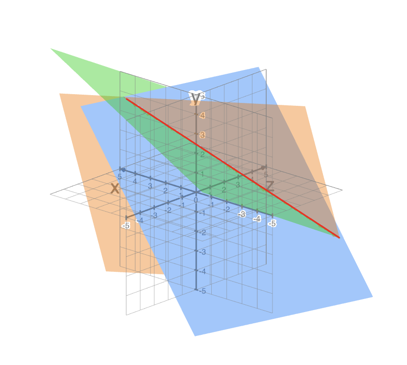

# Solving Linear Systems

When solving a set of linear equations, we try to combine these equations via multiplication or addition to isolate a single variable and its scalar value. This method is similar to the one below known as **Gaussian Elimination**.

## Gaussian Elimination (Matrix row-reduction)

In mathematics, the Gaussian Elimination method is known as the **row-reduction algorithm** for solving linear equations systems. It consists of a sequence of operations performed on the corresponding matrix of coefficients to achieve 0s on the lower left-hand corner of the matrix as much as possible. The obtained matrix is said to be in its **row echelon form** where it is **upper triangular** (bottom left triangle is filled with 0s

To solve the following linear system using Gaussian elimination:

$$
\begin{cases}
x-2y+z = 0 \space (L_1)\\
2x+y-3z=5 \space (L_2)\\
4x-7y+z=-1 \space (L_3)
\end{cases}
$$

We can obtain its coefficient matrix $A$ and a column vector $B$ containing its right hand side constants, i.e.

$$
A =\left[
  \begin{matrix}
    1 & -2 & 1\\
    2 & 1 & -3\\
    4 & -7 & 1\\
  \end{matrix}
\right],
B =\left[
  \begin{matrix}
    0\\
    5\\
    -1\\
  \end{matrix}
\right]
$$

The augmented matrix $(A|B)$ which represents this system is

$$
\left[
  \begin{matrix}
    1 & -2 & 1\\
    2 & 1 & -3\\
    4 & -7 & 1\\
  \end{matrix}
  \left|
    \
    \begin{matrix}
      0\\
      5\\
      -1\\
    \end{matrix}
  \right.
\right]
$$

We now want to transform the coefficient matrix into its **row echelon form**. We start by **eliminating** the $x$ variable from all equations below $L_1$ . This is done by taking

$$
L_2 - 2L_1 \rightarrow L_2 \\
L_3 - 4L_1 \rightarrow L_3
$$

such that we get the augmented matrix

$$
\left[
  \begin{matrix}
    1 & -2 & 1\\
    0 & 5 & -5\\
    0 & 1 & -3\\
  \end{matrix}
  \left|
    \
    \begin{matrix}
      0\\
      5\\
      -1\\
    \end{matrix}
  \right.
\right]
$$

We then **eliminate** the $y$ variable from all equations below $L_2$ . This is done by taking

$$
L_3 - \frac{1}{5}L_2 \rightarrow L_3 \\
$$

such that we get

$$
\left[
  \begin{matrix}
    1 & -2 & 1\\
    0 & 5 & -5\\
    0 & 0 & -2\\
  \end{matrix}
  \left|
    \
    \begin{matrix}
      0\\
      5\\
      -2\\
    \end{matrix}
  \right.
\right]
$$

We have now obtained the coefficient in its **row echelon form**; it is a **upper triangular**.

We now have the linear system

$$
\begin{cases}
x-2y+z = 0 \space(L_1)\\
5y-5z=5 \space(L_2)\\
-2z=-2 \space(L_3)\\
\end{cases}
$$

We can deduce that $z = 1$ . We can then perform **back substitution** by substituting $z$ into $L_2$ to get the value of $y$ and then substituting $y$ and $z$ into $L_1$ to obtain $x$ .

This gives us the linear system

$$
\begin{cases}
x = 3 \\
y=2 \\
z=1 \\
\end{cases}
$$

and the coefficient matrix is said to be in its **reduced row echelon form** because

$$
A' = \left[
  \begin{matrix}
    1 & 0 & 0\\
    0 & 1 & 0\\
    0 & 0 & 1\\
  \end{matrix}
\right]
$$

1. the **leading entry (pivot)**, i.e. the **leftmost non-zero entry**, ****of each row is 1
2. each leading entry is the only non-zero entry in its column
3. the leading entry in a row is to the right of the leading entry in the previous row
4. all rows **consisting entirely of zeros**, if any, are placed at the bottom of the matrix

Linear Systems with No Solutions

Given the linear system

$$
\begin{cases}
x+y+z = 2 \space \\
y-3z=1 \space \\
2x+y+5z=0 \space 
\end{cases}
$$

its augmented matrix is

$$
\left[
  \begin{matrix}
    1 & 1 & 1\\
    0 & 1 & -3\\
    2 & 1 & 5\\
  \end{matrix}
  \left|
    \
    \begin{matrix}
      2\\
      1\\
      0\\
    \end{matrix}
  \right.
\right]
$$

Upon transforming the coefficient matrix to its row echelon form, we get

$$
\left[
  \begin{matrix}
    1 & 1 & 1\\
    0 & 1 & -3\\
    0 & 0 & 0\\
  \end{matrix}
  \left|
    \
    \begin{matrix}
      2\\
      1\\
      -3\\
    \end{matrix}
  \right.
\right]
$$

There is a **contradiction** because the last row corresponds to $0 = -3$ . Therefore, the linear system is **inconsistent**.

## Row operations that preserve singularity

**Elementary row operations** which include

1. **Row Swap**: Exchange any two rows
2. **Scalar Multiplication**: Multiply any row by a scalar (constant)
3. **Row Sum**: Add a multiple of one row to another row

preserves the singularity (linear independence) of a matrix.

Demonstration (Using Determinants)

Given the matrix

$$
A =\left[
  \begin{matrix}
    5 & 1\\
    4 & 3\\
  \end{matrix}
\right]
$$

its determinant $det(A) = 5 \cdot 3 - 1 \cdot4 = 11$

**1) Row Swap:**

$$
A_1 =\left[
  \begin{matrix}
    4 & 3\\
    5 & 1\\
  \end{matrix}
\right]
$$

the new determinant $det(A_1) = 4 \cdot 1 - 5 \cdot 3 = -11$ . Therefore, its singularity is preserved.

**2)** **Scalar Multiplication:**

We multiply the first row of the original matrix by 10 and we get

$$
A_2 =\left[
  \begin{matrix}
    50 & 10\\
    4 & 3\\
  \end{matrix}
\right]
$$

the new determinant $det(A_2) = 50 \cdot 3 - 10 \cdot 4 = (10 \cdot 11)$ . Therefore, its singularity is preserved.

**2)** **Row Sum:**

We add the second row of the original matrix to its first row and we get

$$
A_3 =\left[
  \begin{matrix}
    9 & 4\\
    4 & 3\\
  \end{matrix}
\right]
$$

the new determinant $det(A_3) = 9 \cdot 3 - 4 \cdot 4 = 11$ . Therefore, its singularity is preserved.

## The Rank of a Matrix

The maximum number of **linearly independent** rows (or columns) of a matrix is called the **rank of a matrix**. In fact the [rows and columns always agree on the rank](https://en.wikipedia.org/wiki/Rank_(linear_algebra)#Proofs_that_column_rank_=_row_rank). The rank of a matrix cannot exceed the number of its rows or columns.

Another way to think about rank would be “What are the number of rows that provide unique information for solving the linear set?”

For example, the matrix

$$
A = \left[
  \begin{matrix}
    1 & 0 & 1\\
    -2 & -3 & 1\\
    3 & 3 & 0\\
  \end{matrix}
\right]
$$

has a **rank of 2** as the first two rows are **linearly independent** but the third row is a linear combination of the first two (row 1 minus row 2).

The graph below represents a linear system of the form $Ax + b$ where $x$ is a column vector of variables and $b$ is a column vector of constants.

We can see that the solution set is a **1-dimensional line**. In fact,

$$
Rank = \text{No. of variables - Dimension of solution space}
$$

Therefore, for a linear system with 3 variables 

Row Echelon Form

A common approach to finding the rank of a matrix is to reduce it to a simpler form, generally **row echelon form**, by elementary row operations

Using the previous matrix

$$
A = \left[
  \begin{matrix}
    1 & 0 & 1\\
    -2 & -3 & 1\\
    3 & 3 & 0\\
  \end{matrix}
\right]
$$

We can obtain its **row echelon form**

$$
A' = \left[
  \begin{matrix}
    1 & 0 & 1\\
    0 & -1 & 1\\
    0 & 0 & 0\\
  \end{matrix}
\right]
$$

We can see that the final matrix has two **non-zero** rows and thus the rank of matrix $A$ is 2.
