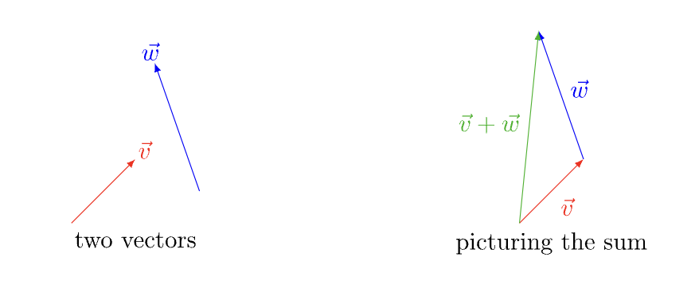

# Linear Transformations

In linear algebra, a **Euclidean vector**, or simply a vector, is a 1-dimensional matrix. For example, a **column vector** with $m$ elements is an $m \space \text{x} \space 1$ matrix, consisting of a single column. For example,

$$
\vec{x} = \left[
  \begin{matrix}
    x_1 \\
    x_2 \\
    \vdots \\
    x_m \\
  \end{matrix}
\right]
$$

Similarly,  **row vector** is a $1 \space \text{x} \space n$ matrix for some $n$ , consisting of a single row of $n$ entries,

$$
\vec{a} = [a_1 \space a_2 \space \dots  \space a_n ]
$$

Vectors are **directed line segments** that have both a **magnitude and direction**. The **direction** of the vector is represented by the start and end point of the line and the magnitude of the vector is **represented** by the length of the line.

## Magnitude of Vectors (Norm)

The **norm of a vector** refers to the **length** or the **magnitude** of a vector. For a vector $\vec{x}$, its norm is denoted as $\|\vec{x}\|$

There are different measures for the norm. The norm of a vector is a non-negative value. A norm must satisfy the following properties:

1. **Triangle Inequality**: $\|\vec{x} + \vec{y} \| \leq \|\vec{x} \| + \|\vec{y} \|$ for all vectors $\vec{x}, \vec{y}$
2. **Absolute Homogeneity**: $\|s\vec{x}\| = \|s\| \|\vec{x}\|$ for all vectors $\vec{x}$ and scalars $s$
3. **Positive Definiteness**: If $\|\vec{x}\| = 0$ , then $\vec{x} = 0$ for all vectors $\vec{x}$

Unit Vector

The **unit vector** has a magnitude of 1. Given a non-zero vector $\vec{x}$, its normalised vector is the unit vector in the same direction, i.e.

$$
\hat{x} = \frac{\vec{x}}{\|\vec{x}\|}
$$

Unit vectors may be used to represent the axes of a [Cartesian coordinate system](https://en.wikipedia.org/wiki/Cartesian_coordinate_system). For instance, the standard unit vectors in the direction of the *x*, *y*, and *z* axes of a three dimensional Cartesian coordinate system are

$$
\hat{x} = \left[
  \begin{matrix}
    1 \\
    0 \\
    0 \\
  \end{matrix}
\right],
\hat{y} = \left[
  \begin{matrix}
    0 \\
    1 \\
    0 \\
  \end{matrix}
\right],
\hat{z} = \left[
  \begin{matrix}
    0 \\
    0 \\
    1 \\
  \end{matrix}
\right]
$$

They form the **standard basis** of the three-dimensional space which is a set of mutually orthogonal (mutually perpendicular) unit vectors.

$\ell^p$ norm

Let $p \geq 1$ be a real number. The $\ell^p$ norm (also called $p$-norm) of a vector $x = (x_1, x_2, \dots, x_n)$ is

$$
\|x\| := (\sum_{i=1}^{n}\|x_i\|^p)^{\frac{1}{p}}
$$

For $p = 1$, we get the **Manhattan norm** (or $\ell^1$ norm) 

$$
\|x\|_1 := \sum_{i=1}^{n}\|x_i\|
$$

which is simply the sum of the absolute values of its **Cartesian coordinates** (columns).

For $p = 2$, we get the **Euclidean norm** (or $\ell^2$ norm) 

$$
\|x\|_2 := \sqrt{x_1^2+\dots + x_n^2} = \sqrt{x \cdot x}
$$

which is the **most commonly used** norm and it is a consequence of the Pythagorean theorem.

As $p$ approaches $\infty$, the $p$-norm becomes the **Chebychev norm** which gives

$$
\|x\|_\infty :=\max _{i}|x_{i}|
$$

## Vector Operations

1) Vector Addition (Linear Combination)

Vector addition is the operation of adding two of more vectors together into a sum. It can be performed simply by adding the corresponding components of the vectors. If $\vec{v} = (v_1, v_2, \dots v_n)$ and $\vec{w} = (w_1, w_2, \dots, w_n)$,

$$
\vec{v} + \vec{w} = (v_1 + w_1, v_2 + w_2, \dots, v_n +w_n)
$$

2) Scalar Multiplication (Scaling a vector)

Scalar multiplication of a real **Euclidean** vector by a **positive real number** multiplies the magnitude of the vector by the magnitude of the scalar. If the scalar is positive, then the direction of the vector **remains the same**. Else, the direction of the vector is becomes the **opposite**.

To multiply a vector by a scalar, multiply each component by the scalar. For example, if $\vec{a} = (a_1, a_2, \dots a_n)$,

$$
3\vec{a} = (3\cdot a_1, 3 \cdot a_2, \dots, 3 \cdot a_n)
$$

3) Dot Product

The **dot product** of two vectors returns a **scalar.** Intuitively, it tells us something about how much two vectors **point in the same direction**. For two vectors, $\vec{a} = (a_1, a_2, \dots a_n)$ and $\vec{b} = (b_1, b_2, \dots, b_n)$,

 ****

$$
\vec{a} \cdot \vec{b} = a_1b_1 + a_2b_2 + \dots + a_nb_n = \sum_{i=1}^{n}a_ib_i
$$

Another way to calculating the dot product is

$$
\vec{a} \cdot \vec{b} = \|\vec{a}\|\|\vec{b}\|\cos\theta
$$

where $\|\vec{a}\|$ and $\|\vec{b}\|$ denotes the magnitude of $\vec{a}$ and $\vec{b}$ respectively and $\theta$ is the angle between the two vectors. 

The dot product of two **orthogonal** vectors (at right angles) is zero because $\cos90 = 0$. 

The dot product of two **codirectional** vectors (same direction) is simply the product of their magnitudes as $cos0 = 1$

4) Cross Product

We write the cross product between two vectors as $\vec{a} \space \text{x} \space \vec{b}$ . Unlike the dot product which returns a scalar, the result of a cross product is another vector, i.e. $\vec{a} \space \text{x} \space \vec{b} = \vec{c}$. The new vector has two properties:

1. $\vec{c}$ is perpendicular to both $\vec{a}$ and $\vec{b}$ $\rightarrow$ $\vec{c}\space \cdot \space \vec{a} = \vec{c} \space \cdot \space \vec{b} = 0$
2. The magnitude of $\vec{c}$ is the area of the parallelogram having $\vec{a}$ and $\vec{b}$  as sides, i.e. $\vec{c}$$\|\vec{c}\| = \|\vec{a}\|\|\vec{b}\| \sin\theta$

## Matrix-Vector Multiplication

Vector Space

A **vector space** consists of a **set of vectors** that is **closed under vector addition and scalar multiplication**. That is, when you multiply any two vectors in a vector space by scalars and add them, the resulting vector is still in the vector space.

Linear Transformation

Linear Transformation is essentially a **function** $f: V \rightarrow W$ that maps a vector from one vector space to another. This function, or map, must **respect the underlying structure of a linear vector space**, i.e. closed under addition and multiplication, such that

$$
f(s\cdot \vec{v_1} + \vec{v_2}) = s\cdot f(\vec{v_1}) + f(\vec{v_2})
$$

 for any vectors $\vec{v_1}, \vec{v_2}$ in $V$ and scalar $s$.

Also, a linear transformation should always map the origin onto itself, i.e.

$$
f(0) = 0
$$

The linear function $f$ can also be represented by a matrix $A$, i.e.

$$
f(\vec{x}) = A\vec{x}
$$

We can see that the **matrix-vector multiplication** is simply a linear transformation of a vector!

Let’s use the example of a 2-dimensional vector space:

Here the vectors $\vec{v_1} = \left[
  \begin{matrix}
    1 \\
    0 \\
  \end{matrix}
\right],
\vec{v_2} = \left[
  \begin{matrix}
    0 \\
    1 \\
  \end{matrix}
\right]$ are standard unit vectors that form the standard basis of the 2-dimensional vector space. 

Under a linear transformation $f$, we get $\vec{v_1}' = \left[
  \begin{matrix}
    3 \\
    1 \\
  \end{matrix}
\right],
\vec{v_2}' = \left[
  \begin{matrix}
    1 \\
    2 \\
  \end{matrix}
\right]$. Understanding the mapping of the standard unit vectors $\vec{v_1}$ and $\vec{v_2}$ allow us to deduce $f$

$$
f(\left[
  \begin{matrix}
    x \\
    y \\
  \end{matrix}
\right]) =  x\cdot\left[
  \begin{matrix}
    3 \\
    1 \\
  \end{matrix}
\right] + y \cdot \left[
  \begin{matrix}
    1 \\
    2 \\
  \end{matrix}
\right] = 
\left[
  \begin{matrix}
    3x +y \\
    x + 2y \\
  \end{matrix}
\right]
$$

where $x$ and $y$ are the values of any vector on the x- and y-axis respectively.

This is the intuition behind the definition of the **matrix-vector multiplication**. We define the matrix $A$ by combining the transformed standard unit vectors under $f$ such that

$$
A = \left[
  \begin{matrix}
    3 & 1 \\
    1 & 2 \\
  \end{matrix}
\right]
$$

Then, we define the matrix-vector multiplication of $A$ and any 2-dimensional vector $\vec{v} = \left[
  \begin{matrix}
    x \\
    y \\
  \end{matrix}
\right]$  as

 

$$
A \cdot \vec{v} = \left[
  \begin{matrix}
    3 & 1 \\
    1 & 2 \\
  \end{matrix}
\right] \cdot \left[
  \begin{matrix}
    x \\
    y \\
  \end{matrix}
\right] = 
\left[
  \begin{matrix}
    3x +y \\
    x + 2y \\
  \end{matrix}
\right]
$$

Therefore, if $A$ is an $m \space \text{x} \space n$ matrix and $\vec{x}$ is a $n \space \text{x} \space 1$ column vector, 

$$
A = \left[
  \begin{matrix}
    a_{11} & a_{12} & \dots & a_{1n}  \\
    a_{21} & a_{22} & \dots & a_{2n} \\
    \vdots & \vdots & \ddots & \vdots \\
    a_{m1} & a_{m2} & \dots & a_{mn} \\
  \end{matrix}
\right], 
\vec{x} = \left[
  \begin{matrix}
    x_1 \\
    x_2 \\
    \vdots \\
    x_n \\
  \end{matrix}
\right]
$$

the **matrix-vector multiplication** of $A$ and $\vec{x}$ is defined as

$$
\begin{align}
A\cdot \vec{x} &= \notag 
\left[
  \begin{matrix}
    a_{11}\\
    a_{21}\\
    \vdots  \\
    a_{m1}\\
  \end{matrix}
\right] \cdot {x_1} +
\left[
  \begin{matrix}
    a_{12}\\
    a_{22}\\
    \vdots  \\
    a_{m2}\\
  \end{matrix}
\right] \cdot {x_2} + \dots + 
\left[
  \begin{matrix}
    a_{1n}\\
    a_{2n}\\
    \vdots  \\
    a_{mn}\\
  \end{matrix}
\right] \cdot {x_n}
\\ 
&= \left[
  \begin{matrix}
    a_{11}x_1 + a_{12}x_2+ \dots + a_{1n}x_n  \\
    a_{21}x_1 + a_{22}x_2+ \dots + a_{2n}x_n \\
    \vdots  \\
    a_{m1}x_1 + a_{m2}x_2 + \dots + a_{mn}x_n \\
  \end{matrix}
\right]
\end{align}
$$

This intuition also allows us to understand why matrix-vector multiplication is only defined between a matrix and a vector where the **length of the vector equals the number of columns of the matrix.**

## Matrix Multiplication

The intuition behind multiplication of matrices is that it allows us to combine the effects of multiple linear transformations in a single step.

Given the matrices $A, B$ and vector $\vec{v}$

$$
A = \left[
  \begin{matrix}
    3 & 1 \\
    1 & 2 \\
  \end{matrix}
\right],
B = \left[
  \begin{matrix}
    2 & -1 \\
    0 & 2 \\
  \end{matrix}
\right],
\vec{v} = \left[
  \begin{matrix}
    x \\
    y \\
  \end{matrix}
\right]
$$

We can see that the linear transformation of $\vec{v}$ under $A$ followed by $B$ is

$$
\begin{align}
B \cdot(A \cdot \vec{v}) &= \notag
\left[
  \begin{matrix}
    2 & -1 \\
    0 & 2 \\
  \end{matrix}
\right]
\cdot
(\left[
  \begin{matrix}
    3 & 1 \\
    1 & 2 \\
  \end{matrix}
\right] \cdot \left[
  \begin{matrix}
    x \\
    y \\
  \end{matrix}
\right] ) \\ &= \notag
\left[
  \begin{matrix}
    2 & -1 \\
    0 & 2 \\
  \end{matrix}
\right]
\cdot
(\left[
  \begin{matrix}
    3x + y  \\
    x + 2y \\
  \end{matrix}
\right])\\ &= \notag
\left[
  \begin{matrix}
    6x + 2y - x - 2y \\
    0x + 0y + 2x + 4y \\
  \end{matrix}
\right]\\ &= \notag
\left[
  \begin{matrix}
    5x + 0y \\
    2x + 4y \\
  \end{matrix}
\right]\\ &= \notag
\left[
  \begin{matrix}
    5 & 0 \\
    2 & 4 \\
  \end{matrix}
\right] \cdot \left[
  \begin{matrix}
    x \\
    y \\
  \end{matrix}
\right]

\end{align}
$$

Therefore we define the matrix multiplication between $B$ and $A$ as

$$
B \cdot A = \left[
  \begin{matrix}
    2 & -1 \\
    0 & 2 \\
  \end{matrix}
\right] \cdot \left[
  \begin{matrix}
    3 & 1 \\
    1 & 2 \\
  \end{matrix}
\right] = \left[
  \begin{matrix}
    5 & 0 \\
    2 & 4 \\
  \end{matrix}
\right]
$$

General Formula of Matrix Multiplication

If $A$ is a $m \space \text{x} \space n$ matrix and $B$ is a $n \space \text{x} \space p$ matrix,

$$
\mathbf {A} =\left[{\begin{matrix}a_{11}&a_{12}&\cdots &a_{1n}\\a_{21}&a_{22}&\cdots &a_{2n}\\\vdots &\vdots &\ddots &\vdots \\a_{m1}&a_{m2}&\cdots &a_{mn}\\\end{matrix}}\right],\quad \mathbf {B} =\left[{\begin{matrix}b_{11}&b_{12}&\cdots &b_{1p}\\b_{21}&b_{22}&\cdots &b_{2p}\\\vdots &\vdots &\ddots &\vdots \\b_{n1}&b_{n2}&\cdots &b_{np}\\\end{matrix}}\right]
$$

To derive $A\cdot B$, we want to measure the **overall effect of the transformation of a vector** under $B$ followed by under $A$.

Let the matrix $C$ be the result $A\cdot B$  such that $C$ is a $m \space \text{x} \space p$ matrix ($m$ rows from $A$ and $p$ columns from $B$)

$$
C = \left[\begin{matrix}c_{11}&c_{12}&\cdots &c_{1p}\\c_{21}&c_{22}&\cdots &c_{2p}\\\vdots &\vdots &\ddots &\vdots \\c_{m1}&c_{m2}&\cdots &c_{mp}\\\end{matrix}\right]
$$

As we saw earlier, the $i$th column of a matrix $C$ allows us to observe the linear transformation of $\hat v_i$ (standard unit vector in the $i$th dimension) under $C$. Since $C$ measures the overall transformation under $B$ followed by $A$, $\hat{v_i}$ under $C$ is

$$
A\cdot (B\cdot \hat{v_i}) = \left[
  \begin{matrix}
    c_{1i} \\
    c_{2i} \\
    \vdots \\
    c_{mi} \\
  \end{matrix}
\right] = i\text{th column of }C
$$

Therefore, there is a systematic approach to deriving each column of $C$ by observing the transformation of every standard unit vector in the standard basis of the $p$-dimensional space under $B$ followed by under $A$.

First, let’s find out $\hat{v_i}$ under $B$ which is

$$
B\cdot \hat{v_i} = \left[
  \begin{matrix}
    b_{1i} \\
    b_{2i} \\
    \vdots \\
    b_{ni} \\
  \end{matrix}
\right]
$$

Now, we want to follow its transformation under $A$

$$
\begin{align}
A \cdot (B \cdot \hat{v_i}) &= \notag A \cdot 
\left[
  \begin{matrix}
    b_{1i} \\
    b_{2i} \\
    \vdots \\
    b_{ni} \\
  \end{matrix}
\right] \\ \notag &=
\left[
  \begin{matrix}
    a_{11} \\
    a_{21} \\
    \vdots \\
    a_{m1} \\
  \end{matrix}
\right] \cdot b_{1i} + 
\left[
  \begin{matrix}
    a_{12} \\
    a_{22} \\
    \vdots \\
    a_{m2} \\
  \end{matrix}
\right] \cdot b_{2i} + \dots +
\left[
  \begin{matrix}
    b_{1n} \\
    b_{2n} \\
    \vdots \\
    b_{mn} \\
  \end{matrix}
\right] \cdot b_{ni} \notag \\ \notag &=

\left[\begin{matrix}
a_{11}b_{1i}+\cdots+a_{1n}b_{ni}\\a_{21}b_{1i}+\cdots+a_{2n}b_{ni}\\\vdots \\
a_{m1}b_{1i}+\cdots+a_{mn}b_{ni}\\\end{matrix}\right] \\ \notag &=
\left[
  \begin{matrix}
    c_{1i} \\
    c_{2i} \\
    \vdots \\
    c_{mi} \\
  \end{matrix}
\right]
\end{align}
$$

We can see that the dot product of the $i$th row vector in $A$ and the $j$th column vector in $B$ gives us $c_{ij}$, the scalar in the $i$th row and $j$th column in the matrix $C$

By horizontally stacking the transformed vectors of every standard unit vector in the standard basis of the $p$-dimensional space, we get

$$
A \cdot B = \left[\begin{matrix}a_{11}b_{11}+\cdots +a_{1n}b_{n1}&a_{11}b_{12}+\cdots +a_{1n}b_{n2}&\cdots &a_{11}b_{1p}+\cdots +a_{1n}b_{np}\\a_{21}b_{11}+\cdots +a_{2n}b_{n1}&a_{21}b_{12}+\cdots +a_{2n}b_{n2}&\cdots &a_{21}b_{1p}+\cdots +a_{2n}b_{np}\\\vdots &\vdots &\ddots &\vdots \\a_{m1}b_{11}+\cdots +a_{mn}b_{n1}&a_{m1}b_{12}+\cdots +a_{mn}b_{n2}&\cdots &a_{m1}b_{1p}+\cdots +a_{mn}b_{np}\\\end{matrix}\right]
$$

which is the general formula for matrix multiplication. 

- **Note**: Order of applying linear transformation matters, i.e. $A\cdot B \neq B \cdot A$ and the number of columns in the left matrix must equal the number of rows in the right matrix

## Identity Matrix

The identity matrix $I_n$ of size $n$ is a $n \space \text{x} \space n$ square matrix such that

$$
B = I_n\cdot B
$$

where the number of rows in $B$ is equal to $n$. In other words, it represents that **identity function** that maps a vector space back to itself

In order to do so, $I_n$ must be a matrix with **1s on the main diagonal and 0s elsewhere** such that

$$
I_{1} ={\begin{bmatrix}1\end{bmatrix}},\ I_{2}={\begin{bmatrix}1&0\\0&1\end{bmatrix}},\ I_{3}={\begin{bmatrix}1&0&0\\0&1&0\\0&0&1\end{bmatrix}},\ \dots ,\ I_{n}={\begin{bmatrix}1&0&0&\cdots &0\\0&1&0&\cdots &0\\0&0&1&\cdots &0\\\vdots &\vdots &\vdots &\ddots &\vdots \\0&0&0&\cdots &1\end{bmatrix}}
$$

- **Note**: you can verify by performing a multiplication of the identity matrix with a vector or matrix!

## Matrix Inverse

Since linear transformation is the effect of a matrix-vector multiplication, i.e. 

$$
\vec{v} = A\vec{x}
$$

where $A$ is the matrix, $\vec{x}$ is the original vector and $v$ is the transformed vector, the inverse of $A$ should be the matrix that transforms $\vec{v}$ back to $\vec{x}$

$$
\vec{x} = A^{-1}\vec{v}
$$

As such,

$$
\vec{x} = A^{-1}\cdot(A\cdot\vec{x})
$$

and

$$
A^{-1} \cdot A = I_n
$$

where $n$ is the no. of dimensions in $\vec{x}$.

If $A = \left[
  \begin{matrix}
    3 & 1 \\
    1 & 2 \\
  \end{matrix}
\right]$, we have

$$
A^{-1}\cdot A = \left[
  \begin{matrix}
    a & b \\
    c & d \\
  \end{matrix}
\right] \cdot \left[
  \begin{matrix}
    3 & 1 \\
    1 & 2 \\
  \end{matrix}
\right] = 
\left[
  \begin{matrix}
    1 & 0 \\
    0 & 1 \\
  \end{matrix}
\right]
$$

To find $A^{-1}$, we know

$$
\begin{align}
3a + b = 1 \\
a + 2b = 0  \\
3c + d = 0 \\
c + 2d = 1

\end{align}
$$

therefore we get

$$
A^{-1} = \left[
  \begin{matrix}
    \frac{2}{5} & -\frac{1}{5} \\
    -\frac{1}{5} & \frac{3}{5} \\
  \end{matrix}
\right]
$$

One important thing to note is that a matrix only has an inverse if it is a **non-singular matrix** (determinant not equal 0)!