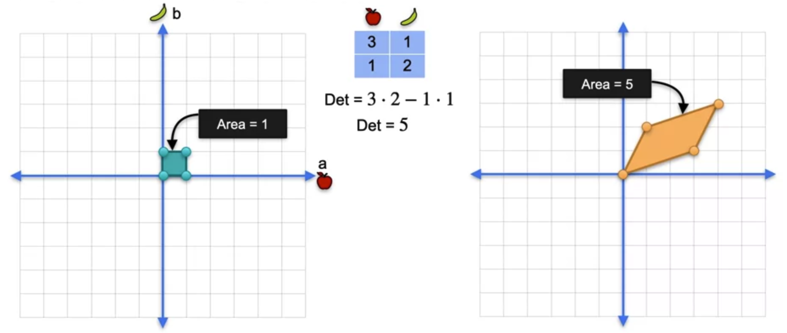

# Determinants and Eigenvectors

## Singularity and rank of linear transformations

As we saw in the previous chapter, linear transformations can be represented as matrices. Given that square matrices can be **singular or nonsingular**, linear transformations under square matrices also have singular and nonsingular properties.

## Geometric meaning of determinant

Matrices are widely used for specifying **geometric transformation** because linear transformation allows for an efficient way of warping points around in a vector space. In fact, the determinant of a square matrix determines how the orientation and volume in the n-dimensional space is scaled. For example, in a 2-d space,

We can see that the **nonsingular (nondegenerate)** square matrix

$$
A = \begin{bmatrix}
3 & 1 \\
1 & 2
 \end{bmatrix}
$$

performs a linear transformation that scales the area of the unit square by a multiple of its determinant $det(A) = 5$

However, when the linear transformation is represented by a **singular matrix** (which means the matrix has **linearly dependent** rows), **** we can see that the resulting transformation has zero area in the 2-dimensional space. Therefore, **singular transformations** map the original vector space to a **lower dimension** and the determinant of the matrix is equal to 0.

In the 3-dimensional space, a linear transformation represented by a nonsingular matrix transforms the geometry of the unit cube to a **parallelepiped** and the volume of this parallelepiped gives us the determinant of the matrix.

The n-dimensional nonsingular matrix transforms the unit n-cube to a n-dimensional parallelotope.

If the determinant of the square matrix is **negative**, it means that it represents a transformation that **reverses** the orientation of the n-dimensional space.

<u>Determinant of a matrix product</u>

By viewing the determinants as a scaling of volume, this allows us to understand why 

$$
det(A \cdot B) = det(A) \cdot det(B) = det(B \cdot A)
$$

where $A$ and $B$ are square matrices.

As the matrix multiplication simply represents **sequential linear transformations**, the overall scaling of the volume is simply the **product of the determinants** of the individual matrices.

Moreover, if either $A$ or $B$ is singular, its determinant will be equal to zero which will result in the matrix product to be singular as well. 

<u>Determinant of inverse matrices</u>

If $A$ is a square matrix,

$$
det(A^{-1}) = \frac{1}{det(A)}
$$

where $A^{-1}$ is the inverse matrix of $A$

As such, the determinant of $A\cdot A^{-1}$ will always be equal to 1. This is because the multiplication of a matrix and its inverse will always return the **identity matrix which has a determinant of 1**

$$
A\cdot A^{-1} = I_{n} = {
    \begin{bmatrix}
    1 & 0 & 0 & \cdots & 0 \\
    0 & 1 & 0 & \cdots & 0 \\
    0 & 0& 1 & \cdots & 0 \\
    \vdots & \vdots & \vdots & \ddots & \vdots \\
    0 & 0 & 0 & \cdots & 1
    \end{bmatrix}
}
$$

The more intuitive explanation for this observation is that the inverse of a matrix represents the **reverse** of the linear transformation performed by the original matrix. This results in no scaling of the volume of the n-dimensional space.

This is why **inverse matrices only exist for nonsingular matrix**. Singular matrices represent linear transformations that map the original vector space to a lower dimension and this results in loss in information about the coordinates of the transformed vectors in the higher dimension → it is impossible to reverse the transformation and reconstruct the original vector so the inverse matrix does not exist.

## Change of Basis

A **basis** is a set of **linearly independent vectors** such that every element in a vector space $V$ can be produced by the **linear combination** of these vectors 

When trying to identify points in a vector space, we usually use the Cartesian coordinate system. A point in a Cartesian coordinate system can also be represented by a linear combination of its standard unit vectors. For example, in a three-dimensional space, any point can be specified by a linear combination of the three unit vectors, $\hat i$, $\hat j$ and $\hat k$. These three vectors form the **standard basis** of the three-dimensional coordinate system.

What if we want to use different vectors as the basis for defining elements within the vector space instead? In other words, what if we could represent every element in the vector space using different basis vectors other than the standard unit vectors? We can construct a new basis as long as there is enough **linearly independent** basis vectors such that we can reach any point in the vector space using a linear combination of these vectors. 

For example, lets say $V$ is a vector space over $\R^2$. We can define our basis vectors to be 

$$
\vec{v} = 
\begin{bmatrix} 2 \\
1 
\end{bmatrix}, 
\vec{w} = 
\begin{bmatrix} 1 \\
3
\end{bmatrix}
$$

such that

$$
B = \{
\begin{bmatrix}
2 \\
1
\end{bmatrix},
\begin{bmatrix}
1 \\
3
\end{bmatrix}
\}
$$

is the basis for $V$

](images/Untitled%205.png)

Image from [Krista King Math](https://www.kristakingmath.com/blog/changing-to-a-new-coordinate-basis#:~:text=Change%20of%20basis%20matrix&text=are%20the%20coordinates%20of%20%E2%83%97,terms%20of%20the%20basis%20B.)

Every vector $\vec{x} \in V$ can be formed by

$$
\vec{x} = a_1 \vec{v} + a_2
\vec{w}
$$

where $a_1$ and $a_2$ are scalars and the coordinate vector of $\vec{x}$ in the basis $B$ is

$$
[\vec{x}]_B = 
\begin{bmatrix} 1 \\
1 \\
\end{bmatrix}
$$

Therefore, we have defined an **alternate coordinate system** with $\vec{v}$ and $\vec{w}$ as its axes. For example, to reach $(3,4)$ in the standard coordinate system, we need one unit of $\vec{v}$ and one unit of $\vec{w}$.

<u>Change of Basis</u>

Now we understand the concept of changing from the standard basis vectors to another set of basis vectors, how do we actually translate between coordinate systems?

We can transform vectors from one coordinate system to another using a **transformation (change of basis) matrix** $A$. We can then set up the equation

$$
A[\vec{x}]_B = \vec{x}
$$

This allows us to translate any vectors represented by basis $B$ back to vectors represent by the standard basis.

The transformation matrix for changing from a vector from the standard basis to $B$ is simply the matrix formed by horizontally stacking the basis vectors

$$
A = 
\begin{bmatrix} 
2 & 1 \\
1 & 3 
\end{bmatrix}
$$

To verify this, we can use the previous example

$$
\begin{bmatrix} 
2 & 1 \\
1 & 3 
\end{bmatrix} \cdot 
\begin{bmatrix} 
1 \\ 
1 
\end{bmatrix} = 
\begin{bmatrix} 
3 \\ 
4 
\end{bmatrix}
$$

## Linear Span

The **span** of a set $S$ of vectors is defined as the **set of all their linear combinations** and it is denoted as $\text{span}(S)$. The linear span can also be seen as a vector space where its linear combinations exist.

A single vector or a set of linearly dependent vectors can only span a line in the vector space.

Two linearly independent vectors span a plane.

## Eigenvalues and Eigenvectors

Given a single vector $\vec{v}$, the span of a set containing only $\vec{v}$ represents a line in the vector space. During linear transformation, it is likely for $\vec{v}$ to be “knocked off” its span, i.e. the direction of $\vec{v}$ is changed.

The **eigenvectors** (or **characteristic vectors**) are the **nonzero vectors** that have their **directions remain unchanged (remains on its span)** by a linear transformation. Therefore, these eigenvectors are only compressed or stretched along its span (no rotation or shear) by a constant factor $\lambda$, i.e.

$$
A\cdot \vec{v} = \lambda\vec{v} \tag{1}
$$

where $A$ is the matrix of the linear transformation and $\vec{v}$ is an eigenvector. $\lambda$ represents the corresponding **eigenvalue** (or **characteristic value**) of $\vec{v}$. 

Let’s suppose we are working in the 2-dimensional space such that

$$
A = {\begin{bmatrix}
3 & 1 \\
0 & 2 
\end{bmatrix}}, \space
\vec{v} = {\begin{bmatrix}
x \\
y \\ 
\end{bmatrix}}
$$

We want to find out the possible $\lambda$ values that will make equation (1) true

Note that the left hand side is a matrix multiplication and the right side is a scalar multiplication. Let’s rewrite the scalar multiplication into a linear transformation using a matrix

$$
\begin{align} \notag
A\cdot \vec{v} &= 
{\begin{bmatrix} 
\lambda & 0  \\ 
0 & \lambda \\
\end{bmatrix}}
\cdot \vec{v} \\ \notag &=
\lambda 
{\begin{bmatrix} 
1 & 0 \\ 
0 & 1 \\
\end{bmatrix}} \cdot \vec{v} \\ \notag &= 
\lambda \space I_2 \cdot \vec{v}
\end{align}
$$

where $I_2$ is the 2-dimensional **identity matrix.**

Therefore, by moving the terms on the right to the left side of the equation, we get

$$
(A - \lambda I_2)\cdot\vec{v} = \vec{0} \\
\implies {\begin{bmatrix}
3 - \lambda & 1  \\
0 & 2 - \lambda  \\ 
\end{bmatrix}} \cdot \vec{v} = \vec{0} \tag{2}
$$

Note that the right side of the equation is the origin vector and we know that only a **singular matrix** is able to transform a **nonzero vector** to become zero (origin point) by projecting the original vector space to a lower dimension vector space. therefore,

$$
det(A - \lambda I_2) = 0 \\
\implies (3 - \lambda) \cdot (2-\lambda) = 0 \\
\implies 6 - 5\lambda + \lambda^2 = 0
$$

The above polynomial is known as the **characteristic polynomial** as its **roots are the eigenvalues** of the linear transformation. By solving the determinant, we get that $\lambda_1 = 3$ or $\lambda_2 = 2$

To get the first eigenvector $\vec{v_1}$, we substitute $\lambda_1 = 3$ values into equation (2) and we get

$$
\begin{bmatrix}
0 & 1 \\
0 & -1
\end{bmatrix} \cdot 
\begin{bmatrix}
x \\
y
\end{bmatrix} = 
\begin{bmatrix}
0 \\
0
\end{bmatrix} \\
\implies y = -y = 0
$$

Since, the eigenvector is **nonzero** (pointless to include the zero vector because it is obvious that the origin remains unchanged during transformation), we know that $\vec{v_1}$ must have a value in the x-dimension, i.e. $\vec{v_1} = (x,0)$. Any scalar for $x$ will work because they all belong to the same span. Therefore, we let $\vec{v_1} = (1,0)$

To get the second eigenvector $\vec{v_2}$, we substitute $\lambda_2 = 2$ into equation (2)

$$
\begin{bmatrix}
1 & 1 \\
0 & 0
\end{bmatrix} \cdot 
\begin{bmatrix}
x \\
y
\end{bmatrix} = 
\begin{bmatrix}
0 \\
0
\end{bmatrix} \\
\implies x + y = 0 \\
\implies x = -y
$$

To get the eigenvector which is nonzero, we can use any scalar for $x$ and as long as $y$  is the negative of it. Therefore

$$
\vec{v_1} = (1,0), \space \vec{v_2} = (-1,1)
$$

## Eigenbasis

<u>Diagonal Matrices</u>

Before understand what **eigenbasis** are, I want to introduce the importance of diagonal matrices. A **diagonal matrix** $D$  is a m-by-n matrix with all the entries not of the form $d_{ij}$ being zero; the only nonzero entries are in the main diagonal. For example

$$
D = \begin{bmatrix}
1 & 0 & 0 \\
0 & 4 & 0 \\
0 & 0 & -2
\end{bmatrix} \text{or}
\begin{bmatrix}
1 & 0 & 0 \\
0 & 4 & 0 \\
0 & 0 & -3 \\
0 & 0 & 0 \\
0 & 0 & 0
\end{bmatrix} \text{or}
\begin{bmatrix}
1 & 0 & 0 & 0 & 0 \\
0 & 4 & 0 & 0 & 0 \\ 
0 & 0 & - 3 & 0 & 0
\end{bmatrix}
$$

Let $D = diag(a_1,...,a_n)$ where $a_i$ is the i-th column vector. Linear transformations represented by diagonal matrices are extremely simple because each **basis vector (nonzero column vector)** $a_i$ in $D$ is an **eigenvector** and its scalar value on the i-th row is its corresponding **eigenvalue**. Diagonal matrices make matrix operations simple because

$$
diag(a_1,...,a_n) * diag(b_1,...,b_n) = diag(a_1b_1,...,a_nb_n)\\
\implies [diag(a_1,...,a_n)]^n = diag(a_1^n,...,a_n^n)
$$

<u>What is the Eigenbasis?</u>

Earlier, we learnt that a change of basis allows us to define an alternate coordinate systems with a set of vectors as its basis. 

If $L$ has enough **linearly independent eigenvectors** such that linear combinations of them can span the entire vector space, we can change the coordinate system such that these eigenvectors are the basis vectors. 

This is done by horizontally stacking the linearly independent eigenvectors to form the change of basis matrix, and this is called the **eigenbasis**. For example, given the eigenvectors $\vec{v_1}, \vec{v_2},...,\vec{v_n}$ of a matrix $A$, we can form the eigenbasis $E$ such that

$$
E = {\begin{bmatrix}
\vec{v_1} & \vec{v_2} & \dots & \vec{v_n}
\end{bmatrix}}
$$

Why would we need the Eigenbasis? How does it relate to diagonal matrices? 

If we were to define a coordinate system in the eigenbasis $E$, it means the vectors are formed using linear combinations of the eigenvectors. For example, let’s use the previous example

$$
A = {\begin{bmatrix}
3 & 1 \\
0 & 2 
\end{bmatrix}}
$$

the eigenvectors and eigenvalues of $A$ are

$$
\vec{v_1} = 
\begin{bmatrix}
1 \\
0 \\
\end{bmatrix},
\vec{v_2} = 
\begin{bmatrix}
-1 \\
1 \\
\end{bmatrix}, \lambda_1 = 3, \lambda_2 = 2
$$

we can then define the eigenbasis as

$$
E = 
\begin{bmatrix}
1 & -1 \\
0 & 1 \\
\end{bmatrix}
$$

Given that we have to find out the linear transformation of a vector using $A$. We can pretend that the vector was defined under the eigenbasis

$$
[\vec{x}]_E = 
\begin{bmatrix} 1 \\
2 \\
\end{bmatrix}
$$

We know that translating $[\vec{x}]_E$ to the standard basis involves a linear transformation using the change of basis matrix, in this case the eigenbasis. That means

$$
E\cdot [\vec{x}]_E =
\begin{bmatrix}
1 & -1 \\
0 & 1 \\
\end{bmatrix} \cdot 
\begin{bmatrix} 1 \\
2 \\
\end{bmatrix} = \vec{v_1} + 2\vec{v_2}
$$

If we also want to know what $[\vec{x}]_E$ will be when transformed by $A$ under the standard basis

$$
A \cdot E\cdot [\vec{x}]_E =
\begin{bmatrix} 3 & 1 \\ 
0 & 2 \\
\end{bmatrix} 
\begin{bmatrix} 1 & -1 \\ 
0 & 1 \\
\end{bmatrix}
\cdot 
\begin{bmatrix} 1 \\
2 \\
\end{bmatrix} = A \cdot (\vec{v_1} + 2\vec{v_2}) 
$$

We know that $E\cdot[\vec{x}]_E$ is formed by a linear combination of the eigenvectors $\vec{v_1} + 2\vec{v_2}$. We also know that the eigenvectors are only scaled by their eigenvalues during the linear transformation, therefore

$$
A \cdot E\cdot [\vec{x}]_E = A \cdot (\vec{v_1} + 2\vec{v_2}) = 3\vec{v_1} + 4\vec{v_2} 
$$

Then we translate it back to under the eigenbasis by multiplying it with the inverse matrix

$$
E^{-1} \cdot A \cdot E\cdot [\vec{x}]_E =
\begin{bmatrix}
1 & 1 \\ 
0 & 1 \\
\end{bmatrix} 
\begin{bmatrix} 
3 & 1 \\ 
0 & 2 \\
\end{bmatrix} 
\begin{bmatrix} 1 & -1 \\ 
0 & 1 \\
\end{bmatrix}
\begin{bmatrix} 1 \\ 
2 \\
\end{bmatrix} = E^{-1}(3\vec{v_1} + 4\vec{v_2} )
$$

Without completing the confusing matrix multiplications, we can intuitively infer that

$$
E^{-1}(3\vec{v_1} + 4\vec{v_2}) = 
\begin{bmatrix} 
3 \\ 
4 \\
\end{bmatrix} 
$$

because $\vec{v_1}$ and $\vec{v_2}$ are the coordinates under the eigenbasis. This means that

$$
E^{-1} \cdot A \cdot E \cdot [\vec{x}]_E = 
\begin{bmatrix}
3 & 0 \\ 
0 & 2 \\
\end{bmatrix} 
\begin{bmatrix} 1 \\
2 \\
\end{bmatrix} = 
\begin{bmatrix}
3 \\ 
4 \\
\end{bmatrix}
$$

The important thing to note here is that $A^{-1} \cdot A \cdot E$ is a **diagonal matrix** with the eigenvalues forming the diagonal. 

This process is called **diagonalization**. We managed to transform $A$ into a diagonal matrix. In general

$$
P^{-1}\cdot A \cdot P=
{\begin{bmatrix}
\lambda _{1} & 0 & \cdots & 0 \\ 
0 & \lambda _{2} & \cdots & 0 \\
\vdots & \vdots & \ddots & \vdots \\
0 & 0& \cdots & \lambda _{n}
\end{bmatrix}}
$$

where $P$ an **invertible** (non-singular) matrix formed by the eigenvectors of $A$

<u>Why is Diagonalization useful?</u>

Suppose we want to calculate $A^n$. If we used the original matrix, it becomes significantly more **computationally expensive** as $n$ increases.

Diagonalization allows us to optimise the solving of $A^n$. First we diagonalize $A$ to obtain $D$ using its eigenbasis

$$
D = E^{-1} \cdot A \cdot E
$$

Since $D$ is a diagonal matrix, calculating $D^n$ is very simple 

$$
D^n = diag(a_1^n,...,a_n^n)
$$

where $a_i$ is the i-th the diagonal value of $D$. Moreover,

$$
\begin{align}
D^n &= (E^{-1} \cdot A \cdot  \notag E)^n\\ &= (E^{-1} \cdot A \cdot E)\cdot (E^{-1} \cdot A \cdot E) \dots \cdot (E^{-1} \cdot A \cdot E) \notag \\ &= \notag E^{-1} \cdot A^n \cdot E
\end{align}
$$

- **Note**: third line is because the adjacent $E^{-1} \cdot E$ can be reduced to $1$

Now, to recover $A^n$

$$
E\cdot E^{-1} \cdot A^n \cdot E \cdot E^{-1} = E\cdot D^n \cdot E^{-1} \\
\implies A^n = E\cdot D^n \cdot E^{-1}
$$