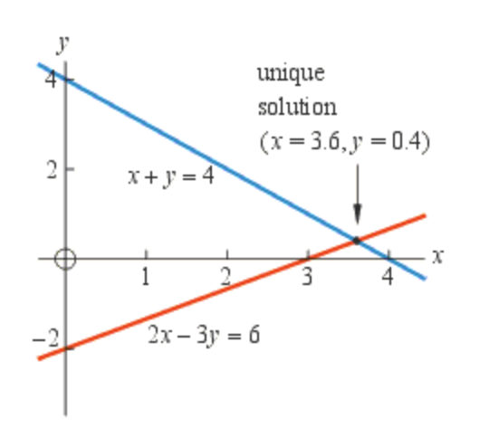

# System of Linear Equations

A system of linear equations (on linear systems) is a collection of one or more equations involving the same variables. For example,

$$
\begin{cases}3x+2y-z=1\\2x-2y+4z=-2\\-x+{\frac {1}{2}}y-z=0\end{cases}
$$

is a system of three equations in the three variables $x$, $y$ and $z$.

## Linear Equation vs Nonlinear Equations

In mathematics, a **linear equation** is an equation in which the **degree of every variable is 1** → no variable in the linear equation has an exponent greater than 1. Therefore, it follows the form:

$$
a_1x_1 + a_2x_2 +... + a_nx_n + b = 0
$$

where $x_1,...,x_n$ are the **variables**, $a_1,...,a_n$ are coefficients and $b$ is a constant. Note that $b, a_1,...,a_n$ are all **scalars** (real numbers).

Conversely, **nonlinear equations** have variables with degrees other than 1.

Examples of Linear Equations

$$
a + b = 10 \\
2a + 3b = 15 \\
3.4a - 48.99b + 2c = 122.5
$$

Examples of Nonlinear Equations

$$
a^2 + b^2 = 10 \\
\sin (a) + 3b = 15 \\
2^a - 3^b = 0
$$

## System of Linear Equations as Lines (2x2)

Linear equations with 2 variables **produce straight lines** when graphed on a two-dimensional plane. The solution set of the system is the intersection of these lines.

Types of Linear Systems

- **Complete**: the system has enough non-redundant equations to determine a solution
- **Redundant**: the system contains redundant equations
- **Inconsistent**: the system contains contradictory equations

Note: 

1. an equation within a system of equations is said to be **redundant** if it does not make any difference by its existence (does not provide new information that contributes to determining the solution of the system)
2. an equation within a system of equations is said to be **contradictory** if it renders the system impossible to solve (leads to inconsistency when combined with other equations) 

The graph above shows a linear system of two non-redundant equations

 

$$
\begin{cases}y+x=4\\y-x=-2\\\end{cases}
$$

in two variables $x$ and $y$.

We also observe that there exists a unique solution to both equations at $(3,1)$, the intersection of the lines. This system is therefore **complete**.

The graph above shows a linear system of two contradictory equations

$$
\begin{cases}y+x=4\\y+x=2\\\end{cases}
$$

in two variables $x$ and $y$.

We also observe that there exists no solution as the two equations conflict with each other. This system is therefore **inconsistent**

The graph above shows a linear system of two redundant equations

$$
\begin{cases}y+x=4\\2y+2x=8\\\end{cases}
$$

in two variables $x$ and $y$.

We also observe that there exists infinite number of solutions. This system is therefore **redundant**.

## System of Linear Equations as Planes (3x3)

For linear systems with 3 variables, each linear equation determines a plane in the three-dimensional space. The solution set of the system is the intersection of these planes.

The graph above shows a linear system of three non-redundant equations

$$
\begin{cases}a+b+c=10\\a+b+2c=17\\a+b+3c=18\end{cases}
$$

in three variables $a$, $b$ and $c$.

We also observe that there exists a unique solution to both equations at $(3,5,2)$, the intersection of the planes. This system is therefore **complete**.

The graph above shows a linear system of three redundant equations

$$
\begin{cases}a+b+c=10\\2a+2b+2c=20\\3a+3b+3c=30\end{cases}
$$

in three variables $a$, $b$ and $c$.

We also observe that there exists infinite number of solutions. This system is therefore **redundant**.

The graph above shows a linear system of three contradictory equations

$$
\begin{cases}a+b+c=10\\a+b+2c=17\\a+b+3c=18\end{cases}
$$

in three variables $a$, $b$ and $c$.

We also observe that there exists no solution as there is no common intersection between all three planes. This system is therefore **inconsistent.**

## Determinant of a Square Matrix

The determinant of a matrix *A* is commonly denoted $det(a)$, $det A$, or $|A|$.

The determinant of a **2 x 2 matrix** is 

$$
\begin{vmatrix}a&b\\c&d\end{vmatrix}=ad-bc
$$

The determinant of a **3 x 3 matrix** is 

$$
\begin{vmatrix}a&b&c\\d&e&f\\g&h&i\end{vmatrix}=aei+bfg+cdh-ceg-bdi-afh
$$

## Singular vs Non-Singular Coefficient Matrices

In linear algebra, a coefficient matrix is a matrix consisting of the **coefficients** of the variables in a set of linear equations. We can determine whether a **square linear system** (no. of linear equations = no. of variables) using its coefficient matrix.

2x2 Linear Systems

Therefore, given a 2x2 linear system such as

$$
\begin{cases}x+y=4\\x-y=2\end{cases}
$$

we can represent its coefficient using a matrix like so

$$
A = \begin{vmatrix}1&1\\1&-1\\\end{vmatrix}
$$

We can then calculate the determinant of the coefficient matrix to determine if the system is singular or non-singular

$$
det(A) = -1\cdot 1 - 1 \cdot 1 = -2
$$

A square matrix is **singular** (or **degenerate**) if and only if its **determinant is zero**. Therefore, the linear system is non-singular as it has a non-singular coefficient matrix. It has a unique solution at (3,1).

3x3 Linear Systems

Similarly, given a 3x3 linear system such as

$$
\begin{cases}x+y+z=10\\2x+2y+2z=20\\3x+3y+3z=30\end{cases}
$$

we can represent its coefficient using a matrix like so

$$
A = \begin{vmatrix}1&1&1\\2&2&2\\3&3&3\end{vmatrix}
$$

We can then calculate the determinant of the coefficient matrix to determine if the system is singular or non-singular

$$
det(A) = 3(1\cdot 2 \cdot 3) -3(1\cdot 2 \cdot 3) = 0
$$

Therefore, the linear system is **singular** as its determinant is equal to zero.

## Linear Dependence and Independence

Linearly independent systems of equations refer to a collection of equations in which **none of the equations** can be derived from the **linear combination** of the other equations in the system. In other words, each equation in the system provides **unique information** that cannot be obtained by combining the other equations through multiplication or addition.

For instance, given the linear system

$$
\begin{cases}2a+b+2c=10\\a+2b+c=20\\6a+6b+6c=60\end{cases}
$$

we can see that $Equation (3) = 2\cdot [Equation (1) + Equation (2)]$

Therefore, the system has **linearly dependent rows** → the system is **linearly dependent**

For **square linear systems**, we can use the **determinant of its coefficient matrix** to determine whether it is linearly dependent or independent. 

If the determinant of its coefficient matrix is **equal to zero**, it implies that the system is **linearly dependent**. Inversely, If the determinant of its coefficient matrix is **not equal to zero**, it implies that the system is **linearly independent**.

For example, given a 3x3 linear system such as

$$
\begin{cases}x+2y+z=10\\x+3y+z=12\\x+3y+2z=17\end{cases}
$$

we can represent its coefficient using a matrix like so

$$
A = \begin{vmatrix}1&2&1\\1&3&1\\1&3&2\end{vmatrix}
$$

We can then calculate the determinant of the coefficient matrix using

$$
det(A) = (1\cdot 3 \cdot 2) + (2\cdot 1 \cdot 1) + (1\cdot 1 \cdot 3) \\- (1\cdot 3 \cdot 1) - (2\cdot 1 \cdot 2) - (1\cdot 1 \cdot 3) = 1
$$

Therefore, the linear system is **non-singular** and **linearly independent** as it has a non-zero determinant. It has a unique solution at (1, 2, 5).