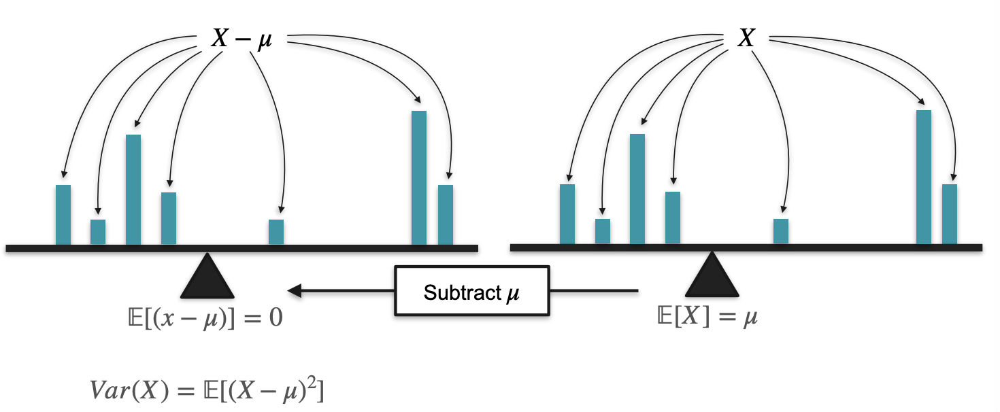

# Probability Distributions

## Describing Probability Distributions

### Central Tendency

- **Mode:** the most frequent value.
- **Median:** the middle number in an ordered dataset.
- **Mean:** the sum of all values divided by the total number of values.

### Expected Value

Expected value uses probability to tell us what outcomes to expect in the long run. It represents the average outcome or the long-term average that can be anticipated from a probability distribution. Informally, the expected value is the arithmetic mean of the possible values a random variable can take, weighted by the probability of those outcomes. The expected value of a random variable $X$ is denoted by $E[X]$.

For discrete distributions 

$$
E[X] = \sum_{i=1}^{N}x_i \cdot P(x_i)
$$

For example, given a fair coin flip where landing heads $H$ results in winning $10 and landing tails $T$ results in winning $0, the expected value of winnings can be calculated as

$$
E[X] = 10 \times \frac{1}{2} + 0 \times \frac{1}{2} = 5
$$

For continuous distributions 

Now consider a random variable *X* which has a probability density function given by a function *f* on the real number line. This means that the probability of *X* taking on a value in any given open interval is given by the integral of *f* over that interval. The expectation of *X* is then given by the integral

$$
E[X] = \int_{-\infty}^{\infty} xf(x)dx
$$

where $f(x)$ is the PDF.

For uniform distributions

The expected value for a uniform distribution in the range $[a,b]$ is given by

$$
E[X] = \frac{a+b}{2}
$$

Sum of expectations

For two random variables $X$ and $Y$,

$$
E[X+Y] = E[X] + E[Y]
$$

### Variance

Variance is a statistical measure that reveals the spread or dispersion of a set of data points from its mean value. Variance helps distinguish between distributions with the same expected value but different degrees of spread.

$$
\begin{align} \notag
Var(X) &= E[(X-\mu)^2]\\\ \notag
&= E[X^2] - E[2\mu X] + E[\mu^2]\\\ \notag
&= E[X^2] - 2\mu E[X] + \mu^2\\\ \notag
&= E[X^2] - 2E[X]\cdot E[X] + \mu^2\\\ \notag
&= E[X^2] - 2E[X]^2 + E[X]^2\\\ \notag
&= E[X^2] - E[X]^2
\end{align}
$$

### Standard Deviation

The standard deviation is a crucial statistical measure used to quantify the amount of variability or dispersion within a dataset. It addresses the drawback of variance, which is measured in squared units, by representing the spread of a distribution in the same units as the original data.

$$
\sigma = \sqrt{Var(X)} = \sqrt{E[X^2] - E[X]^2}
$$

Empirical Rule

The empirical rule, or 68-95-99.7 rule, tells you where most of your values lie in a normal distribution

- Around 68% of values are within 1 standard deviation from the mean.
- Around 95% of values are within 2 standard deviations from the mean.
- Around 99.7% of values are within 3 standard deviations from the mean.

### Sum of Gaussians

Given two **independent normally distributed** random variables $X \sim \mathcal{N}(\mu_X, \sigma^2_X)$ and $Y \sim \mathcal{N}(\mu_Y, \sigma^2_Y)$ and $Z = X + Y$, then

$$
Z \sim \mathcal{N}(\mu_X + \mu_Y, \sigma^2_X + \sigma^2_Y)
$$

This means that the sum of two independent normally distributed random variables is normal, with its mean being the sum of the two means, and its variance being the sum of the two variances (i.e., the square of the standard deviation is the sum of the squares of the standard deviations)

### Standardisation

From earlier we saw that we can convert any normal distribution to the **standard normal distribution**, where $\mu =0$ and $\sigma = 1$. This is done by transforming each value $x \in X$ into its corresponding standardized $z$ value using the following formula

$$
z = \frac{x - \mu}{\sigma}
$$

But why is that so? Let’s first look at the numerator

$$
\begin{align} \notag
E[X-\mu] &= E[X] - E[\mu]\\\ \notag
&= E[X] - \mu\\\ \notag
&= 0
\end{align}
$$

So this shifts the mean to 0, which completes our first goal. Now let’s understand how it converts the standard deviation to 1. First, we need to understand given a scalar $c$

$$
\begin{align} \notag
Var(cX) &= E[(cX)^2] - E[cX]^2\\\ \notag
&= E[c^2X^2] - c^2E[X]^2\\\ \notag
&= c^2E[X^2] - c^2E[X]^2\\\ \notag
&= c^2(E[X^2] - E[X]^2)\\\ \notag
&= c^2Var(X)
\end{align}
$$

Therefore,

$$
Var(\frac{X}{\sigma}) = \frac{Var(X)}{\sigma^2} = \frac{\sigma^2}{\sigma^2} = 1
$$

We can see that the variance has now be scaled to 1.

### Moments of a Distribution (Skewness and Kurtosis)

Skewness and kurtosis are statistical measures that provide insights into the shape, symmetry, and distribution of a dataset beyond what is conveyed by mean, variance, or standard deviation.

The n-th moment of a random variable is the expected value of its n-th power → $E[X^n]$

Skewness

Skewness is the third **standardised** moment and it measures the asymmetry of the probability distribution of a real-valued random variable

$$
Skew[X] = E[(\frac{X-\mu}{\sigma})^3]
$$

- **Skewed to the Right (Positive Skewness):** The skewness value will be greater than zero. It implies a heavier right tail, indicating that extreme positive values occur more frequently than predicted by a normal distribution.
- **Symmetric (No Skewness):** If the skewness value is around zero, the distribution is relatively symmetric around the mean, resembling a normal distribution.
- **Skewed to the Left (Negative Skewness):** A skewness value less than zero signifies a heavier left tail, meaning that extreme negative values occur more frequently compared to a normal distribution.

Kurtosis

Kurtosis characterises the **peakedness** or **flatness** of a probability distribution compared to the normal distribution.

$$
Kurt[X] = E[(\frac{X-\mu}{\sigma})^4]
$$

- **Leptokurtic:** A distribution with higher kurtosis than the normal distribution, showcasing taller and sharper peaks, indicating heavy tails and extreme values.
- **Platykurtic:** Distributions with lower kurtosis than the normal distribution, displaying flatter peaks and lighter tails, indicating fewer extreme values.
- **Mesokurtic:** Distributions with the same kurtosis as the normal distribution, presenting similar peakedness and tail behaviour.

## Visualising Data

### Quantiles

Quantiles are values that divide a dataset into equal portions. For instance, the median is the 50th percentile, dividing the data into two equal halves.

**Calculating Quantiles:**

- To find a specific percentile or quantile:
    - Arrange the data in ascending order.
    - Determine the position of the desired quantile using the percentage.
    - If the position is a whole number, the quantile is the value at that position. If it's not a whole number, take the average of the nearest two values.

](images/Untitled%209.png)

Image from [Scribbr](https://www.scribbr.com/statistics/quartiles-quantiles/)

**Common Quantiles:**

- Median (50th percentile): Splits the data into two equal parts.
- First quartile (Q1 or 25th percentile): Divides the lowest 25% of data from the rest.
- Third quartile (Q3 or 75th percentile): Divides the lowest 75% of data from the highest 25%.

The **interquartile range (IQR)** is a measure of statistical dispersion that represents the range between the first quartile (Q1) and the third quartile (Q3) of a dataset.

$$
IQR = Q_3 - Q_1
$$

### Box-Plots

A box plot, also known as a **box-and-whisker plot**, is a graphical representation that displays the distribution of a dataset based on five summary statistics: minimum, maximum, median, and quartiles (Q1 and Q3).

**Usefulness:**

- Helps identify the symmetry, skewness, and presence of outliers in the dataset.
- Provides a concise summary of data distribution without detailed statistical analysis.
- Facilitates comparisons between different datasets or groups.

### Kernel Density Estimation (KDE)

Kernel density estimation is a non-parametric technique used to estimate the probability density function (PDF) of a continuous random variable based on observed data.

- Begin by plotting each observed data point.

- For each data point, place a small kernel, often represented as a Gaussian (though other kernels are possible), creating a curve centered at that data point.
- Begin by plotting each observed data point.
- For each data point, place a small kernel, often represented as a Gaussian (though other kernels are possible), creating a curve centered at that data point.

- Scale and sum all individual kernels, typically by multiplying each kernel by 1/n, where n is the sample size.
- The sum of these kernels forms an estimated smooth curve representing the PDF of the dataset. (the picture above is not a good example because there is not enough data points)

With enough data points, we get a smooth curve

**Advantages:**

- Provides an estimate of the underlying continuous probability distribution from discrete observations.
- Offers a smoothed approximation of the PDF compared to histograms, especially for small sample sizes.
- Offers flexibility in kernel choice, allowing adaptation to different data distributions.

**Limitations:**

- The choice of kernel and bandwidth can affect the final KDE plot, influencing the smoothness and shape of the estimated density.
- Accuracy of KDE heavily relies on the sample size, and small sample sizes may lead to less reliable estimations.

### Violin Plots

A **violin plot** is a statistical graphic for comparing probability distributions. It is similar to a box plot, with the addition of a rotated kernel density plot on each side

### Quantile-Quantile Plots (QQ Plots)

Now, checking for normality in data is frequently done in data science. Many models, such as linear regression, logistic regression, and Gaussian Naïve Bayes, assume that the variables follow a Gaussian distribution. Some other tests used in data science also assume this hypothesis. But how can we tell if the data follows a normal distribution or not? Well, sometimes a quick inspection of something as simple as a histogram can let us know that data is in Gaussian. 

For example, the left one doesn't look very Gaussian, and the right one looks a little gaussian. But how do we get a more exact answer if the data is Gaussian or not when it looks bell shaped like the one in the right? Well, for that we use quantile quantile plots, or QQ plots. These are a great tool to visually inspect if your data is Gaussian.

To plot a QQ Plot:

- **Data Standardization:**
    - Initially standardizes the dataset by subtracting the mean and dividing by the standard deviation.
- **Quantile Comparison:**
    - Compares the quantiles of the standardized dataset (blue scatterplot) with the quantiles of a theoretical normal distribution (orange line).
    

## Probability Distributions with Multiple Variables

### Joint Distribution

$$
P_{XY}(x,y) = P(X=x, Y=y)
$$

Discrete

Continuous

**Finding the mean**

**Finding the variance**

### Marginal Distribution

A **marginal distribution** represents the probability distribution of one variable from a joint distribution while disregarding or integrating over all other variables. It provides insights into the behavior of one variable independently of the others.

**For Discrete Variables**: To obtain the marginal distribution of a variable, sum the joint probabilities over all possible values of the other variable(s) along the corresponding axis. For example,

$$
P_Y(y_j) = \sum_{i} P_{XY}(x_i,y_j)
$$

**For Continuous Variables**: Integrate the joint probability density function (PDF) over the range of the variable of interest to derive its marginal distribution.

### Conditional Distribution

The conditional distribution represents the probability distribution of one variable, $Y$, given specific known conditions or values of another variable, $X = x$.

For discrete variables, to find $P(Y=y | X=x)$, isolate the row corresponding to the specific value $x$ of $X$ and **normalize** the probabilities in that row to sum up to one (because conditional probabilities have to sum to 1)

Similarly, in continuous distributions, conditional probability is calculated using probability density functions (PDFs) instead of probability mass functions (PMFs).

In general,

$$
P_{Y|X=x}(y) = \frac{P_{XY}(x,y)}{P_X(x)}
$$

### Covariance

Covariance quantifies the relationship between two variables in a dataset. It measures how changes in one variable correspond to changes in another variable.

**Calculation of Covariance**

- Step 1: Standardise the data.
- Step 2: Calculate the average of the product of the centered values.

Covariance Formula For $n$ observations of equal probability:

$$
Cov(X,Y) = \frac{1}{N}\sum_{i=1}^{n}(x_i - \mu_x)(y_i - \mu_y) 
$$

Covariance Formula For Joint Probability:

$$
{Cov}(X,Y)=\sum_{i=1}^{n}\sum_{j=1}^{n}(x_{i}-E[X])(y_{j}-E[Y])\cdot P(X = x_i, Y = y_j)
$$

Covariance Formula in terms of Expected Values:

$$
\begin{align} \notag
Cov(X,Y) &= E[(X-E[X])(Y-E[Y])]\\\ \notag
&= E[XY - XE[Y] - E[X]Y + E[X]E[Y]]\\\ \notag
&= E[XY] - E[X]E[Y] - E[X]E[Y] +E[X]E[Y]\\\ \notag
&= E[XY] -E[X]E[Y]
\end{align}
$$

$$
E[XY] = \sum_{i=1}\sum_{j=1}x_i \cdot y_j \cdot P(X = x_i, Y = y_j)
$$

**Understanding Covariance**

- Covariance indicates how variables change together.
- I**f** two random variables are **independent**, the covariance is 0.
- Positive covariance (e.g., Age vs. Height): Both variables tend to increase together.
- Negative covariance (e.g., Age vs. Naps per day): One variable increases while the other decreases.
- Near-zero covariance (e.g., Age vs. Grades): Suggests little to no linear relationship.

Covariance of Probability Distributions

Same mean and variance, but different covariances

Covariance Matrix

A **covariance matrix** is a square matrix that summarizes the variances and covariances of multiple variables in a dataset. It provides a systematic arrangement of variances along the diagonal and covariances off the diagonal. 

For a dataset with $n$ variables, the covariance matrix is an $n \times n$ matrix. It looks like the following

$$
{cov}(X) =\begin{bmatrix}
var(x_1) & cov(x_1, x_2) & \cdots & cov(x_1,x_n)\\\\
cov(x_2,x_1) & var(x_2) & \cdots & cov(x_2, x_n)\\\\
\vdots & \vdots & \ddots & \vdots\\\\
cov(x_n,x_1) & cov(x_n, x_2) & \cdots & var(x_n)
\end{bmatrix}
$$

Since $cov(X,Y) = cov(Y,X)$, we can see that the covariance matrix is **symmetric** (equal to its transpose).

The **correlation coefficient** measures the strength and direction of the linear relationship between two variables in a dataset. It is a standardized metric that ranges between -1 and 1, where -1 indicates a perfect negative linear relationship, 1 represents a perfect positive linear relationship, and 0 suggests no linear relationship between the variables. This allows comparing of different pairs of variables irrespective of their original scales, enabling standardized comparisons.

$$
corr(X,Y) = \frac{cov(X,Y)}{\sigma_X \sigma_Y} = \frac{cov(X,Y)}{\sqrt{var(x)}\sqrt{var(Y)}}
$$

Equivalently, the correlation matrix can be seen as the covariance matrix of the standardized random variables

$$
corr(X) =
\begin{bmatrix}
1 & {\frac{{E}[(X_{1}-\mu_{1})(X_{2}-\mu_{2})]}{\sigma (X_{1})\sigma (X_{2})}} & \cdots & {\frac{{E} [(X_{1} - \mu_{1})(X_{n}-\mu _{n})]}{\sigma (X_{1})\sigma (X_{n})}}\\\\
{\frac{{E}[(X_{2}-\mu_{2})(X_{1}-\mu_{1})]}{\sigma (X_{2})\sigma (X_{1})}} & 1 & \cdots & {\frac{{E} [(X_{2} - \mu_{2})(X_{n} - \mu _{n})]}{\sigma (X_{2})\sigma (X_{n})}}\\\\
\vdots & \vdots & \ddots & \vdots\\\\
{\frac{{E}[(X_{n}-\mu_{n})(X_{1}-\mu _{1})]}{\sigma (X_{n})\sigma (X_{1})}} & {\frac {{E}[(X_{n} - \mu_{n})(X_{2} - \mu_{2})]}{\sigma (X_{n})\sigma (X_{2})}} & \cdots & 1
\end{bmatrix}
$$