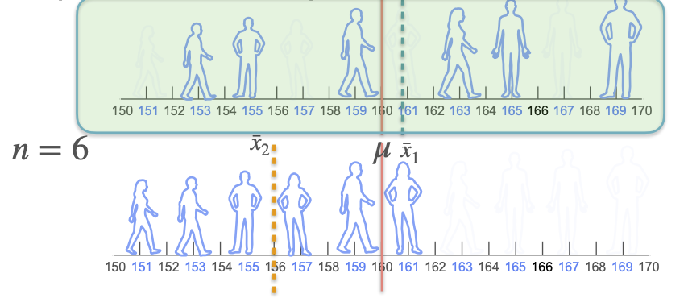

# Sampling and Point Estimation

## Sample

- **Population:** The entirety of individuals or items under study constitutes the population.
- **Sample:** A subset of the population that is observed or measured.

### Sample Mean

Due to constraints, it can be difficult to calculate the **population mean**. Instead, we can sample enough proportion of the population and use the **sample mean** as an approximate. It is important to perform **random sampling** to prevent any biased selection that does not effectively represent the entire population. The larger the sample size and the more representative it is of the population, the closer the sample mean tends to be to the population mean.

The sample mean is the average of the sample values, which is the sum of those values divided by the number of samples. Using mathematical notation,

$$
\bar{x} = \frac{1}{N}\sum_{i=1}^{N}x_i
$$

The **law of large numbers** is a mathematical theorem that states that the average of the results obtained from a large number of independent and identical random samples converges to the true value, if it exists. → sampling more data gives us a more accurate approximate of the mean!

### Sample Proportion

A **population proportion**, generally denoted by $P$, is a parameter that describes a percentage value associated with a population (for e.g. percentage of vehicles which are motorcycles). A population proportion is usually estimated through an unbiased sample statistic obtained from an observational study or experiment. This is known as the **sample proportion,** denoted by $**\hat{p}**$.

$$
\hat{p} = \frac{x}{n}
$$

where $x$ is the count of successes in the sample and $n$ is the size of the sample obtained from the population.

### Sample Variance

If all possible observations of the system are present then the calculated variance is called the **population variance**. Normally, however, only a subset is available, and the variance calculated from this is called the **sample variance**. The variance calculated from a sample is considered an estimate of the full population variance.

Population variance formula:

$$
\sigma^2 = \frac{1}{N}\sum_{i=1}^{N}(x_i - \mu)^2
$$

**Unbiased** sample variance formula:

$$
s^2 = \frac{1}{n-1}\sum_{i=1}^{n}(x_i - \bar{x})^2
$$

Note how we divide the sum of the squared differences by $n-1$ instead of $n$. This is known as **Bessel’s Correction**.

### Central Limit Theorem

The **central limit theorem** (**CLT**) states that, under appropriate conditions, the distribution of a normalized version of the sample mean converges to a **standard normal distribution**. This holds even if the original variables themselves are not normally distributed.

$$
\lim_{n \to \infty}\frac{\bar{x} -\mu }{\sigma}\sqrt{n} \sim\mathcal{N}(0,1^2)
$$

## Maximum Likelihood Estimation

In statistics, **maximum likelihood estimation** (**MLE**) is a method of estimating the parameters of an assumed probability distribution, given some observed data. 

The parameter values are found such that they maximise the likelihood that the process described by the model produced the data that were actually observed.

The point in the parameter space that maximises the likelihood function is called the maximum likelihood estimate.

It is important to be clear about the difference between “probability” and “likelihood”. Probability refers to the possibility of an event given a sample distribution of the data. Likelihood measures how well an observed data conforms to a specific model or distribution. Therefore, we use likelihood to determine the best parameters for a probability distribution that best represent an observed data.

### Bernoulli Trials

A Bernoulli trial is a random experiment with two outcomes. The standard example is the flip of a probably biased coin. Given that we flip a coin with probability $p$ of heads, $H$, and a $(1-p)$ probability of tails, $T$. We observed 8 heads and 2 tails. Remember the probability mass function of the Bernoulli distribution for a single observation can be expressed using

$$
f(x;p) = p^x(1-p)^{1-x}
$$

If we have $n$ independent observations $x_1, \dots, x_{n}$, their joint probability mass function is

$$
f(x_1,\dots,x_{n};p) = \prod_i^{n}f(x_i;p)=\prod_i^{n}p^{x_i}(1-p)^{1-x_i}
$$

If we interpret this function not in the observations with the fixed parameter $p$ but instead as a function in the model parameter with fixed observations $x_1,\dots,x_n$, we get the likelihood function

$$
L(p;x_1,\dots,x_n) = f(x_1,\dots,x_{n};p)
$$

Now, we want to find the $p$ with the highest likelihood given the fixed observations, which means we want to maximise our likelihood function. Since products are hard to differentiate, it would be more convenient to maximise the log likelihood which yields the same result, since the natural logarithm is a **monotonically increasing function**. This means that the maximum value of the log likelihood function occurs at the same point as the original likelihood function.

$$
logL(p;X) = log(p)\sum_i^nx_i + log(1-p)\sum_i^n (1-x_i)
$$

To find the extreme points, we need to find where the derivative of the log likelihood function w.r.t. to $p$ is equals to zero

$$
\frac{dlogL(p;X)}{dp} = \frac{\sum_i^nx_i}{p} - \frac{\sum_i^n (1-x_i)}{1-p} = 0
$$

After we substitute the observations of $8H2T$, where $H$ corresponds to 1 and $T$ corresponds to 0

$$
\begin{align} \notag
\frac{dlogL(p;X)}{dp} &= \frac{8}{p} - \frac{2}{1-p} = 0\\\ \notag
\implies p &=0.8
\end{align}
$$

This means the most likely $p$ for the probability mass function is 0.8

- **Note**: we should technically include finding the second derivativ eof the log likelihood just to make sure that the $p$ value we obtain is a maximum

### Gaussian Population

Suppose you have $n$ samples $X = (x_1,\dots,x_n)$ from a Gaussian distribution with mean $\mu$ and variance $\sigma^2$. This means that $x_i \overset{i.i.d}{\sim} \mathcal{N}(\mu, \sigma^2)$. The PDF of a generic sample is

$$
f_X(x_i;\mu,\sigma) = \frac{1}{\sqrt{2\pi} \sigma}e^{\frac{-(x_i-\mu)^2}{2\sigma^2}}
$$

If you want the MLE for $\mu$ and $\sigma$ the first step is to define the likelihood. If both $\mu$ and $\sigma$ are unknown, then the likelihood will be a function of these two parameters. For a realisation of $X$,  given by $X = (x_1,\dots,x_n)$:

$$
\begin{align} \notag
L(\mu,\sigma;X) &= \prod_{i=1}^n f_X(x_i;\mu,\sigma)\\\ \notag 
&= \prod_{i=1}^n \frac{1}{\sqrt{2\pi} \sigma}e^{\frac{-(x_i-\mu)^2}{2\sigma^2}}\\\ \notag
&= \frac{1}{(\sqrt{2\pi})^n \sigma^n}e^{\frac{-\sum_{i=1}^n (x_i-\mu)^2}{2\sigma^2}}
\end{align}
$$

We want to find the extreme points where the derivative of $L$ w.r.t. to $\mu$ and $\sigma$  is zero. Again, we can exploit the properties of logarithm to get rid of the exponential term and make it easier to calculate the derivative

$$
\begin{align} \notag
logL(\mu,\sigma;X) &= log(\frac{1}{(\sqrt{2\pi})^n \sigma^n}e^{\frac{-\sum_{i=1}^n (x-\mu)^2}{2\sigma^2}})\\\ \notag
&= -\frac{n}{2}log(2\pi) - nlog(\sigma) - \frac{\sum_{i=1}^n (x_i-\mu)^2}{2\sigma^2}
\end{align}
$$

Taking the partial derivatives of $L$ w.r.t. to $\mu$ and $\sigma$, we have

$$
\begin{align} \notag
\frac{\partial logL(\mu,\sigma;X)}{\partial \mu} &= \frac{\sum_{i=1}^n (x_i-\mu)}{\sigma^2}\\\ \notag
&= \frac{\sum_{i=1}^n x_i -n\mu}{\sigma^2}
\end{align}
$$

and

$$
\frac{\partial logL(\mu,\sigma;X)}{\partial \sigma} = -\frac{n}{\sigma} + \frac{\sum_{i=1}^n (x_i - \mu)^2}{\sigma^3}
$$

We first solve for the partial derivative w.r.t. $\mu$ when we equate it to 0

$$
\begin{align} \notag
\frac{\partial logL(\mu,\sigma;X)}{\partial \mu}
&= \frac{\sum_{i=1}^n x_i -n\mu}{\sigma^2} = 0\\\ \notag
\implies \hat\mu 
&= \frac{\sum_{i=1}^n x_i}{n} = \bar{x}
\end{align}
$$

which is the sample mean. Then we find the value of $\sigma$ that achieves $\frac{\partial logL(\mu,\sigma;X)}{\partial \sigma} = 0$

$$
\begin{align} \notag
\frac{\partial logL(\mu,\sigma;X)}{\partial \sigma} 
&= -\frac{n}{\sigma} + \frac{\sum_{i=1}^n (x_i - \mu)^2}{\sigma^3} = 0\\\ \notag
\implies \hat\sigma 
&= \sqrt{\frac{\sum_{i=1}^n(x_i-\mu)^2}{n}}
\end{align}
$$

Substituting $\hat\mu = \bar{x}$ into the above we get the MLE for standard deviation

$$
\hat\sigma = \sqrt{\frac{\sum_{i=1}^n(x_i-\bar{x})^2}{n}}
$$

This tells us that the MLE for the standard deviation of a Gaussian population is the square root of the average squared difference between each sample and the sample mean. This expression is very similar to the sample standard deviation, the only difference is the degrees of freedom, for MLE we have $n$ but for sample standard deviation we use $n-1$.

### Linear Regression

Given $n$ samples $X= (x_{1},\dots,x_{n}), y = (y_1, \dots, y_n)$ , a linear regression model assumes that the relationship between the dependent variable $y$ and the regressors $x$ is linear. That is:

$$
y  = \beta x + \epsilon
$$

where $\beta$ is a vector of coefficients and $\epsilon$ is the error or residual term.

How can we use MLE to estimate the parameters of the linear regression model? An approach to fitting the model is to think about a probabilistic procedure that might have given rise to our observation. Let us assume that each response $y_i$ is IID and Gaussian distributed with mean $\beta x_i$ (point on the regression line) and variance $\sigma^2$ 

The PDF for a generic sample is given by

$$
f(y;x,\beta,\sigma) =\frac{1}{\sqrt{2\pi} \sigma}e^{\frac{-(y_i-\beta x_i)^2}{2\sigma^2}} 
$$

We want to find the MLE of the parameters $\beta, \sigma$. The likelihood function is

$$
L(\beta, \sigma; X,y) = \prod_{i=1}^n \frac{1}{\sqrt{2\pi} \sigma}e^{\frac{-(y_i-\beta x_i)^2}{2\sigma^2}} 
$$

and the log likelihood function is

$$
\ell(\beta, \sigma; X,y) = -\frac{n}{2}log(2\pi) - \frac{nlog(\sigma^2)}{2} - \frac{\sum_{i=1}^n (y_i-\beta x_i)^2}{2\sigma^2}
$$

We want to find the extreme point where the partial derivative of $\ell$ w.r.t. to $\beta$ is equal to 0

$$
\frac{\partial \ell(\theta)}{\partial \beta} = \frac{\partial}{\partial\beta}(\frac{-\sum_{i=1}^n (y_i-\beta x_i)^2}{2\sigma^2}) = 0
$$

Observe that this is the same as minimising the **sum of squared errors**, same as the ordinary least squares method. In other words, the best estimate for $\beta$ is where the point where sum of squared errors is the minimum.

The partial derivative of $\ell$ w.r.t. to $\sigma^2$ is given by

$$
\frac{\partial \ell(\theta)}{\partial \sigma^2} = -\frac{n}{2\sigma^2} + \frac{\sum_{i=1}^n (y_i-\beta x_i)^2}{2\sigma^4}
$$

Therefore, solving for $\frac{\partial \ell(\theta)}{\partial \sigma^2} = 0$ we get

$$
\sigma^2 = \frac{1}{n}\sum_{i=1}^n(y_i-\beta x_i)^2
$$

This tells us that the MLE for the variance is the average squared error.

## Bayesian vs Frequentist

There are two approaches to statistical inference: Bayesian and Frequentist. The method of Maximum Likelihood you've seen so far falls in the Frequentist category.

Let's see what some differences between the two approaches:

| Frequentist | Bayesian |
| --- | --- |
| Probabilities represent long term frequencies | Probabilities represent a degree of belief, or certainty |
| Parameters are fixed (but unknown) constants, so you can not make probability statements about them | You make probability statements about parameters, even if they are constants (beliefs) |
| Find the model that better explains the observed data | Update beliefs on the model based on the observed data |
| Statistical procedures have well-defined long run frequency properties | You make inferences about a parameter θ by producing a probability distribution for θ |

The main difference between Frequentists and Bayesians is in the **interpretation of probabilities**.

- **Frequentists**: probabilities represent long term relative frequencies, which is the frequency of appearance of a certain event in infinite repetitions of the experiment. This implies that probabilities are objective properties of the real world and that the parameters of the distribution are fixed constants; you might not know their value but the value is fixed. Since probabilities represent long term frequencies, Frequentists interpret observed data as samples from an unknown distribution, so it is natural to estimate models in a way that they explain the sampled data as best as possible.
    - **Goal**: Find the model that most likely generated the observed data
- **Bayesians**: Probabilities represent degrees of belief or uncertainty. When you are Bayesian, even though you know the parameters take on a fixed value, you are interested on your beliefs on those values. A prior is your baseline belief, what you believe about the parameter before you get new evidence or data. **Therefore, Bayesian inference** involves specifying a prior distribution based on existing knowledge or beliefs and then updating this distribution with observed data to obtain a posterior distribution.
    - **Goal**: update prior belief based on observations

The method of Maximum Likelihood we’ve seen so far falls in the Frequentist category. Let’s understand better using an example. Imagine you have four coins, three of which are fair and one biased with a probability of heads of 0.8. You choose randomly one of the four coins, and you want to know if you chose the biased one. You flip the coin 10 times and get 7 heads. Which coin did you choose?

A frequentist would say that you chose the biased one, because it has a higher likelihood:

$$
L(0.8; 7H3T) = 0.8^70.2^3 = 0.0018 > L(0.5;7H3T) = 0.5^70.5^3 = 0.00098
$$

What would a Bayesian say? Notice that that the frequentist didn't take into account the fact that the biased coin had 1 in 4 chances of being picked at the beginning. A Bayesian will try to exploit that information, it will be their **initial belief**: without having any other information (observations) the chances of picking the biased coin is 1/4. The goal of a Bayesian is to update this belief, or probability, based on the observations.

How do you actually perform this update? The answer lies in Bayes theorem.

But how can you use this to update the beliefs?

Notice that if the event B represents the event that the parameter takes a particular value, and the event A represents your observations (7 heads and 3 tails), then $P(B)$ is your prior belief of how likely is that you chose the biased coin before observing the data (0.25). $P(A|B)$ is the probability of your data given the particular value of the parameter (probability of seeing 7 heads followed by 3 tails given that the probability of heads is 0.8). Finally, $P(B|A)$ is the updated belief, which is called the **posterior**.  Note that $P(A)$ is simply a normalizing constant, so that the posterior is well defined (make the posterior density integrate to 1).

Look how you went from a 0.25 confidence of choosing the biased coin to 0.364. Note that while your beliefs of having chosen the biased coin have increased, this still isn't the most likely explanation. This is because you are taking into account the fact that originally your chances of choosing the biased coin were much smaller than choosing a fair one.

### Formalizing Bayesian statistics

In Bayesian statistics, the parameter you want to estimate is considered a random variable, and as such it has a probability distribution. This distribution will represent your beliefs on the parameters.

In the previous example, you are actually trying to estimate the probability of heads, which can be either 0.5, if the coin is fair, or 0.8 is the coin is biased. Before seeing the coin flips, your belief was that $P(H) =0.5$ with probability 0.75, and $P(H)=0.8$ with probability 0.25. After the 10 coin flips, you updated your beliefs to favor a little bit more the biased coin than initially, so that:  $P(H) = 0.5$ with probability 0.636, and $P(H)=0.8$ with probability 0.364.

Let's introduce some notation. We will use $\Theta$ to represent any parameters we want to estimate

- If the samples come from a population with a Bernoulli$(p)$ distribution, then $\Theta = p = P(Success)$
- If the samples come from a population with a Gaussian$(\mu, \sigma)$ distribution, then $\Theta = (\mu,\sigma)$
- If the samples come from a population with a Uniform$(0,b)$ distribution, then $\Theta = b$

There are five components in Bayesian statistics:

- **Parameter** ($\Theta$): the parameter that you want to estimate. Note that we distinguish $\Theta$ the random variable representing the parameter, from $\theta$, a particular value that the parameter takes.
- **Observed sample vector** ($X = (x_1,\dots, x_n$)) : your vector of observations
- **Prior distribution**: it represents your initial beliefs on the parameter before having any samples. This tells about how you think the probabilities for $\Theta = \theta$ are distributed
- **Conditional distribution of the samples**: For each possible $\Theta = \theta$ you know the joint distribution of the samples. Since the observed values of the sample are fixed, this turns out to be a function of $\theta$, so the condition distribution of the samples actually represents a **likelihood!**
- **Posterior distribution**: your updated beliefs on the parameter $\Theta$ after observing the data. You will update them using the Bayes rules based on the observed data.

### Maximum a Posteriori (MAP)

Sometimes you still want a point estimate for the parameter $\Theta$. You can use the posterior distribution to define different point estimates. One of the most commonly used point estimates in Bayesian statistics is known as Maximum a Posteriori (MAP). As the name suggests, it the the value $\theta$ that maximizes the posterior distribution of the parameter. If $\Theta$ is a continuous random variable, this can be expressed as

$$
\hat\theta = \argmax_\theta f_{\Theta|X=x}
$$

Note that the MAP is nothing more than the **posterior mode.**

Some other frequently used point estimators are

- **Posterior mean:**

$$
\hat\theta = \mathbb{E}[\Theta|X = x]
$$

It can be shown that this estimate has the property of minimizing the $L_2$, or quadratic, error.

- **Posterior median**: median of the posterior distribution

$$
\hat\theta =median(\Theta|X=x)
$$

This estimate actually minimizes the $L_1$ error.

### Relationship between MAP and MLE

It turns out the MAP estimation and the MLE have a lot in common. Begin by noting that the conditional distribution of the data has the same expression as the likelihood:

$$
p_{X|\Theta=\theta}(x) = \prod_{i=1}^n p_{X_i|\Theta=\theta (x_i)} \hspace{1cm} L(\theta;x) = \prod_{i=1}^np_{X_i}(x_i)
$$

The interpretations are slightly different, because one comes from a conditional distribution and the other does not.. However, the expressions are exactly the same.

If you use an uninformative prior,  just like the coin example, then you are assigning equal weight to every possible value of the parameter. You are essentially multiplying the conditional distribution of your data by a constant, so that the posterior is proportional to this function:

$$
f_{\Theta|X=x}(\theta) = \frac{p_{X|\Theta = \theta}(x) constant_1}{constant_2} \propto p_{X|\Theta=\theta}(x)
$$

Since the posterior is proportional to the conditional distribution of the data, the value $\theta$ that maximizes the posterior distribution has to be the same as the $\theta$ that maximized the conditional distribution of data. But this conditional distribution coincided with the likelihood. **This means that the MAP estimation with an uninformative prior yields the same result as the MLE**.

## Regularization

In mathematics, statistics, finance, computer science, particularly in machine learning and inverse problems, **regularization** is a process that changes the result answer to be "simpler". It is often used to obtain results for ill-posed problems or to prevent overfitting.

### L2 Regularization: Ridge Regression

Ridge regression adds the **squared magnitude** of the coefficient as the penalty term to the loss function. Ridge Regression performs regularization by shrinking the coefficients present.

$$
Cost = L(\theta) + \lambda\sum_{i=1}^{m}w_i^2
$$

where $\lambda$ is a penalty parameter and $w_i$ is the coefficient of the $i$-th independent variable. The higher the penalty, it reduces the magnitude of coefficients. Therefore, it is used to prevent multicollinearity, and it reduces the model complexity by coefficient shrinkage.

### L1 Regularization: Lasso Regression

Lasso is an acronym for least absolute shrinkage and selection operator, and lasso regression adds the **absolute value of magnitude** of the coefficient as a penalty term to the loss function.

$$
Cost = L(\theta) + \lambda\sum_{i=1}^{m}w_i
$$

Ridge regression improves prediction error by shrinking the sum of the squares of the regression coefficients to be less than a fixed value in order to reduce overfitting, but it does not perform covariate selection and therefore does not help to make the model more interpretable. Lasso achieves both of these goals by forcing the sum of the absolute value of the regression coefficients to be less than a fixed value, which forces certain coefficients to zero, excluding them from impacting prediction.