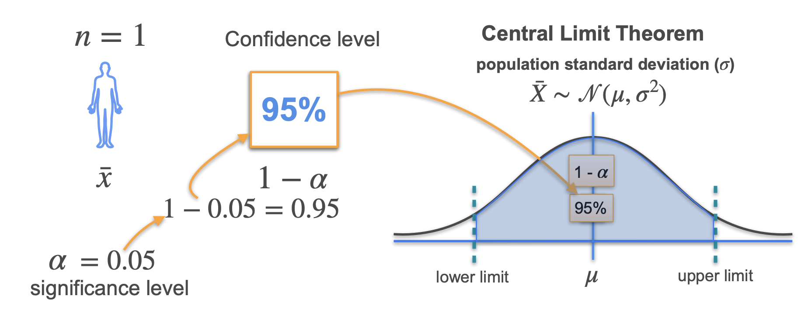

# Confidence Intervals and Hypothesis testing

## Confidence

A **confidence interval** (**CI**) is an interval which is expected to typically contain the parameter being estimated

The **confidence level $\gamma$** is determined by a **significance value** $\alpha$ → $\gamma = 1 -\alpha$

- Commonly used values for α: 0.05, 0.01, 0.10.
- A confidence level of 95% corresponds to $\alpha =0.05$, indicating we're 95% confident the true parameter lies within the interval.

As the sample size grows and with more data points, there's higher confidence in the accuracy of the estimated parameter value, resulting in narrower confidence intervals.

### Standard Error

Recall that the standard deviation of a population $\sigma$ is a representation of the spread of each of the data points. Suppose an independent sample of $n$ observations $x_1,\dots,x_n$ is taken from a population with standard deviation of $\sigma$. The mean value calculated from the sample, $\bar x$, will have an associated standard error on the mean, $\sigma_{\bar x}$ given by

$$
\sigma_{\bar x} = \frac{\sigma}{\sqrt{n}}
$$

Practically this tells us that when trying to estimate the value of a population mean, due to the factor $\frac{1}{\sqrt{n}}$, reducing the error on the estimate by a factor of two requires acquiring four times as many observations in the sample; reducing it by a factor of ten requires a hundred times as many observations.

Derivation of Standard Error

If $X = (x_1,\dots,x_n)$ is a sample of $n$ independent observations from a population with mean $\bar x$ and standard deviation $\sigma$. Then

$$
Var(X) = Var(x_1) + \dots + Var(x_n) = n\sigma^2
$$

We want to know the variance of the sample mean $\bar x$

$$
Var(\bar x) = Var(\frac{X}{n}) = \frac{1}{n^2}Var(X) = \frac{\sigma^2}{n}
$$

Therefore the standard deviation of the sample mean, also known as the standard error, is given by:

$$
\sigma_{\bar x} = \sqrt{Var(\bar x)} = \frac{\sigma}{\sqrt{n}}
$$

### Margin of Error

The **margin of error** is a measure of the precision or uncertainty in an estimate derived from a sample when attempting to infer characteristics about a larger population. It quantifies the potential difference between the estimate obtained from the sample and the true value of the population parameter. The **margin of error** is equal to half the width of the entire confidence interval.

The confidence interval is given by

$$
CI = [\bar x - z_{\gamma}\times\sigma_{\bar x}, \space \bar x + z_{\gamma}\times\sigma_{\bar x}] = [\bar x - z_{\gamma}\times\frac{\sigma}{\sqrt{n}}, \space \bar x + z_{\gamma}\times\frac{\sigma}{\sqrt{n}}]
$$

where $z_{\gamma}$ is the z-score which measures the standard deviations away from the mean are the **critical values for** a specified confidence level $\gamma$. 

The critical values define the boundaries of the acceptance region for the confidence interval. For a normal distribution, 95% of the data fall within 1.96 standard deviations from the mean. If our confidence level is 95% of the data, then $z = 1.96$.

The margin of error is therefore

$$
MOE_{\gamma} = z_{\gamma} \times \frac{\sigma}{\sqrt{n}}
$$

### Student’s t-distribution

Most of the time we won’t know the true population standard deviation, which is necessary for calculating confidence interval and margin of error for a normal distribution. The **Student's t-distribution** is a statistical distribution used when dealing with small sample sizes or when the population standard deviation is unknown. It is similar to the standard normal distribution (the bell-shaped curve) but has heavier tails, meaning it has more probability in the tails than the normal distribution.

As the sample size increases, the tails of the t-distribution become lighter as it slowly become closer to the normal distribution.

To calculate the confidence interval in the event of an unknown population standard deviation, we use the sample standard deviation, denoted as $s$, instead. We then replace the z-score with the t-score as we are now find critical values in the t-distribution. Similar to the z-score, the t-score measures how many standard deviations away from the mean are the critical values, but for a t-distribution.

### Difference between Confidence and Probability

The **confidence level** (e.g., 95% confidence) represents the long-term success rate of the method in capturing the true population parameter. It indicates how often the calculated confidence intervals contain the population parameter when the same estimation procedure is used on different samples from the same population. It DOES NOT mean that there is a 95% probability that the population parameter falls within the confidence interval. This is because the population parameter (e.g. mean, variance) is fixed and does not have a probability distribution. The parameter is either in the confidence interval or not, there is no probability.

### Confidence Interval for Proportion

We calculated confidence intervals for means based on sample data. Now, let's consider scenarios where we want to estimate proportions rather than means. When dealing with proportions, we're interested in estimating the proportion of a certain characteristic within a population based on sample data. Similar to confidence intervals for population means, a confidence interval for a population proportion is constructed by calculating the sample proportion $\hat{p}$ , and then adding and subtracting the margin of error from $\hat{p}$ to get the limits of the confidence interval.

$$
CI = \hat{p} \pm MOE_{\gamma}
$$

The margin of error for a confidence interval with confidence level $\gamma$ for an unknown population proportion <i>p</i> is

$$
MOE_{\gamma} = z_{\gamma} \times\sqrt{\frac{\hat{p}(1-\hat{p})}{n}}
$$

As such, the confidence interval for proportions is

$$
CI = \hat{p} \pm z_{\gamma} \times\sqrt{\frac{\hat{p}(1-\hat{p})}{n}}
$$

## Hypothesis Testing

Hypothesis testing is a statistical method used to assess whether a certain assumption about a population is likely to be true or false based on sample data.

**Notes**: Apologies but the notes for hypothesis testing is rather empty. I recommend watching other online resources for this

### Defining Hypothesis

In hypothesis testing, there are two hypotheses considered:

- **Null Hypothesis** $H_0$: This is the default assumption or the status quo. It assumes no effect or no difference.
- **Alternative Hypothesis** $H_1$: This hypothesis challenges the status quo and presents the hypothesis under consideration or what we're trying to identify.

**Mutual Exclusivity and Dichotomous Nature:**

- $H_0$ and $H_1$ are mutually exclusive as they present conflicting propositions, e.g., an email cannot be both spam and not spam at the same time.
- They must have a binary, true/false outcome.

**Designing Good Hypotheses:**

- The quality of hypotheses is crucial. They need to be well-designed, with clear and contrasting statements.
- The null hypothesis is typically the baseline or default assumption, while the alternative hypothesis represents the statement we aim to support or prove.

**Evidential Approach in Hypothesis Testing:**

- Hypothesis testing involves gathering evidence from data to make a decision between $H_0$ and $H_1$.
- The evidence could be any relevant data points or information that supports or contradicts the null hypothesis.

**Rejection and Acceptance of Hypotheses:**

- If the evidence strongly contradicts $H_0$, then $H_0$ is rejected in favor of $H_1$.
- However, failing to reject $H_0$ doesn't necessarily prove $H_0$ true; it simply means the evidence isn't sufficient to support $H_1$.

### Type I and Type II error

A **Type I error** is the mistaken rejection of a null hypothesis that is actually true. A type I error is also known as a "false positive" finding or conclusion; example: "an innocent person is convicted". A **Type II error** is the failure to reject a null hypothesis that is actually false.

### Left-Tailed, Right-Tailed and Two-Tailed Tests

A **two-tailed test** is appropriate if the estimated value is greater or less than a certain range of values, for example, whether a test taker may score above or below a specific range of scores. This method is used for null hypothesis testing and if the estimated value exists in the critical areas, the alternative hypothesis is accepted over the null hypothesis. A **one-tailed test** (left-tailed or right-tailed) is appropriate if the estimated value may depart from the reference value in only one direction, left or right, but not both.

### p-Value

The ***p*-value**  is the probability of obtaining test results at least as extreme as the result actually observed, under the assumption that the null hypothesis is correct. A very small *p*-value means that such an extreme observed outcome would be very unlikely under the null hypothesis. The lower the *p*-value is, the lower the probability of getting that result if the null hypothesis were true. A p-value is said to be *statistically significant* if it is lower than a predefined significance level $\alpha$ → allows us to reject the null hypothesis. All other things being equal, smaller p-values are taken as stronger evidence against the null hypothesis.

### Steps for Performing Hypothesis Testing

1. State your hypotheses
    1. Null hypothesis: the baseline
    2. Alternative hypothesis: the statement you want to prove
2. Design your test
    1. Decide the test statistic to work with.
    2. Decide the significance level
3. Compute the observed statistic (based on your sample)
4. Reach a conclusion:
    1. If the p-value is less than the significance level reject H0