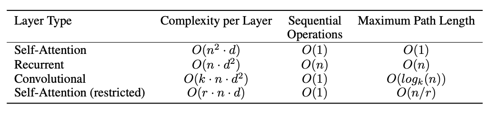

# Attention Is All You Need
Link to original paper: https://arxiv.org/abs/1706.03762

## Why and what is the Transformer architecture

Before Transformers, RNNs like LSTM and GRUs have been dominant in sequence-modeling tasks but RNNs process sequences sequentially, which limit parallelization RNNs and CNNs also struggle with handling longer sequences because RNNs suffer from vanishing gradients and lose information from earlier time steps and CNNs require large kernel sizes to capture long-range dependencies between distant patterns in data through convolutional operations. During the time of the publishing of this paper, self-attention has been picking up because they are effective in capturing dependencies in sequences, and they are usually employed alongside recurrent architectures.

So the Transformer model stands out as the first model relying entirely on self-attention for computing representations of both input and output without the use of sequence-aligned RNNs or convolution.

## Why Self-Attention?

1. **Computational Efficiency**
    1. **Sequential operations**: Self-attention has constant ($O(1)$) number of sequentially executed operations but a recurrent layer requires no. of operations linear to sequence length ($O(n)$).
    2. **Complexity per Layer**: 
        1. In a self-attention layer, each element attends to all other elements resulting in $n^2$ pairwise interactions. For each interaction, there is a matrix multiplication of dimension $d$ (dimension of input vectors), resulting in $O(n^2 \cdot d)$  complexity per layer
        2. In a recurrent layer, the operations are mainly matrix multiplications between the input and hidden states ($d^2$ complexity). This operation is executed for each element in the sequence, resulting in $O(n \cdot d^2)$ complexity per layer
        3. As long as the sequence length $n$ is smaller than the dimension of input vectors $d$, self-attention layers are faster than recurrent layers (usually the case in sentence representation) 
2. **Parallelisation**: Due to constant number of sequential operations, self-attention can be highly parallelised. Recurrent layers are inherently sequential in their processing → limits parallelisation.
3. **Path Length between Dependencies**: Learning long-range dependencies is crucial in many tasks. Self-attention enables shorter paths that forward and backward signals have to traverse in the network (i.e. shorter distance between supervision and input), facilitating the learning of long-range dependencies. Recurrent and convolutional layers generally have longer dependency paths.

## Overview of the Transformer architecture

## Step-by-step Explanation of How Transformers Work

Let’s pretend we are training the Transformer model to translate English sentences to French sentences. Let’s feed the training set of english and french sentence into the model.

**Step 1 (Word Vectorisation)**: convert the input (English sentence) and output (French sentence) sequences using a word-embedding layer into vectors of dimension $d_{model}$. Same weight matrices are used for both the embedding of input and output tokens and the pre-softmax linear transformation layer in the decoder. This allows for a learned shared set of parameters for both token embeddings and final token prediction step in the decoder.

**Step 2 (Positional Encoding)**: because the Transformer is not sequential like an RNN, it has to add positional encoding (PE) within the embeddings itself. Sinusoidal functions (sine and cosine functions) are used to transform the position indices to allow for representation of positional information in a continuous manner

**Note**: reasons behind summing PE rather than concatenating:

1. Maintain the same dimensionality $d_{model}$ for input vectors - no need to add a projection layer to squeeze the vectors back to $d_{model}$ size for the final output
2. The neural networks can learn to separate positional information from the word embedding
3. It is possible but unlikely for a word embedding to collide with another word embedding upon adding positional information as the delta from the PE is really small and PE usually only alter the first few dimensions of the word embedding. Moreover, one can use word embedding layers that are trained from scratch such that they learn to not encode too much information within the first few dimensions during word embedding.

**Step 3 (Self-Attention and Multi-Head Attention)**:

Self-attention layers are employed within the encoder and decoder stacks.

What is Self-Attention?

](Images/Untitled%206.png)

Image from [Sudipto Baul](https://medium.com/machine-intelligence-and-deep-learning-lab/transformer-the-self-attention-mechanism-d7d853c2c621)

For each word in the sequence, we want to measure how relevant is this word to all the other words in the sequence. For example, in the sentence “He is watching a french show”, the words *“watching”* and *“show”* should be highly related. Therefore, when the model processes the word *“watching”*, it pays **high attention** to the word *“show”* to understand the sequence better. This attention mechanism allows the model to understand contextual information.

Therefore, for each word in the sequence, the attention layer creates a query vector and a key vector of dimension $d_k$, and value vector of dimension $d_v$. The query, key and value vectors of all the words in the sequence are packed into matrices $Q$, $K$ and $V$ respectively. They are derived from

$$
\begin{split}
Q = X \cdot W_Q^T \\
K = X \cdot W_K^T \\ 
V = X \cdot W_V^T \\
\end{split}
$$

where $X$ is the matrix of word embeddings and $W_Q^T$, $W_K^T$ and $W_V^T$ are transposed learned weight matrices

Then, we will calculate the attention weights by applying *softmax* operation to the dot product of $Q$ and $K$ and then dividing it by $\sqrt{d_k}$

$$
weights = softmax(\frac{Q \cdot K^T}{\sqrt{d_k}})
$$

**Note**: reason why we divide the dot product by $\sqrt{d_k}$ is to control the variance before applying *softmax* → reduce likelihood of exploding or vanishing gradients → improve stability of learning process

By applying the *softmax* function, it returns a weights between 0 and 1 → probabilities that each (query, vector) pair in $Q$ and $K$ are related

| q | k | probability |
| --- | --- | --- |
| watching | show | 0.95 |
| watching | french | 0.33 |

Finally, we will calculate the attention scores using the dot product of the weights and the values. The entire equation is therefore:

$$
Attention (Q, K, V) = softmax(\frac{Q \cdot K^T}{\sqrt{d_k}})V
$$

By multiplying the weights with the value matrix $V$, we get the weighted sum of the value vectors to represent the relevance of each word in the sequence → allow the model to pay less attention to words that have low weighted sums as they are not relevant to the sequence 

Decoder: Self-Attention with Masking

In the decoder, prior to applying the softmax function to derive the attention weights, a mask is added to the scaled dot-product matrix. The mask is a matrix where the upper triangular portion is filled with -∞ and lower triangular portion is filled with zeros. The equation for calculation attention scores in the decoder is therefore:

$$
Attention_{decoder} (Q, K, V) = softmax(\frac{Q \cdot K^T}{\sqrt{d_k}} + M)V
$$

where $M$  is the mask

The reason behind adding this mask is such that for each word in the sequence, we only calculate its relevance to words prior to it; weights corresponding to future positions are set to -∞. In this way, this prevents the model from having access to future tokens when trying to predict the current token in the output sequence; it should not be allowed to use information from future tokens to predict the current token → ensure the autoregressive nature of the decoding process

Multi-Headed Attention

In a single attention layer, the attention scores are weighted sum of the value vectors. This results in a reduction in effective resolution of the model, i.e. the granularity in the representation of those positions. To counteract this, the Transformer architecture implements multi-headed attention mechanism. 

Given a multi-headed attention layer with $h$ heads and using different learned linear projection layers for each head, the $Q$, $K$ and $V$ matrices are projected into $h$ different matrices of $d_k$, $d_k$ and $d_v$ dimensions respectively. These projected queries, keys, and values undergo parallel self-attention computations, generating $d_v$-dimensional output values independently for each head.

The output values from every head are then concatenated and linearly projected to produce the final output vectors. The equation is therefore

$$
\begin{split}
MultiHead(Q, K, V) = Concat(head_1,..., head_2)W^O \\
where \space head_i = Attention(QW_i^Q, KW_i^K, VW_i^V)
\end{split}
$$

where $W_i^Q$, $W_i^K$, $W_i^V$are the weight matrices for each the $i$th head and $W^O$ is the weight of the final linear projection layer

**Benefits**: With different learned weight matrices for each head, Multi-Head Attention enables the model to capture deeper relationships and dependencies within the input sequence compared to a single attention head → improve effective resolution of the model

Residual Connection and Layer Normalisation

There is also residual connections around each multi-head attention layer, followed by layer normalisation. 

The residual connections help the network train better because the neural networks contribute very little at initialisation and the unimpeded residual pathways between the input and supervision of the feed-forward network reduces gradient loss. Only when the neural layers begin to come online over time will it have an impact over the residual connections.

The layer normalisations are used to stabilise the learning process of the model 

**Step 4 (Position-wise Feed-Forward Networks)**:

The normalised residual output is fed into a position-wise feed-forward neural network which are a couple of linear layers with *ReLu* activation to gain richer representation of the weighted attention values. The inner layer of the feed-forward neural network has numbers of nodes equal to 4x of $d_{model}$

There is also residual connections around the feed-forward network, followed by layer normalisation. 

**Step 5 (Cross-Attention)**:

While there is self-attention occurring within the encoder and decoder themselves, there is also cross-attention occurring between the encoder and decoder where the keys ($K$) and values ($V$) matrices from the encoder stack is compared with the query ($Q$) vectors from the decoder stack to decide which encoder input is relevant to focus on for each decoder output.

**Step 6 (Decoding Output)**: 

The decoder stack’s outputs are fed into a final linear transformation layer followed by a *softmax* function to transform them into a probability distribution over the word vector space. These distributions represent the likelihood of each token in the target vocabulary being the next predicted token in the sequence. The token with the highest probability is selected as the predicted token. This continues until the “end” token is produced, signifying the end of the decoded sequence. And ta-da, we get the French sentence translated from the original English sentence by the model!

**References**

1. [https://medium.com/machine-intelligence-and-deep-learning-lab/transformer-the-self-attention-mechanism-d7d853c2c621](https://medium.com/machine-intelligence-and-deep-learning-lab/transformer-the-self-attention-mechanism-d7d853c2c621)
2. [https://datascience.stackexchange.com/questions/55901/in-a-transformer-model-why-does-one-sum-positional-encoding-to-the-embedding-ra](https://datascience.stackexchange.com/questions/55901/in-a-transformer-model-why-does-one-sum-positional-encoding-to-the-embedding-ra)
3. [https://www.youtube.com/watch?v=kCc8FmEb1nY](https://www.youtube.com/watch?v=kCc8FmEb1nY)
4. [https://www.youtube.com/watch?v=XfpMkf4rD6E](https://www.youtube.com/watch?v=XfpMkf4rD6E)